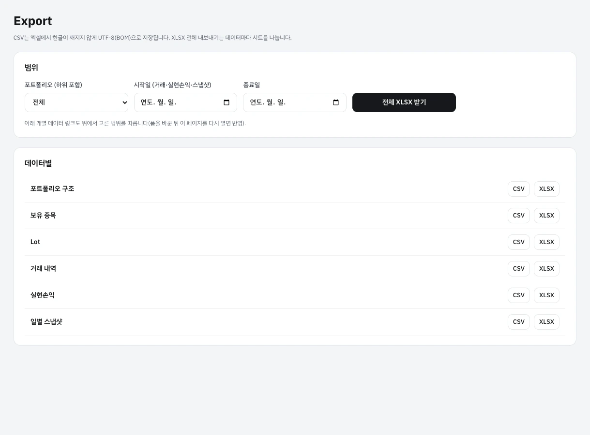

# PPFP 사용설명서

PPFP는 여러 계좌와 자산을 포트폴리오 단위로 묶어 관리하고, 매수할 때마다 생기는 Lot 단위로 매도와 손익을 계산하는 개인 투자 관리 앱입니다. 이 문서는 화면별로 무엇을 볼 수 있고 어떻게 쓰는지 설명합니다.

> **화면 캡처 안내** — 이 문서의 화면은 설명용 데모 계정과 가짜 시세로 만들었습니다. 종목 이름은 실제 이름을 썼지만 가격·잔고·거래는 모두 가상입니다. 캡처 안의 주황색 번호(1, 2, 3…)는 본문의 ①, ②, ③…과 짝을 이룹니다.

> **기능 이력 표기** — 각 기능 제목 아래에 그 기능이 들어온 커밋을 적었습니다. 예: **추가** [`6156d44`](https://github.com/hgrgr/PPFP/commit/6156d44348ee35aa0d5d265030b3856bdc96a79a) · 2026-10-08. 나중에 바뀐 점은 **바뀜**으로 적고, 없어진 기능은 [사라진 기능](#사라진-기능)에 모았습니다. 전체 흐름은 [기능 이력](#기능-이력)에 있습니다.

## 목차

1. [시작하기](#시작하기)
2. [화면 구성](#화면-구성)
3. [대시보드](#대시보드)
4. [포트폴리오](#포트폴리오)
5. [종목 화면 · Lot 매도](#종목-화면--lot-매도)
6. [거래 내역](#거래-내역)
7. [매매일지](#매매일지)
8. [실시간 시세](#실시간-시세)
9. [종목 상세 · 봉 차트](#종목-상세--봉-차트)
10. [연동 · 설정](#연동--설정)
11. [보유종목 가져오기](#보유종목-가져오기)
12. [코인 거래소 거래내역](#코인-거래소-거래내역)
13. [Export](#export)
14. [기능 이력](#기능-이력)
15. [사라진 기능](#사라진-기능)
16. [이 문서 관리하기](#이-문서-관리하기)

---

## 시작하기

**추가** [`db77f63`](https://github.com/hgrgr/PPFP/commit/db77f639c3e24f0a4d5affbf259d87e442975f8a) · 2026-10-07


1. **가입하기**에서 이메일과 비밀번호(10자 이상)로 계정을 만듭니다. 이름은 넣지 않아도 됩니다.
2. 처음 들어가면 대시보드에 **시작하기** 안내가 나옵니다. 아래 순서로 준비하면 됩니다.
   1. [포트폴리오](#포트폴리오)에서 맨 위 포트폴리오(예: 순자산)와 그 아래 계좌·전략별 포트폴리오를 만듭니다.
   2. [연동 · 설정](#연동--설정)에서 쓰는 증권사나 코인 거래소의 Open API 키를 연결합니다. 상장 종목 시세를 받으려면 증권사가 하나 이상 연결돼 있어야 합니다.
   3. [보유종목 가져오기](#보유종목-가져오기)로 계좌 보유종목을 한 번에 넣거나, 포트폴리오 화면에서 매수를 직접 기록합니다. 코인은 [코인 거래소 거래내역](#코인-거래소-거래내역)으로 가져옵니다.

## 화면 구성

**추가** [`db77f63`](https://github.com/hgrgr/PPFP/commit/db77f639c3e24f0a4d5affbf259d87e442975f8a) · 2026-10-07 · **바뀜** [`6156d44`](https://github.com/hgrgr/PPFP/commit/6156d44348ee35aa0d5d265030b3856bdc96a79a) (실시간 시세 메뉴), [`c99f35d`](https://github.com/hgrgr/PPFP/commit/c99f35dcc414d1e13afb8b7be55ce11998fc8d2e) (보유종목 가져오기 메뉴), [`72034c5`](https://github.com/hgrgr/PPFP/commit/72034c52db619e96bee37ba344491ab18d96a11b) · 2026-10-08 (매매일지 메뉴)

왼쪽 메뉴에서 화면을 옮겨 다닙니다.

| 메뉴 | 하는 일 |
| --- | --- |
| 대시보드 | 순자산이나 고른 포트폴리오의 평가액, 기간 수익률, 자산 배분, 비중 변화 |
| 실시간 시세 | 주요 지수, 내 종목 시세판, 실시간 랭킹, 종목별 봉 차트와 호가 |
| 포트폴리오 | 포트폴리오 구조를 만들고 편집, 포트폴리오별 보유 자산과 매수·입출금 기록 |
| 보유종목 가져오기 | 증권사 계좌 보유종목, 붙여넣은 잔고 표, 코인 거래소 거래내역 가져오기 |
| 거래 내역 | 모든 거래를 기간·포트폴리오·유형으로 찾아보고 삭제 |
| 매매일지 | 거래의 근거와 목표 예상 가격을 기록하고 지금 가격과 비교, 일지 양식 관리 |
| Export | 구조·보유·Lot·거래·실현손익·스냅샷을 CSV/XLSX로 내보내기 |
| 연동 · 설정 | 증권사·거래소 연결, 상승/하락 색, 과거 기록 다시 계산 |

메뉴 아래쪽에는 연결 상태(몇 곳 연결됨, 마지막 확인 시각, 오류가 난 연결)와 로그아웃 버튼이 있습니다.


**휴대폰에서 쓰기** — 화면이 좁으면 메뉴가 위쪽으로 올라가고 카드가 한 줄씩 쌓입니다. 브라우저의 *홈 화면에 추가*로 설치하면 앱처럼 쓸 수 있습니다(PWA). 시스템이 다크 모드면 화면도 어둡게 바뀝니다([대시보드](#대시보드) 참고).

<br clear="right">

## 대시보드

**추가** [`db77f63`](https://github.com/hgrgr/PPFP/commit/db77f639c3e24f0a4d5affbf259d87e442975f8a) · 2026-10-07 · **바뀜** [`656324d`](https://github.com/hgrgr/PPFP/commit/656324dd40947d9ed67ecb30dc3c44906eac736b) · 2026-10-07 (자산 배분에 종목별 비중 추가), [`72034c5`](https://github.com/hgrgr/PPFP/commit/72034c52db619e96bee37ba344491ab18d96a11b) · 2026-10-08 (원형 차트와 보유 종목에서 그 종목의 매매일지 보기)


- ① **보기 범위** — 순자산 전체 또는 특정 포트폴리오를 고릅니다. 포트폴리오를 고르면 그 하위 포트폴리오까지 할당 비율만큼 합쳐서 보여 줍니다.
- ② **금액 가리기** — 금액을 가립니다. 화면을 다른 사람에게 보여 줄 때 씁니다. 설정은 브라우저에 기억됩니다.
- ③ **기간 선택** — 1D·1W·1M·3M·6M·YTD·1Y·3Y·전체, 또는 *사용자 지정*으로 시작일·종료일을 고릅니다. 고른 기간이 화면의 모든 숫자와 차트에 똑같이 적용되고 주소(URL)에도 남습니다.
- ④ **요약**
  - *총평가액*: 지금 시세로 평가한 금액입니다. 원가와 미실현 손익이 함께 나옵니다.
  - *기간 손익*: 입금·출금을 빼고 계산한 기간 손익입니다. 실현 손익과 순입금이 함께 나옵니다.
  - *수익률 (TWR)*: 시간가중 수익률로, 돈을 넣고 뺀 시점의 영향을 없앤 수익률입니다. 최대낙폭도 함께 나옵니다.
  - *배당 · 이자*: 기간 안에 받은 금액을 원화로 환산한 값입니다.
- ⑤ **평가액 추이** — 실선은 평가액, 점선은 투자원금(시작 평가액 + 순입금)입니다. 두 선의 차이가 손익입니다.
- ⑥ **자산 배분** — *종목*(기본), *유형*, *통화* 기준으로 비중을 봅니다. *종목* 기준에서는 여러 포트폴리오에 나눠 담은 같은 종목을 하나로 합칩니다. 매매일지가 있는 종목에는 *일지 n* 표시가 붙고, 조각이나 범례를 누르면 그 종목의 매매일지가 나옵니다([아래](#대시보드에서-매매일지-보기)). 부채는 배분에서 빼고 총평가액에서는 차감합니다.

화면은 30초마다 새 시세로 다시 계산됩니다. 일부 종목 시세를 받지 못하면 제목 아래에 *일부 시세 지연*이 표시됩니다.


- **비중 변화** — 기간 동안 자산 유형별 비중이 어떻게 바뀌었는지 100% 누적 그래프와 시작·종료 비교표로 보여 줍니다.
- **포트폴리오 / 하위 포트폴리오** — 보기 범위 아래 포트폴리오의 할당 비율, 평가액, 비중, 기간 수익률입니다. 이름을 누르면 그 포트폴리오로 범위가 바뀝니다.
- **보유 종목** — 수량과 Lot 수, 현재가, 평가액, 비중, 미실현 손익입니다. 종목 이름을 누르면 [종목 화면](#종목-화면--lot-매도)으로 갑니다. 맨 오른쪽 **일지 n** 버튼은 그 종목의 매매일지를 엽니다.

> **과거 기록 계산** — 기간 분석은 하루 단위 기록(스냅샷)으로 계산합니다. 처음 자산을 넣은 직후에는 *과거 기록 계산* 버튼이 나옵니다. 누르면 연결된 증권사에서 과거 종가를 받아 첫 거래일부터 기록을 만듭니다. 스냅샷은 평일 기준이라 코인의 주말 가격 변동은 다음 평일 기록에 반영됩니다.


**다크 모드** — 운영체제나 브라우저가 다크 모드면 자동으로 어두운 화면으로 바뀝니다. 따로 바꾸는 버튼은 없습니다.

### 대시보드에서 매매일지 보기

**추가** [`72034c5`](https://github.com/hgrgr/PPFP/commit/72034c52db619e96bee37ba344491ab18d96a11b) · 2026-10-08


- ① 자산 배분을 *종목* 기준으로 두고 원형 차트의 조각이나 범례 줄을 누릅니다. 보유 종목 표의 **일지 n** 버튼을 눌러도 됩니다. *기타 n종목*과 *포트폴리오 현금*은 고를 수 없습니다.
- ② 그 종목의 매매일지가 최신순으로 나옵니다. 줄마다 작성일, 상태, 연결된 거래 수, 본문 앞부분, 목표 예상 가격과 목표까지 남은 등락률이 보입니다. **+ 새 일지**는 이 종목으로 새 일지를 시작하고, **전체 보기**는 [매매일지](#매매일지) 목록을 이 종목으로 걸러서 엽니다. 같은 종목을 다시 누르거나 **✕**를 누르면 닫힙니다.


- ① 목록에서 일지를 누르면 화면 오른쪽에 작은 창이 겹쳐 열립니다. 대시보드를 떠나지 않고 내용을 확인할 수 있습니다.
- ② 목표 예상 가격, 현재가, 진행 막대, 기준 가격·손절가, 양식의 속성 값, 연결된 거래가 위에 나오고 그 아래 본문(표·그래프·이미지 포함)이 이어집니다. 이 창에서는 고칠 수 없습니다. 고치려면 **편집**을 누릅니다. **Esc**나 **✕**로 닫습니다.

## 포트폴리오

**추가** [`db77f63`](https://github.com/hgrgr/PPFP/commit/db77f639c3e24f0a4d5affbf259d87e442975f8a) · 2026-10-07

### 구조 만들기


포트폴리오 안에 다른 포트폴리오를 원하는 비율만큼 넣을 수 있습니다. 예를 들어 *순자산* 아래에 *국내 주식*, *미국 주식*, *코인*을 100%씩 넣으면 순자산 금액이 세 포트폴리오의 합이 됩니다.

- ① **포함 비율** — 하위 포트폴리오가 상위에 몇 % 합산되는지 보여 줍니다. 한 포트폴리오를 여러 상위에 나눠 넣을 수 있지만 합계는 100%를 넘지 못합니다. 남은 비율이 있으면 *미배정* 배지가 붙습니다.
- ② **분석** — 그 포트폴리오를 범위로 한 대시보드를 엽니다.
- ③ **분리** — 상위와의 연결만 끊습니다. 포트폴리오 자체는 지워지지 않습니다.
- ④ **새 포트폴리오** — 이름, 상위 포트폴리오와 포함 비율, 매도할 때 기본으로 쓸 Lot 방식, 색상을 정해 만듭니다.
- ⑤ **기존 포트폴리오 연결** — 이미 있는 두 포트폴리오를 상위·하위로 잇거나, *이미 연결된 경우 비율만 변경*을 켜고 비율을 고칩니다. 하위가 다시 상위를 포함하는 순환 구조는 저장되지 않습니다.

### 포트폴리오 화면


포트폴리오 이름을 누르면 열립니다.

- ① **보유종목 가져오기** — 이 포트폴리오를 기본 대상으로 [보유종목 가져오기](#보유종목-가져오기)를 엽니다.
- ② **+ 거래 추가** — 아래쪽 매수·입출금 입력으로 이동합니다.
- ③ **요약** — 하위 포함 평가액(직접 보유분 별도 표시), 포트폴리오 현금(통화별), 매도 기본 Lot 방식입니다.
- ④ **직접 보유 종목** — 이 포트폴리오에 직접 담긴 자산입니다. 이름을 누르면 종목 화면으로 갑니다.

### 매수 · 입출금 기록


- ① **자산 종류** — *상장 종목*은 종목코드(예: `005930`, `AAPL`)를 넣으면 연결된 증권사에서 이름과 시세를 찾습니다. *수기 자산*은 부동산·현금·예금·채권·펀드·대안자산·부채처럼 시세가 자동으로 들어오지 않는 자산을 이름과 통화로 등록합니다.
- 매수 일시, 수량, 단가, 수수료, 세금, (해외 종목이면) 환율을 넣고 **매수 기록**을 누릅니다. 매수할 때마다 Lot이 하나씩 생기고, Lot 단가에는 매수 수수료와 세금이 포함됩니다.
- ② **이 포트폴리오의 현금으로 결제** — 켜면 포트폴리오 현금에서 돈이 빠집니다. 끄면 밖에서 돈을 넣어 산 것으로 기록되어 수익률 계산에서 입금으로 처리됩니다.
- ③ **입출금 · 배당 · 이자** — 입금·출금·배당·이자·수수료·세금을 원화나 달러로 기록합니다. 입금·출금은 수익률에서 빠지고 배당·이자는 수익으로 잡힙니다. 배당은 관련 종목을 고를 수 있습니다.

화면 맨 아래에서 하위 포트폴리오 비율 변경, 이름·색상·기본 Lot 방식 변경, 보관과 삭제를 할 수 있습니다. 거래나 하위 포트폴리오가 있는 포트폴리오는 삭제할 수 없으니 대신 *보관*하세요.

## 종목 화면 · Lot 매도

**추가** [`db77f63`](https://github.com/hgrgr/PPFP/commit/db77f639c3e24f0a4d5affbf259d87e442975f8a) · 2026-10-07 · **바뀜** [`72034c5`](https://github.com/hgrgr/PPFP/commit/72034c52db619e96bee37ba344491ab18d96a11b) · 2026-10-08 (매매일지 목록, 거래마다 일지 쓰기)


대시보드나 포트폴리오에서 종목 이름을 누르면 열립니다. 맨 위에 현재가, 보유 수량과 평균단가, 원화 평가액, 누적 실현손익이 나옵니다.

- ① **보유 Lot** — 매수마다 생긴 Lot의 취득일시, 취득·잔여 수량, 단가(수수료 포함), 취득 환율, 보유 기간, 평가 손익입니다.
- ② **Lot 선택 방식** — 이번 매도에서 어느 Lot을 먼저 팔지 고릅니다. 기본값은 포트폴리오에 정한 방식입니다.

  | 방식 | 먼저 파는 Lot |
  | --- | --- |
  | 직접 선택 | 표에서 Lot마다 팔 수량을 직접 입력 |
  | 선입선출 (FIFO) | 가장 먼저 산 Lot |
  | 후입선출 (LIFO) | 가장 나중에 산 Lot |
  | 고가 우선 (HIFO) | 단가가 가장 높은 Lot (실현이익을 작게) |
  | 저가 우선 (LOFO) | 단가가 가장 낮은 Lot |
  | 이동평균 | 남은 Lot 모두에서 수량 비율대로 조금씩 (평균 단가로 판 것과 같음) |

- ③ **매도 수량** — 수량, 단가, 수수료, 세금, 환율, 거래 일시를 넣으면 아래 표에 Lot별로 몇 주가 팔리는지 바로 나옵니다.
- ④ **예상 실현손익** — 저장하기 전에 손익을 미리 봅니다. 해외 종목은 원화 환산 손익(환차 포함)도 함께 나옵니다. 매도 수수료·세금은 소진 수량 비율로 각 Lot에 나눕니다.

*매도 대금을 포트폴리오 현금으로*를 끄면 매도 대금이 포트폴리오 밖으로 나간 것(출금)으로 기록됩니다. 여기서 고른 Lot은 이 앱 장부의 관리용이며, 증권사 손익(보통 평균단가 기준)이나 세무 신고 기준과 다를 수 있습니다.

같은 화면 아래쪽에서 할 수 있는 일:

- **추가 매수** — 이 종목을 더 산 기록을 남깁니다. 새 Lot이 생깁니다.
- **평가 갱신** (수기 자산) — 부동산·예금처럼 시세가 없는 자산의 현재 가치를 기록합니다. 기록한 날부터 이 값으로 평가합니다.
- **분할 · 병합 · 무상증자** — 모든 Lot의 수량에 비율을 곱하고 단가를 나눕니다. 예: 1주→4주 분할은 4, 10주→1주 병합은 0.1.
- **매매일지** — 이 종목에 대해 쓴 일지와 목표까지의 진행입니다. **+ 새 일지**로 바로 씁니다.
- **거래 내역** — 이 종목의 거래만 모아 봅니다. *매매일지* 열의 **+ 일지**를 누르면 그 거래가 연결된 새 일지가 열리고, 이미 연결된 일지가 있으면 **일지**로 바로 갑니다.

## 거래 내역

**추가** [`db77f63`](https://github.com/hgrgr/PPFP/commit/db77f639c3e24f0a4d5affbf259d87e442975f8a) · 2026-10-07 · **바뀜** [`72034c5`](https://github.com/hgrgr/PPFP/commit/72034c52db619e96bee37ba344491ab18d96a11b) · 2026-10-08 (매매일지 열)


모든 포트폴리오의 거래를 최신순으로 보여 줍니다. 코인 거래소에서 가져온 체결·입출금도 여기에 함께 나옵니다.

- ① **필터** — 포트폴리오(하위 포함), 유형(매수·매도·입금·출금·배당·평가 갱신 등), 기간으로 좁힙니다. 오른쪽 위 **CSV**·**XLSX**는 지금 필터 그대로 내려받습니다.
- **매매일지** — 종목이 있는 거래에는 **+ 일지**가 있습니다. 누르면 그 거래가 연결되고, 거래 종류에 맞는 양식(매도→매도 복기, 매수→매수 계획)과 거래 단가가 기준 가격으로 채워진 새 일지가 열립니다. 이미 연결된 일지가 있으면 **일지**(여러 개면 *일지 n*)로 표시되고 누르면 그 일지로 갑니다.
- **삭제** — 잘못 넣은 거래를 지웁니다. 거래를 고치려면 지우고 다시 입력합니다. 지운 거래는 감사 로그에 원본이 남고, 연결된 매매일지에서는 빠지지만 일지 자체는 남습니다. 이미 일부 매도된 Lot의 매수 거래는 그 매도를 먼저 지워야 삭제됩니다.

## 매매일지

**추가** [`72034c5`](https://github.com/hgrgr/PPFP/commit/72034c52db619e96bee37ba344491ab18d96a11b) · 2026-10-08

거래할 때의 생각을 남기는 노트입니다. 일지는 종목 하나에 대해 쓰고, 그 종목의 거래를 여러 개 연결할 수 있습니다. 모든 일지에는 **목표 예상 가격**이 반드시 들어갑니다. 앱은 이 값을 지금 가격과 비교해 진행 상황을 보여 주고, 앞으로 넣을 *가격 도달 알림*과 *AI 어드바이저*도 이 값을 기준으로 씁니다.

### 목록


- ① **필터** — 종목, 상태(진행 중·종료), 검색어(제목·본문·종목명)로 좁힙니다.
- ② **진행** — 기준 가격에서 목표 예상 가격까지 지금 가격이 얼마나 왔는지 막대로, 목표까지 남은 등락률을 숫자로 보여 줍니다. 목표에 닿으면 *목표 도달*로 바뀝니다. 목표가 기준 가격보다 낮으면(하락을 기다리는 일지) 아래로 내려갈수록 막대가 찹니다.
- ③ **양식 관리** — 일지 양식을 보고 만듭니다([양식](#양식)).

제목을 누르면 일지가 열립니다. 오른쪽 끝 *거래*는 연결된 거래 수입니다.

### 일지 쓰기


**+ 새 매매일지**, 거래 내역의 **+ 일지**, 종목 화면이나 대시보드의 **+ 새 일지**로 시작합니다. 위쪽은 노션의 페이지 속성처럼 생겼습니다.

- **제목** — 비워 두면 *종목명 + 양식 이름*으로 저장됩니다.
- **종목** — 일지를 쓸 종목입니다. 고르면 현재가가 옆에 나옵니다.
- ① **목표 예상 가격 (필수)** — 그 종목의 거래 통화로 적습니다. 옆에 현재가에서 목표까지 몇 % 남았는지 나옵니다.
- **기준 가격** — 일지를 쓸 때의 가격입니다. 거래에서 시작하면 그 거래 단가, 아니면 현재가가 미리 들어갑니다. 목표까지의 진행률은 이 가격부터 셉니다. **현재가 넣기**로 바꿀 수 있습니다.
- **손절가 · 목표 기한 · 작성일 · 상태** — 손절가와 목표 기한은 선택입니다. 상태는 *진행 중*과 *종료*가 있고, 목록에서 걸러 볼 때 씁니다.
- **양식 속성** — 고른 양식에 들어 있는 항목(예: 매도 사유, 감정, 확신도 별점)입니다.
- ② **연결된 거래** — **거래 연결**을 누르면 이 종목의 매수·매도·배당 등이 나오고, 체크해서 연결합니다. **✕**로 연결을 풉니다.
- ③ **속성 편집** — 이 일지에만 속성을 더하거나 빼고 순서를 바꿉니다. **이 구성을 양식으로 저장**은 지금 속성과 본문을 새 양식으로 저장해 다음 일지에서 고를 수 있게 합니다.
- ④ **양식 고르기** — 연결한 거래에 맞춰 하나를 추천합니다(매도 거래→*매도 복기*, 매수 거래→*매수 계획*, 거래 없음→*장기 투자 노트*). 다른 양식을 누르면 속성과 본문이 그 양식으로 바뀝니다. 본문을 이미 썼다면 바꾸기 전에 확인을 받습니다.

새 일지는 **저장**을 눌러 처음 저장합니다. 그다음부터는 고칠 때마다 1~2초 뒤 자동으로 저장되고, 오른쪽 위에 *저장됨*이 표시됩니다. **Ctrl+S**(맥은 **⌘S**)로 바로 저장할 수도 있습니다.

### 본문 편집기


본문은 노션처럼 블록 단위로 씁니다.


- 빈 줄에서 **/**를 누르면 넣을 블록 목록이 나옵니다. 이어서 글자를 치면(예: `/표`, `/그래프`) 목록이 좁혀집니다.
  - 제목 1·2·3, 본문, 인용
  - 글머리·번호·체크리스트, 접을 수 있는 목록(토글)
  - 표: 칸을 누르고 쓰며, 표 가장자리의 **+**로 줄·칸을 더합니다
  - 코드 블록: 언어를 고르면 문법 색이 칠해집니다
  - 구분선
  - 이미지·비디오·오디오·파일: 이미지는 올리거나 주소로 넣고, 화면에 붙여넣어도 됩니다
  - 그래프와 종목 시세 차트(아래 설명)
- 글자를 드래그하면 굵게·기울임·밑줄·취소선·색·**링크** 도구가 뜹니다. 줄 맨 앞에 `# `(제목), `- `(글머리 목록), `1. `(번호 목록)을 치면 그 블록으로 바로 바뀝니다.
- 블록 왼쪽의 **⋮⋮** 손잡이를 끌어 순서를 바꾸고, 눌러서 블록을 지우거나 색을 바꿉니다.
- 이미지는 PNG·JPEG·GIF·WebP를 5MB까지 올릴 수 있고, 올린 사람만 볼 수 있습니다.

<br clear="right">

**그래프 블록** — `/그래프`로 넣습니다. **막대·선·영역·원형** 중 하나를 고르고, **데이터 편집**을 눌러 값을 넣습니다. 첫 줄은 항목 이름, 다음 줄부터 값이며 쉼표나 탭으로 나눕니다. 엑셀에서 표를 복사해 붙여넣어도 됩니다. 값 열이 여러 개면 계열이 여러 개인 그래프가 됩니다. 원형은 첫 번째 값 열만 씁니다.

```
분기,매출,영업이익
1Q,120,12
2Q,150,18
```


**종목 시세 차트 블록** — `/시세`로 넣습니다. 이 일지 종목의 봉 차트가 나오고, 목표 예상 가격과 손절가가 점선으로 그려집니다. 간격(1분~주봉)은 [종목 상세](#종목-상세--봉-차트)와 같이 바꿀 수 있습니다. 상장 종목(국내·미국·코인)에서만 나옵니다.

### 양식


양식은 *기록할 속성*과 *본문의 틀*을 묶은 것입니다. 종목·목표 예상 가격·기준 가격·손절가·목표 기한·상태는 양식과 상관없이 모든 일지에 들어갑니다.

| 추천 양식 | 이럴 때 | 속성 | 본문 틀 |
| --- | --- | --- | --- |
| 매수 계획 | 사기 전에 | 진입 방식, 투자 기간, 목표 비중, 확신도 | 매수 근거, 시나리오 표, 리스크와 손절 조건, 체크리스트, 참고 자료 |
| 매도 복기 | 판 뒤에 | 매도 사유, 계획대로 했나, 그때 감정, 이번 매매 점수 | 매도 사유, 계획과 비교 표, 잘한 점, 아쉬운 점, 다음에 바꿀 것 |
| 장기 투자 노트 | 오래 들고 갈 때 | 투자 기간, 적정 가치, 점검 주기, 확신도 | 한 줄 요약, 투자 아이디어, 경쟁력, 핵심 지표 표, 틀렸다고 볼 조건, 점검 기록 |
| 단기 매매 | 차트를 보고 짧게 | 셋업, 손익비, 확신도 | 종목 시세 차트, 진입 근거, 청산 계획, 결과 |
| 빈 페이지 | 자유롭게 | 없음 | 빈 본문 |

- ① **이 양식으로 쓰기** — 이 양식으로 새 일지를 엽니다.
- ② **복사해서 내 양식 만들기** — 추천 양식을 복사해 고칩니다. 추천 양식 자체는 바꿀 수 없습니다.
- ③ **+ 새 양식** — 빈 양식부터 만듭니다.


내 양식에서는 이름, 한 줄 설명, 속성, 본문 틀을 정합니다.

- ① 속성마다 이름과 종류를 고릅니다. 종류는 텍스트, 숫자, 가격, 퍼센트, 날짜, 선택(선택지를 쉼표로 적음), 별점(1~5), 체크박스, 링크가 있습니다. **↑ ↓**로 순서를 바꾸고 **✕**로 지웁니다. *미리보기*를 펼치면 일지에서 어떻게 보이는지 나옵니다.
- ② **+ 속성 추가**로 항목을 더합니다(최대 30개).
- 본문 틀은 일지 본문과 같은 편집기로 씁니다. 양식을 고친 뒤에도 이미 쓴 일지는 쓸 때의 속성 그대로 남습니다.

## 실시간 시세

**추가** [`6156d44`](https://github.com/hgrgr/PPFP/commit/6156d44348ee35aa0d5d265030b3856bdc96a79a) · 2026-10-08 · **바뀜** [`a9cb43c`](https://github.com/hgrgr/PPFP/commit/a9cb43c123a3f2238ad3744c28fadaf132d8d05c) · 2026-10-08 (코인 시세·코인 랭킹 탭 추가), [`8e6df7e`](https://github.com/hgrgr/PPFP/commit/8e6df7e0585896c34a2f7f6e9811c05a7520ad79) · 2026-10-08 (랭킹 표에서 현재가와 등락률을 한 칸에 표시)


연결된 증권사·거래소에서 몇 초마다 새 값을 받아오는 시세판입니다. 오른쪽 위 **자동 갱신 멈춤**으로 잠시 멈출 수 있고, 브라우저 탭이 안 보일 때는 저절로 멈춥니다.

- ① **지수 · 환율** — 코스피, 코스닥, 나스닥, S&P 500, 다우존스와 원/달러를 전일 대비와 함께 보여 줍니다.
- ② **관심종목 추가** — 국내 종목코드(`005930`), 미국 티커(`AAPL`), 코인 원화마켓 코드(`KRW-BTC`)를 넣습니다. 관심종목은 표 오른쪽 ★로 뺍니다.
- ③ **내 종목** — 모든 포트폴리오에 보유한 상장 종목·코인과 관심종목입니다.
  - *현재가·등락률·거래량*: 전일 종가 대비 값입니다.
  - *오늘*: 당일 흐름을 보여 주는 미니 차트입니다. 코인은 최근 12시간입니다.
  - *평가금액·오늘 손익*: 보유한 종목만 나옵니다. 해외 종목은 현재 환율로 환산합니다.
  - 행을 누르면 아래에 [종목 상세](#종목-상세--봉-차트)가 열립니다.
- ④ **실시간 랭킹** — 시장(국내·미국·코인)과 기준(거래대금·거래량·급상승·급하락)을 골라 상위 종목을 봅니다. 등락률은 현재가 바로 아래에 나옵니다. 창이 좁으면 랭킹 카드가 시세판 아래로 내려가서 표가 잘리지 않습니다. 아래에 응답한 증권사·거래소가 *출처*로 나옵니다. 종목을 누르면 상세가 열립니다.


**코인 랭킹** — 코인 거래소를 연결하면 *코인* 탭에서 원화마켓 코인의 24시간 거래대금·거래량과 등락률 순위를 볼 수 있습니다.

갱신 주기는 시세판 4초, 종목 상세 3초, 랭킹 15초입니다. 같은 종목을 여러 탭에서 보더라도 서버가 잠깐 저장해 둔 값을 같이 쓰므로 증권사 호출 한도를 넘지 않습니다.

## 종목 상세 · 봉 차트

**추가** [`a9cb43c`](https://github.com/hgrgr/PPFP/commit/a9cb43c123a3f2238ad3744c28fadaf132d8d05c) · 2026-10-08 (봉 차트와 거래량) · 종목 상세 화면과 호가는 [`6156d44`](https://github.com/hgrgr/PPFP/commit/6156d44348ee35aa0d5d265030b3856bdc96a79a) · 2026-10-08 · **바뀜** [`9c61e96`](https://github.com/hgrgr/PPFP/commit/9c61e96d06312e509777b480a7f240e58a249e91) · 2026-10-08 (가격 축 폭을 가격 길이에 맞춤, 1시간·4시간봉 축에 날짜 표시)


시세판이나 랭킹에서 종목을 누르면 열립니다. 고른 종목은 주소(`?s=005930`)에 남아서 새로고침해도 그대로입니다.

- ① **봉 간격** — 1분·5분·15분·1시간·4시간·일·주 중에서 고릅니다. 위쪽은 캔들(시가·고가·저가·종가), 아래쪽 막대는 거래량입니다. 차트 위에 마우스를 올리면 그 봉의 시·고·저·종가와 등락률, 거래량이 나옵니다. 마지막으로 고른 간격은 브라우저에 기억됩니다.
- ② **출처 · 묶어 만듦** — 봉을 준 증권사·거래소입니다. 그 간격을 직접 주는 곳이 없으면 더 짧은 봉을 시각 경계에 맞춰 묶어 만들고 *더 짧은 봉을 묶어 만듦*으로 표시합니다. 예를 들어 한국투자증권은 국내 종목에 1분봉만 주므로 5분봉은 1분봉 다섯 개를 묶은 것입니다. 기관별로 직접 주는 간격은 [README](../README.md#봉캔들-차트)에 표로 정리돼 있습니다.
- ③ **호가** — 매도 호가 10단계(위)와 매수 호가 10단계(아래)의 가격과 잔량입니다. 막대 길이가 잔량이고, 지금 체결가와 같은 줄은 강조됩니다. 색은 설정한 상승/하락 색을 따릅니다.

분봉(1분~4시간)에는 *전일 종가* 점선이 함께 나옵니다. 시각은 모두 한국 시간이고, 1시간·4시간봉은 여러 날에 걸치므로 축에 날짜도 함께 표시합니다.


코인도 같은 화면에서 봅니다. 코인 거래소는 1분부터 주봉까지 모든 간격을 직접 주므로 묶어 만들지 않습니다. 24시간 거래되므로 봉이 끊기지 않습니다.

## 연동 · 설정

**추가** [`db77f63`](https://github.com/hgrgr/PPFP/commit/db77f639c3e24f0a4d5affbf259d87e442975f8a) · 2026-10-07 (토스증권만) · **바뀜** [`c99f35d`](https://github.com/hgrgr/PPFP/commit/c99f35dcc414d1e13afb8b7be55ce11998fc8d2e) · 2026-10-07 (증권사 6곳), [`a9cb43c`](https://github.com/hgrgr/PPFP/commit/a9cb43c123a3f2238ad3744c28fadaf132d8d05c) · 2026-10-08 (코인 거래소 4곳)


- ① **연결된 증권사 · 코인 거래소** — 연결 이름, 기관, 가려진 앱키·계좌번호, 상태(정상이면 마지막 확인 시각, 아니면 오류 내용)입니다.
- ② **연결 확인** — 저장된 키로 다시 접속해 봅니다. 오류가 사라졌는지 확인할 때 씁니다. **해제**는 저장된 키와 토큰을 지웁니다. 이미 가져온 Lot은 그대로 남습니다.
- ③ **증권사 · 거래소 추가** — 기관을 고릅니다. 증권사는 *토스·한국투자·키움·LS·DB·메리츠*, 코인 거래소는 *업비트·빗썸·코인원·코빗*입니다. 고른 곳에 맞춰 입력란 이름(App Key, Access Key 등)과 필요한 정보(한국투자증권은 계좌번호, 모의투자를 지원하는 증권사는 모의투자 여부)가 바뀝니다.
- ④ **API 관리 / 개발자 포털 링크** — 키를 발급하는 곳으로 갑니다. 위의 안내문에 필요한 권한이 적혀 있습니다. 예를 들어 업비트는 *자산조회·주문조회·입금조회·출금조회* 권한만 있으면 되고, 키를 만들 때 **이 서버의 공인 IP를 허용 IP로 등록**해야 합니다.

**연결 확인 후 저장**을 누르면 실제로 접속해 본 뒤 성공했을 때만 저장합니다. Secret과 접근토큰은 서버에서 암호화해 보관하며 다시 화면에 나오지 않습니다. 이 앱은 조회만 하고 주문은 내지 않습니다.

- **API가 없는 증권사** — 하나·미래에셋·KB·NH·삼성·신한·대신 등은 웹 서버에서 호출할 수 있는 Open API가 없거나 확인되지 않았습니다. 잔고 붙여넣기로 가져오세요.
- **표시** — 이름과 상승/하락 색(*상승 빨강·하락 파랑* 또는 *상승 초록·하락 빨강*)을 고릅니다.
- **데이터 다시 계산** — 과거 종가를 다시 받고 첫 거래일부터 일별 기록을 새로 계산합니다. 오래된 거래를 많이 고쳤을 때 씁니다.

## 보유종목 가져오기

**추가** [`c99f35d`](https://github.com/hgrgr/PPFP/commit/c99f35dcc414d1e13afb8b7be55ce11998fc8d2e) · 2026-10-07

### 연결한 계좌에서


연결한 증권사 계좌마다 표가 하나씩 나옵니다. 각 열은 다음과 같습니다.

- *계좌 수량*: 지금 계좌에 있는 수량
- *이미 가져옴*: 이 계좌에서 예전에 가져와 아직 남아 있는 수량
- *가져올 수량*: 둘의 차이 (기본값)

처음이면 전부, 다시 오면 그 사이 새로 산 만큼만 제안합니다.

- ① 가져올 종목을 고릅니다. 이미 다 가져온 종목은 *완료*로 표시되고 선택이 꺼져 있습니다.
- ② 종목마다 넣을 포트폴리오를 고릅니다. 아래 *선택한 종목을 모두 … 에 넣기*로 한꺼번에 바꿀 수도 있습니다. 수량과 평균단가도 고칠 수 있습니다.
- ③ **가져오기** — 종목마다 증권사 평균단가로 시작 Lot을 하나 만들고, 외부 입금(수익률 계산에서 제외)으로 기록합니다. *취득 기준 일시*가 그 Lot의 취득일이 됩니다.

정확한 Lot별 취득일·단가가 필요하면 가져오기 대신 과거 매수를 하나씩 기록하세요. 해외 종목은 가져오는 시점의 환율을 취득 환율로 씁니다.

### 잔고 표 붙여넣기 · 파일


API가 없는 증권사는 HTS·MTS·웹의 잔고 화면을 표 전체로 복사해 붙여넣거나, 내려받은 CSV·엑셀(.xlsx) 파일을 올립니다.

- *증권사 이름*은 꼭 넣습니다. 같은 이름으로 다시 가져오면 이미 가져온 수량을 빼고 보여 줍니다.
- 첫 줄에 **종목코드·보유수량·평균단가**(또는 매입금액) 열 이름이 있으면 열 순서는 상관없습니다. 종목명만 있고 코드가 없는 표는 읽지 못합니다.
- CSV는 UTF-8과 EUC-KR을 모두 읽습니다. 예전 엑셀(.xls)은 .xlsx나 CSV로 저장해 올리세요.
- **읽기**를 누르면 위와 같은 선택 표가 나오고, 같은 방법으로 가져옵니다.

## 코인 거래소 거래내역

**추가** [`a9cb43c`](https://github.com/hgrgr/PPFP/commit/a9cb43c123a3f2238ad3744c28fadaf132d8d05c) · 2026-10-08


코인은 보유 수량만 가져오지 않고 **거래내역을 그대로 재현**합니다. 그래서 Lot·실현손익·수익률이 거래소 기록과 같은 날짜·가격·수수료로 계산됩니다. *보유종목 가져오기* 화면 아래쪽 *코인 거래소 거래내역*에서 거래소별로 실행합니다.

- 처음 가져올 때(빗썸 예시):
  - ③ **넣을 포트폴리오**를 고릅니다. 한 거래소는 한 포트폴리오로만 동기화합니다.
  - ④ **시작일**을 고릅니다. 기본은 1년 전입니다.
  - ⑤ **거래내역 가져오기**를 누릅니다. 주문이 많으면 몇 분 걸릴 수 있습니다.
- 그다음부터(업비트 예시):
  - ① 넣은 포트폴리오, 시작일, 마지막 동기화 시각이 표시됩니다.
  - ② **새 거래내역 동기화**를 누르면 새로 생긴 내역만 이어서 가져옵니다. 늦게 반영된 체결을 놓치지 않도록 마지막 동기화 2시간 전부터 다시 읽고, 이미 넣은 기록은 건너뜁니다.

**어떻게 기록되나요**

| 거래소 기록 | 포트폴리오에 남는 기록 |
| --- | --- |
| 시작일 이전부터 갖고 있던 코인 | 시작일 직전에 거래소 평균단가로 시작 Lot (외부 입금으로 처리) |
| 시작일 이전부터 있던 원화 | 시작일 직전에 원화 입금 |
| 체결된 매수 · 매도 | 포트폴리오 현금으로 사고파는 매수·매도, 수수료 포함 (코인으로 낸 수수료는 받은 수량에서 뺌) |
| 원화 입금 · 출금 | 입금·출금, 출금 수수료는 별도 수수료 기록 |
| 코인 입고 · 출고 (외부 지갑과 주고받음) | 그날 종가로 평가해 외부에서 들어오거나 밖으로 나간 Lot |

시작 보유분은 지금 잔고에서 기간 안의 거래를 거꾸로 빼서 구합니다. 그래서 동기화를 마치면 포트폴리오의 코인 수량과 원화 현금이 거래소 잔고와 같아집니다.

**거래소별로 알아둘 점**

- 원화마켓(`KRW-`) 거래만 다룹니다. BTC·USDT 마켓 체결은 건너뜁니다.
- **코빗**은 체결 내역을 최근 36시간만 주고, 지금 보유 중인 코인만 조회할 수 있습니다. 그 이전 보유분은 시작 시점에 평균단가로만 들어갑니다.
- 코인 거래소 보유분은 이중으로 집계되지 않도록 위쪽 *연결한 계좌에서* 목록에는 나오지 않습니다.

## Export

**추가** [`db77f63`](https://github.com/hgrgr/PPFP/commit/db77f639c3e24f0a4d5affbf259d87e442975f8a) · 2026-10-07



- **범위** — 포트폴리오(하위 포함)와 기간을 고른 뒤 **전체 XLSX 받기**를 누르면 데이터마다 시트를 나눈 엑셀 파일 하나를 받습니다.
- **데이터별** — 포트폴리오 구조, 보유 종목, Lot, 거래 내역, 실현손익, 일별 스냅샷을 각각 CSV나 XLSX로 받습니다. 위에서 고른 범위를 따릅니다.
- CSV는 엑셀에서 한글이 깨지지 않도록 UTF-8(BOM)으로 저장됩니다. 대시보드 오른쪽 위 **Export** 버튼을 누르면 지금 보고 있는 범위·기간이 미리 채워진 채로 이 화면이 열립니다.

---

## 기능 이력

커밋 순서대로 무엇이 추가·변경·삭제됐는지 정리했습니다. 커밋을 누르면 GitHub에서 바뀐 내용을 볼 수 있습니다.

| 날짜 | 커밋 | PR | 추가 | 바뀜 · 사라짐 |
| --- | --- | --- | --- | --- |
| 2026-10-07 | [`db77f63`](https://github.com/hgrgr/PPFP/commit/db77f639c3e24f0a4d5affbf259d87e442975f8a) | — | 가입·로그인, 포트폴리오 계층, 상장·수기 자산, 매수·Lot 매도(6가지 방식), 입출금·배당·이자, 평가 갱신, 분할·병합, 대시보드(기간·요약·평가액 추이·자산 배분(유형·통화)·비중 변화), 거래 내역, Export, 금액 가리기, 상승/하락 색, 다크 모드, 홈 화면 설치, 토스증권 연동, 계좌 잔고와 장부 비교 | — |
| 2026-10-07 | [`c99f35d`](https://github.com/hgrgr/PPFP/commit/c99f35dcc414d1e13afb8b7be55ce11998fc8d2e) | [#2](https://github.com/hgrgr/PPFP/pull/2) | 증권사 6곳 연동(토스·한국투자·키움·LS·DB·메리츠), 보유종목 가져오기(계좌·붙여넣기·CSV·XLSX) | **사라짐**: 설정의 *계좌 잔고와 장부 비교*, 토스증권 전용 연결 칸 → 보유종목 가져오기와 여러 기관 연결로 대체 |
| 2026-10-07 | [`656324d`](https://github.com/hgrgr/PPFP/commit/656324dd40947d9ed67ecb30dc3c44906eac736b) | [#3](https://github.com/hgrgr/PPFP/pull/3) | 대시보드 자산 배분의 *종목* 기준(종목별 비중) | 자산 배분 기본 기준이 *유형* → *종목* |
| 2026-10-08 | [`6156d44`](https://github.com/hgrgr/PPFP/commit/6156d44348ee35aa0d5d265030b3856bdc96a79a) | [#4](https://github.com/hgrgr/PPFP/pull/4) | 실시간 시세: 지수·환율, 내 종목·관심종목, 미니 차트, 국내·미국 랭킹, 종목 상세(1분 선 차트·호가) | — |
| 2026-10-08 | [`a9cb43c`](https://github.com/hgrgr/PPFP/commit/a9cb43c123a3f2238ad3744c28fadaf132d8d05c) | [#5](https://github.com/hgrgr/PPFP/pull/5) | 봉 차트(1분~주봉 7가지)와 거래량, 코인 거래소 4곳 연동(업비트·빗썸·코인원·코빗), 코인 시세·관심종목·랭킹 탭, 코인 거래내역 동기화, *가상자산* 자산 유형 | **사라짐**: 종목 상세의 당일 1분 선 차트 → 봉 차트로 대체 |
| 2026-10-08 | [`9c61e96`](https://github.com/hgrgr/PPFP/commit/9c61e96d06312e509777b480a7f240e58a249e91) | — | — | 봉 차트: 코인처럼 긴 가격도 축에서 잘리지 않음, 1시간·4시간봉 시간 축에 날짜 표시 |
| 2026-10-08 | [`8e6df7e`](https://github.com/hgrgr/PPFP/commit/8e6df7e0585896c34a2f7f6e9811c05a7520ad79) | [#7](https://github.com/hgrgr/PPFP/pull/7) | — | 실시간 랭킹: 현재가와 등락률을 한 칸에 표시, 창 폭 1280px 근처에서 등락률 열이 밀려 안 보이던 문제 수정 |
| 2026-10-08 | [`72034c5`](https://github.com/hgrgr/PPFP/commit/72034c52db619e96bee37ba344491ab18d96a11b) | — | 매매일지: 목표 예상 가격(필수)·기준 가격·손절가·목표 기한, 거래 연결, 노션식 블록 편집기(표·이미지·링크·코드·그래프·종목 시세 차트), 추천 양식 5가지와 내 양식(사용자 속성 9종류), 목표까지 진행 표시 | 대시보드: 원형 차트·보유 종목에서 종목의 매매일지 목록과 겹쳐 열리는 보기 창. 거래 내역·종목 화면: 거래마다 *+ 일지* |

## 사라진 기능

예전에는 있었지만 지금은 없는 기능입니다. 대신 쓸 방법을 함께 적었습니다.

| 기능 | 있던 기간 | 대신 쓰는 방법 |
| --- | --- | --- |
| **계좌 잔고와 장부 비교** (연동 · 설정) — 토스증권 계좌 수량과 앱의 Lot 합계를 나란히 놓고 차이만큼 시작 Lot을 만들던 표 | [`db77f63`](https://github.com/hgrgr/PPFP/commit/db77f639c3e24f0a4d5affbf259d87e442975f8a)에서 추가 → [`c99f35d`](https://github.com/hgrgr/PPFP/commit/c99f35dcc414d1e13afb8b7be55ce11998fc8d2e)에서 삭제 | [보유종목 가져오기](#보유종목-가져오기). 계좌 수량·이미 가져온 수량·차이를 계좌마다 보여 주고, 증권사 6곳과 붙여넣기까지 지원합니다. |
| **토스증권 전용 연결 칸** (연동 · 설정의 Client ID/Secret 입력) | [`db77f63`](https://github.com/hgrgr/PPFP/commit/db77f639c3e24f0a4d5affbf259d87e442975f8a)에서 추가 → [`c99f35d`](https://github.com/hgrgr/PPFP/commit/c99f35dcc414d1e13afb8b7be55ce11998fc8d2e)에서 삭제 | *증권사 · 거래소 추가*에서 토스증권을 고릅니다. 예전 연결은 업그레이드할 때 자동으로 옮겨졌습니다. |
| **종목 상세의 당일 1분 선 차트** (실시간 시세) | [`6156d44`](https://github.com/hgrgr/PPFP/commit/6156d44348ee35aa0d5d265030b3856bdc96a79a)에서 추가 → [`a9cb43c`](https://github.com/hgrgr/PPFP/commit/a9cb43c123a3f2238ad3744c28fadaf132d8d05c)에서 삭제 | [봉 차트](#종목-상세--봉-차트)에서 *1분*을 고르면 같은 흐름을 캔들과 거래량으로 봅니다. 시세판의 *오늘* 미니 차트는 그대로 있습니다. |

## 이 문서 관리하기

기능을 추가하거나 바꾸거나 없앨 때마다 이 문서도 함께 고칩니다.

- **새 기능** — 알맞은 장(章)에 설명을 넣고, 제목 아래에 **추가** 커밋과 날짜를 적습니다. [기능 이력](#기능-이력) 표에도 한 줄 추가합니다.
- **바뀐 기능** — 제목 아래 **바뀜**에 커밋과 바뀐 점을 적고, 본문과 화면을 지금 동작에 맞게 고칩니다.
- **없앤 기능** — 본문에서 지우고 [사라진 기능](#사라진-기능) 표로 옮깁니다. 있던 기간(추가·삭제 커밋)과 대신 쓰는 방법을 적습니다.
- **화면 캡처** — 화면이 바뀌면 `npm run build` 후 `npm run docs:screenshots`로 다시 찍습니다. 데모 데이터와 가짜 시세로 임시 DB에서 찍고 끝나면 지우므로 실제 데이터는 쓰지 않습니다. 일부만 다시 찍으려면 `DOCS_ONLY=market,login npm run docs:screenshots`처럼 실행합니다. 찍을 화면과 번호 위치는 [`scripts/docs/capture.ts`](../scripts/docs/capture.ts)의 `SHOTS`에서 정합니다.
- 커밋 번호는 기능 커밋을 만든 뒤 같은 브랜치의 문서 커밋에서 적습니다. PR은 *Merge commit*으로 합쳐서 커밋 번호가 바뀌지 않게 합니다.
