# PPFP 사용설명서

PPFP는 여러 계좌와 자산을 포트폴리오 단위로 묶어 관리하고, 매수할 때마다 생기는 Lot 단위로 매도와 손익을 계산하는 개인 투자 관리 앱입니다. 이 문서는 화면별로 무엇을 볼 수 있고 어떻게 쓰는지 설명합니다.

> **화면 캡처 안내** — 이 문서의 화면은 설명용 데모 계정과 가짜 시세로 만들었습니다. 종목 이름은 실제 이름을 썼지만 가격·잔고·거래는 모두 가상입니다. 캡처 안의 주황색 번호(1, 2, 3…)는 본문의 ①, ②, ③…과 짝을 이룹니다.

> **기능 이력 표기** — 각 기능 제목 아래에 그 기능이 들어온 커밋을 적었습니다. 예: **추가** [`6156d44`](https://github.com/hgrgr/PPFP/commit/6156d44348ee35aa0d5d265030b3856bdc96a79a) · 2026-10-08. 나중에 바뀐 점은 **바뀜**으로 적고, 없어진 기능은 [사라진 기능](#사라진-기능)에 모았습니다. 전체 흐름은 [기능 이력](#기능-이력)에 있습니다.

## 목차

1. [시작하기](#시작하기)
2. [화면 구성](#화면-구성)
3. [대시보드](#대시보드)
4. [성과 분석](#성과-분석)
5. [포트폴리오](#포트폴리오)
6. [보유 자산](#보유-자산)
7. [종목 화면 · Lot 매도](#종목-화면--lot-매도)
8. [거래 내역](#거래-내역)
9. [세금](#세금)
10. [배당](#배당)
11. [목표](#목표)
12. [매매일지](#매매일지)
13. [자산 성질](#자산-성질)
14. [알림](#알림)
15. [투자 노트](#투자-노트)
16. [AI 어드바이저](#ai-어드바이저)
17. [사용량 · 비용](#사용량--비용)
18. [실시간 시세](#실시간-시세)
19. [종목 상세 · 봉 차트](#종목-상세--봉-차트)
20. [연동 · 설정](#연동--설정)
21. [보유종목 가져오기](#보유종목-가져오기)
22. [코인 거래소 거래내역](#코인-거래소-거래내역)
23. [가져오기 · 내보내기](#가져오기--내보내기)
24. [기능 이력](#기능-이력)
25. [사라진 기능](#사라진-기능)
26. [이 문서 관리하기](#이-문서-관리하기)

---

## 시작하기

**추가** [`db77f63`](https://github.com/hgrgr/PPFP/commit/db77f639c3e24f0a4d5affbf259d87e442975f8a) · 2026-10-07

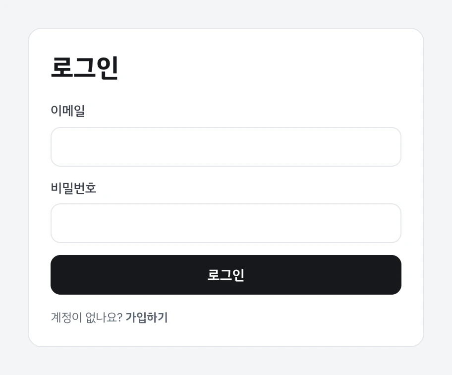

1. **가입하기**에서 이메일과 비밀번호(10자 이상)로 계정을 만듭니다. 이름은 넣지 않아도 됩니다.
2. 처음 들어가면 대시보드에 **시작하기** 안내가 나옵니다. 아래 순서로 준비하면 됩니다.
   1. [포트폴리오](#포트폴리오)에서 맨 위 포트폴리오(예: 순자산)와 그 아래 계좌·전략별 포트폴리오를 만듭니다.
   2. [연동 · 설정](#연동--설정)에서 쓰는 증권사나 코인 거래소의 Open API 키를 연결합니다. 상장 종목 시세를 받으려면 증권사가 하나 이상 연결돼 있어야 합니다.
   3. [보유종목 가져오기](#보유종목-가져오기)로 계좌 보유종목을 한 번에 넣거나, 포트폴리오 화면에서 매수를 직접 기록합니다. 코인은 [코인 거래소 거래내역](#코인-거래소-거래내역)으로 가져옵니다.

## 화면 구성

**추가** [`db77f63`](https://github.com/hgrgr/PPFP/commit/db77f639c3e24f0a4d5affbf259d87e442975f8a) · 2026-10-07 · **바뀜** [`6156d44`](https://github.com/hgrgr/PPFP/commit/6156d44348ee35aa0d5d265030b3856bdc96a79a) (실시간 시세 메뉴), [`c99f35d`](https://github.com/hgrgr/PPFP/commit/c99f35dcc414d1e13afb8b7be55ce11998fc8d2e) (보유종목 가져오기 메뉴), [`72034c5`](https://github.com/hgrgr/PPFP/commit/72034c52db619e96bee37ba344491ab18d96a11b) · 2026-10-08 (매매일지 메뉴), [`69b342e`](https://github.com/hgrgr/PPFP/commit/69b342ed62f0292c09f37f67cb89e73ab555c154) · 2026-10-08 (자산 성질 메뉴), [`64b046f`](https://github.com/hgrgr/PPFP/commit/64b046fac2dd876a95bd627b3ba9ddc71ae44264) · 2026-10-08 (알림 메뉴), [`27b79fc`](https://github.com/hgrgr/PPFP/commit/27b79fc73d98b453b9b4bf395de2e5d553122f73) · 2026-10-08 (투자 노트 메뉴, 빠른 메모 버튼), [`57ab87e`](https://github.com/hgrgr/PPFP/commit/57ab87e100ea61b0a4042020f25cac070cfbe580) · 2026-10-08 (AI 어드바이저 메뉴, AI 버튼), [`3a2ebd2`](https://github.com/hgrgr/PPFP/commit/3a2ebd21e2860482117172ef07010c1f099bf8fa) · 2026-10-08 (성과 분석 메뉴), [`0982906`](https://github.com/hgrgr/PPFP/commit/0982906c172a739ce7c566c9967fe2a8cf63287b) · 2026-10-08 (세금 메뉴), [`0b04f87`](https://github.com/hgrgr/PPFP/commit/0b04f877a18a1867fde5348367db75c2672db4ae) · 2026-10-08 (배당 메뉴), [`c041869`](https://github.com/hgrgr/PPFP/commit/c041869dfa2ed36f5ca355b6317a0b937cdc74d8) · 2026-10-08 (목표 메뉴), [`a4f44eb`](https://github.com/hgrgr/PPFP/commit/a4f44eb11cda0136950ad5a0a7604586aaa6bf51) · 2026-10-09 (*Export* 메뉴가 *가져오기 · 내보내기*로), [`55360b4`](https://github.com/hgrgr/PPFP/commit/55360b464505d2f35d52fa358f82444d6b74ccfe) · 2026-10-10 (보유 자산 메뉴), [`35bd533`](https://github.com/hgrgr/PPFP/commit/35bd5336cda613428453324cc90b2359b7501811) · 2026-10-10 (사용량 · 비용 메뉴, 위쪽 AI 비용 표시)

왼쪽 메뉴에서 화면을 옮겨 다닙니다.

| 메뉴 | 하는 일 |
| --- | --- |
| 대시보드 | 순자산이나 고른 포트폴리오의 평가액, 기간 수익률, 자산 배분, 비중 변화 |
| 성과 분석 | 내 시간가중수익률을 코스피 200·S&P 500·나스닥 100과 비교, 종목·자산 유형별 수익 기여도 |
| 실시간 시세 | 주요 지수, 내 종목 시세판, 실시간 랭킹, 종목별 봉 차트와 호가 |
| 포트폴리오 | 포트폴리오 구조를 만들고 편집, 포트폴리오별 보유 자산과 매수·입출금 기록 |
| 보유 자산 | 가진 종목·자산을 한 목록으로 보고, 담긴 포트폴리오·성질 확인, 다른 포트폴리오로 옮기기·빼기·더 사기·성질 고르기 |
| 보유종목 가져오기 | 증권사 계좌 보유종목, 붙여넣은 잔고 표, 코인 거래소 거래내역 가져오기 |
| 거래 내역 | 모든 거래를 기간·포트폴리오·유형으로 찾아보고 삭제 |
| 세금 | 해외주식 양도소득세 예상, 금융소득 종합과세 기준, 연말 전 절세 후보 |
| 배당 | 받은 배당과 앞으로 12개월 예상 배당, 월별 현금흐름, 배당 달력 |
| 목표 | 목표 금액 달성 확률 시뮬레이션, 리밸런싱 규칙 백테스트 |
| 매매일지 | 거래의 근거와 목표 예상 가격을 기록하고 지금 가격과 비교, 자산 구성 트리, 일지 양식 관리 |
| 자산 성질 | 올웨더 국면·자산군·주식 스타일 같은 성질별 비중을 목표와 비교하고, 부족한 성질에 살 종목 찾기 |
| 알림 | 가격 도달·목표 비중 이탈 알림함, 가격 알림 만들기, 푸시 알림 받을 기기 |
| 투자 노트 | 메모, 독서 노트, 투자 거장의 철학 정리, 이들을 묶는 키워드. 내 종목·자산 성질과 이어서 보기 |
| AI 어드바이저 | 포트폴리오 매니저·투자 거장 관점 에이전트와 대화. 점검·리밸런싱·리서치, 메모·알림·목표 비중 제안 |
| 가져오기 · 내보내기 | 포트폴리오·거래 내역·매매일지·투자 노트를 파일로 내보내고 같은 형식으로 가져오기, 형식 안내와 샘플 파일, 보유·Lot·실현손익·스냅샷 보고서 |
| 사용량 · 비용 | 이번 달 AI 비용과 한도, 모델·에이전트별 비용, 외부 API 호출 수와 남은 한도 |
| 연동 · 설정 | 증권사·거래소 연결, AI 어드바이저 키·사용 한도, 상승/하락 색, 과거 기록 다시 계산 |

*알림* 옆 빨간 숫자는 아직 읽지 않은 알림 수입니다. AI 키를 넣었으면 화면 오른쪽 위에 **✦ AI 이번 달 $0.32 / $20.00**처럼 이번 달 AI 비용과 월 한도가 작게 보입니다(누르면 [사용량 · 비용](#사용량--비용)). 메뉴 아래쪽에는 연결 상태(몇 곳 연결됨, 마지막 확인 시각, 오류가 난 연결)와 로그아웃 버튼이 있습니다. 화면 오른쪽 아래의 **✦ AI**는 [AI 어드바이저](#ai-어드바이저) 창(Alt+K), **✎ 메모**는 [빠른 메모](#빠른-메모)(Alt+M)를 엽니다.

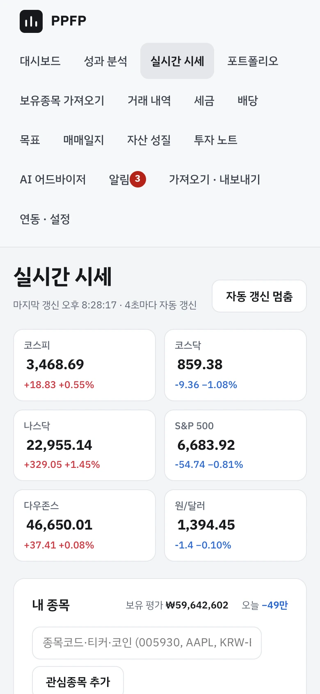

**휴대폰에서 쓰기** — 화면이 좁으면 메뉴가 위쪽으로 올라가고 카드가 한 줄씩 쌓입니다. 브라우저의 *홈 화면에 추가*로 설치하면 앱처럼 쓸 수 있습니다(PWA). 시스템이 다크 모드면 화면도 어둡게 바뀝니다([대시보드](#대시보드) 참고).

<br clear="right">

## 대시보드

**추가** [`db77f63`](https://github.com/hgrgr/PPFP/commit/db77f639c3e24f0a4d5affbf259d87e442975f8a) · 2026-10-07 · **바뀜** [`656324d`](https://github.com/hgrgr/PPFP/commit/656324dd40947d9ed67ecb30dc3c44906eac736b) · 2026-10-07 (자산 배분에 종목별 비중 추가), [`72034c5`](https://github.com/hgrgr/PPFP/commit/72034c52db619e96bee37ba344491ab18d96a11b) · 2026-10-08 (원형 차트와 보유 종목에서 그 종목의 매매일지 보기), [`69b342e`](https://github.com/hgrgr/PPFP/commit/69b342ed62f0292c09f37f67cb89e73ab555c154) · 2026-10-08 (자산 배분의 *성질* 기준), [`57ab87e`](https://github.com/hgrgr/PPFP/commit/57ab87e100ea61b0a4042020f25cac070cfbe580) · 2026-10-08 (*✦ AI 점검* 버튼), [`dbadaae`](https://github.com/hgrgr/PPFP/commit/dbadaae2e82e105c20e4ebc481ab326d4c18e772) · 2026-10-10 (자산 배분 *구성* 기준이 기본), [`35bd533`](https://github.com/hgrgr/PPFP/commit/35bd5336cda613428453324cc90b2359b7501811) · 2026-10-10 (*₩ 원화 · $ 현지 통화*)

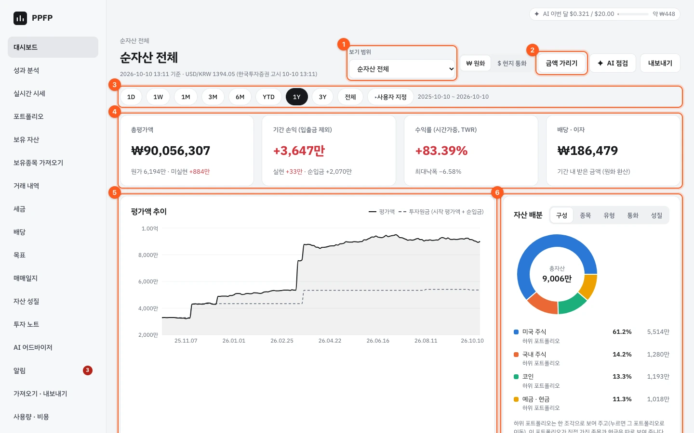

- ① **보기 범위** — 순자산 전체 또는 특정 포트폴리오를 고릅니다. 포트폴리오를 고르면 그 하위 포트폴리오까지 할당 비율만큼 합쳐서 보여 줍니다.
- ② **금액 가리기** — 금액을 가립니다. 왼쪽의 **₩ 원화 · $ 현지 통화**는 해외 자산 금액을 무슨 통화로 볼지 고릅니다([아래](#해외-자산을-현지-통화로-보기)). 화면을 다른 사람에게 보여 줄 때 씁니다. 설정은 브라우저에 기억됩니다. 옆의 **✦ AI 점검**은 지금 보기 범위의 포트폴리오 점검을 [AI 어드바이저](#ai-어드바이저)에게 바로 물어봅니다.
- ③ **기간 선택** — 1D·1W·1M·3M·6M·YTD·1Y·3Y·전체, 또는 *사용자 지정*으로 시작일·종료일을 고릅니다. 고른 기간이 화면의 모든 숫자와 차트에 똑같이 적용되고 주소(URL)에도 남습니다.
- ④ **요약**
  - *총평가액*: 지금 시세로 평가한 금액입니다. 원가와 미실현 손익이 함께 나옵니다.
  - *기간 손익*: 입금·출금을 빼고 계산한 기간 손익입니다. 실현 손익과 순입금이 함께 나옵니다.
  - *수익률 (TWR)*: 시간가중 수익률로, 돈을 넣고 뺀 시점의 영향을 없앤 수익률입니다. 최대낙폭도 함께 나옵니다.
  - *배당 · 이자*: 기간 안에 받은 금액을 원화로 환산한 값입니다.
- ⑤ **평가액 추이** — 실선은 평가액, 점선은 투자원금(시작 평가액 + 순입금)입니다. 두 선의 차이가 손익입니다.
- ⑥ **자산 배분** — *구성*(기본), *종목*, *유형*, *통화*, *성질* 기준으로 비중을 봅니다([구성](#구성-기준-자산-배분), [성질별 배분](#성질별-배분)). *구성*은 지금 보는 포트폴리오가 실제로 가진 것, 곧 하위 포트폴리오(한 조각씩)와 직접 가진 종목·현금을 보여 줍니다. *종목*은 하위 포트폴리오 속 종목까지 모두 펼치고, 여러 포트폴리오에 나눠 담은 같은 종목을 하나로 합칩니다. 매매일지가 있는 종목에는 *일지 n* 표시가 붙고, 종목 조각이나 범례를 누르면 그 종목의 매매일지가 나옵니다([아래](#대시보드에서-매매일지-보기)). 부채는 배분에서 빼고 총평가액에서는 차감합니다.

화면은 30초마다 새 시세로 다시 계산됩니다. 일부 종목 시세를 받지 못하면 제목 아래에 *일부 시세 지연*이 표시됩니다.

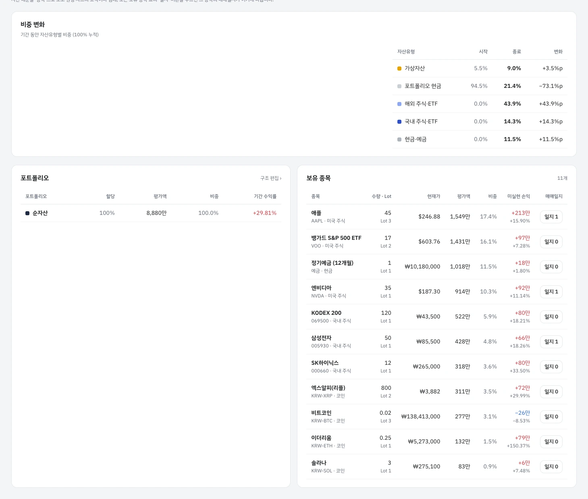

- **비중 변화** — 기간 동안 자산 유형별 비중이 어떻게 바뀌었는지 100% 누적 그래프와 시작·종료 비교표로 보여 줍니다.
- **포트폴리오 / 하위 포트폴리오** — 보기 범위 아래 포트폴리오의 할당 비율, 평가액, 비중, 기간 수익률입니다. 이름을 누르면 그 포트폴리오로 범위가 바뀝니다.
- **보유 종목** — 수량과 Lot 수, 현재가, 평가액, 비중, 미실현 손익입니다. 종목 이름을 누르면 [종목 화면](#종목-화면--lot-매도)으로 갑니다. 맨 오른쪽 **일지 n** 버튼은 그 종목의 매매일지를 엽니다.

> **과거 기록 계산** — 기간 분석은 하루 단위 기록(스냅샷)으로 계산합니다. 처음 자산을 넣은 직후에는 *과거 기록 계산* 버튼이 나옵니다. 누르면 연결된 증권사에서 과거 종가를 받아 첫 거래일부터 기록을 만듭니다. 스냅샷은 평일 기준이라 코인의 주말 가격 변동은 다음 평일 기록에 반영됩니다.

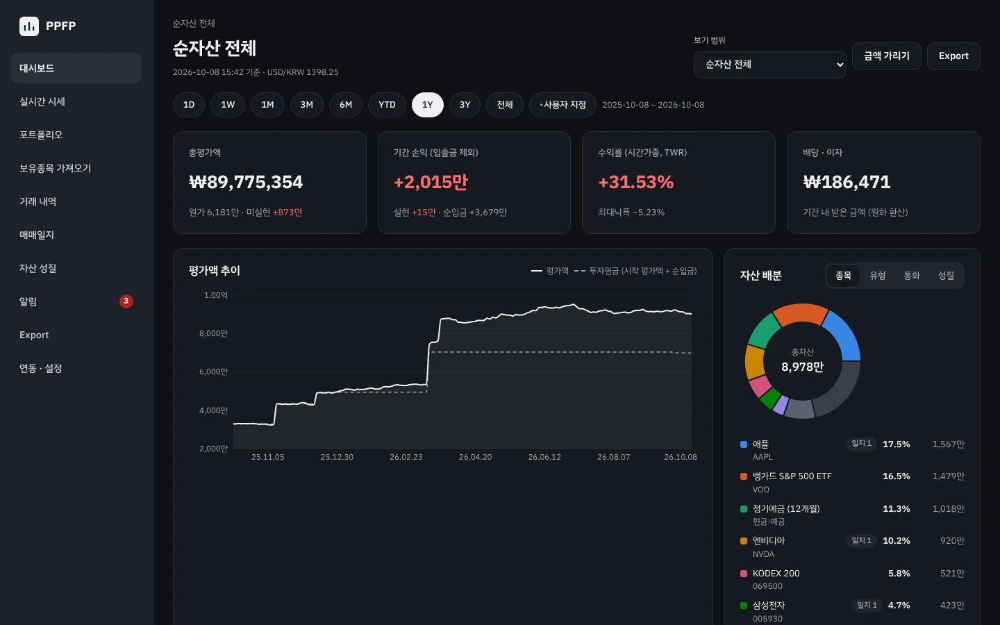

**다크 모드** — 운영체제나 브라우저가 다크 모드면 자동으로 어두운 화면으로 바뀝니다. 따로 바꾸는 버튼은 없습니다.

### 해외 자산을 현지 통화로 보기

**추가** [`35bd533`](https://github.com/hgrgr/PPFP/commit/35bd5336cda613428453324cc90b2359b7501811) · 2026-10-10

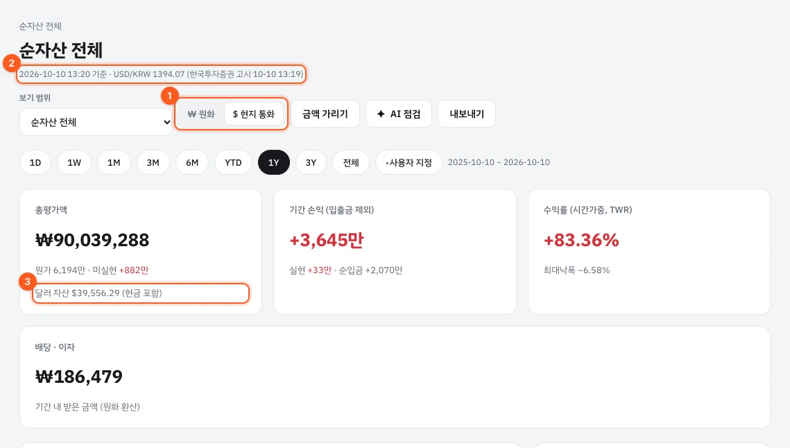

- ① **₩ 원화 · $ 현지 통화** — *$ 현지 통화*를 고르면 해외 자산의 평가액과 손익을 그 자산의 통화(달러)로 먼저 보여 주고, 원화 금액은 그 아래 작게 보여 줍니다. 고른 값은 계정에 저장되어 대시보드·[성과 분석](#성과-분석)·[포트폴리오 화면](#포트폴리오-화면)·[보유 자산](#보유-자산)에 똑같이 쓰입니다.
- ② **기준 환율** — 달러 금액은 가장 최근에 공시된 환율로 바꾼 값입니다. 연결된 증권사가 알려 주는 환율을 먼저 쓰고(예: *한국투자증권 고시 10-10 13:18*), 받지 못하면 저장된 일별 환율을 씁니다. 어느 환율인지와 그 시각이 제목 아래에 나옵니다.
- ③ **달러 자산** — 총평가액 카드에 달러로 가진 자산(달러 현금 포함)의 합계가 나옵니다.

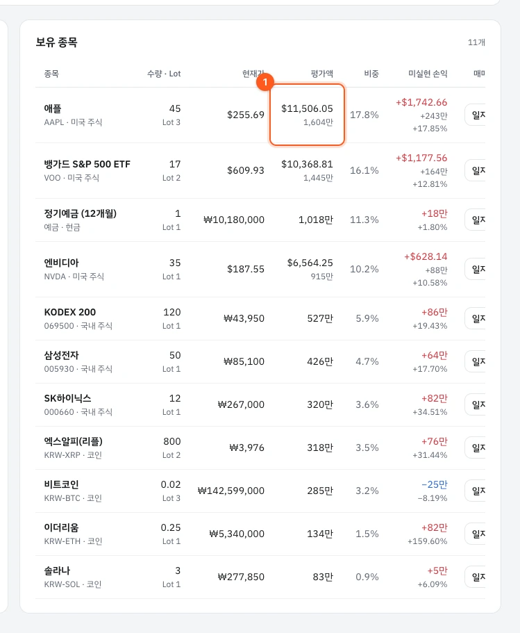

보유 종목 표에서 해외 종목의 평가액과 미실현 손익이 달러로 나옵니다(①). 평가액은 수량 × 현재가와 같습니다. 손익은 원화 손익을 지금 환율로 바꾼 값이라, 산 뒤의 환율 변화도 들어 있습니다. 국내 자산과 합계·차트는 원화 그대로입니다.

### 구성 기준 자산 배분

**추가** [`dbadaae`](https://github.com/hgrgr/PPFP/commit/dbadaae2e82e105c20e4ebc481ab326d4c18e772) · 2026-10-10

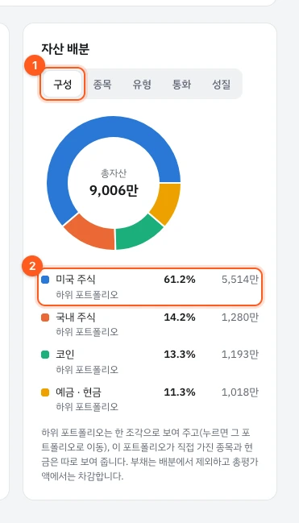

- ① **구성** — 자산 배분의 기본 기준입니다. 보고 있는 포트폴리오가 실제로 가진 것을 가격 비율로 나눕니다. 하위 포트폴리오는 안의 종목을 펼치지 않고 한 조각(할당 비율만큼)으로, 이 포트폴리오에 직접 담긴 종목과 포트폴리오 현금은 각각 따로 보여 줍니다.
- ② **하위 포트폴리오** — 조각이나 범례를 누르면 그 포트폴리오의 대시보드로 이동합니다. 거기서도 자산 배분은 같은 방식으로, 그 포트폴리오의 하위 포트폴리오와 직접 가진 종목을 보여 줍니다. 종목 조각을 누르면 매매일지가 나옵니다.

*순자산 전체*에서는 맨 위 포트폴리오들의 비중을 보여 주고, 맨 위 포트폴리오가 하나뿐이면 그 포트폴리오의 구성을 보여 줍니다. 하위 포트폴리오 속 종목까지 한눈에 보려면 *종목* 기준을 고르세요.

### 성질별 배분

**추가** [`69b342e`](https://github.com/hgrgr/PPFP/commit/69b342ed62f0292c09f37f67cb89e73ab555c154) · 2026-10-08

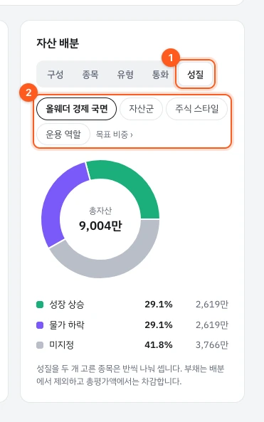

- ① 자산 배분에서 **성질**을 누르면 [자산 성질](#자산-성질)에서 만든 분류 기준으로 원형 차트를 그립니다. 분류가 하나도 없으면 자산 성질 화면으로 갑니다.
- ② 아래 칩으로 분류(올웨더 경제 국면, 자산군, 주식 스타일 …)를 바꿉니다. 목표 비중을 정한 성질은 범례에 *목표 n%*가 함께 나오고, **목표 비중 ›**은 그 분류의 자산 성질 화면을 엽니다. 보기 범위(포트폴리오)를 바꾸면 그 범위 안의 종목만으로 계산합니다.

### 대시보드에서 매매일지 보기

**추가** [`72034c5`](https://github.com/hgrgr/PPFP/commit/72034c52db619e96bee37ba344491ab18d96a11b) · 2026-10-08

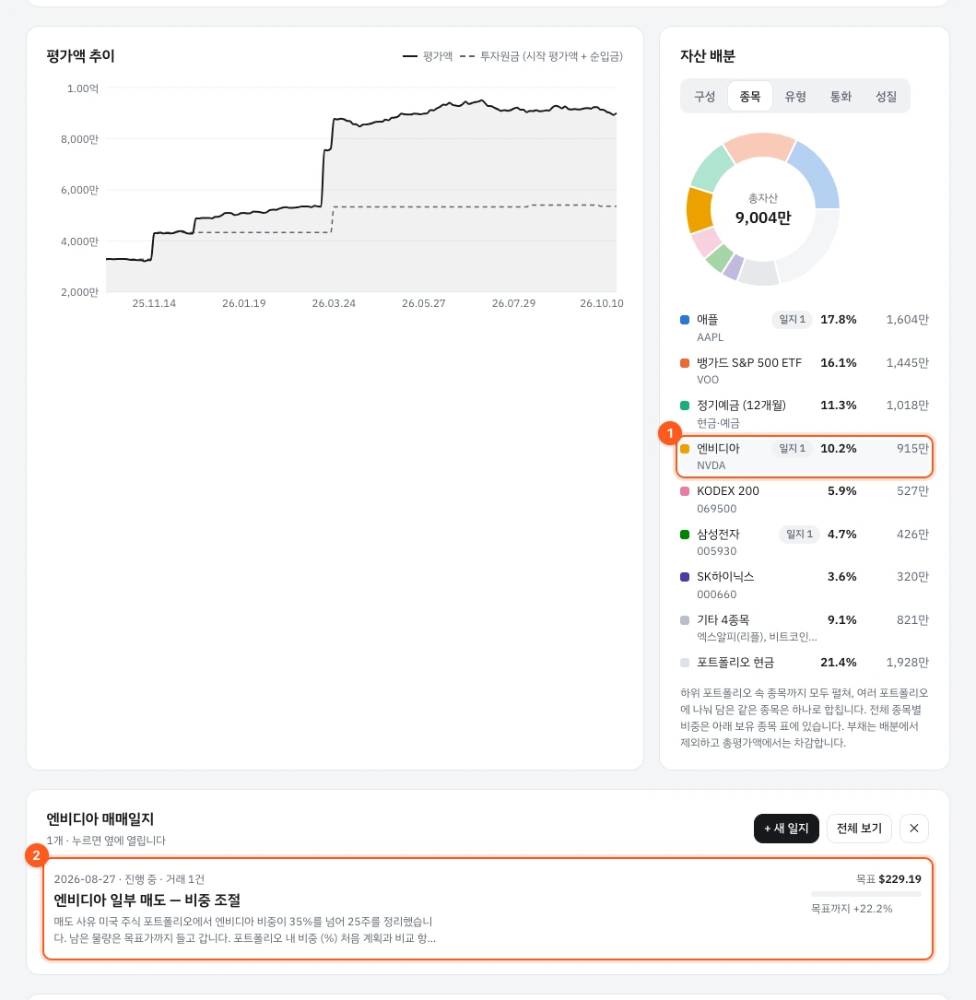

- ① 자산 배분을 *종목* 기준으로 두고 원형 차트의 조각이나 범례 줄을 누릅니다(*구성* 기준에서는 직접 가진 종목 조각을 누릅니다). 보유 종목 표의 **일지 n** 버튼을 눌러도 됩니다. *기타 n종목*과 *포트폴리오 현금*은 고를 수 없습니다.
- ② 그 종목의 매매일지가 최신순으로 나옵니다. 줄마다 작성일, 상태, 연결된 거래 수, 본문 앞부분, 목표 예상 가격과 목표까지 남은 등락률이 보입니다. **+ 새 일지**는 이 종목으로 새 일지를 시작하고, **전체 보기**는 [매매일지](#매매일지) 목록을 이 종목으로 걸러서 엽니다. 같은 종목을 다시 누르거나 **✕**를 누르면 닫힙니다.

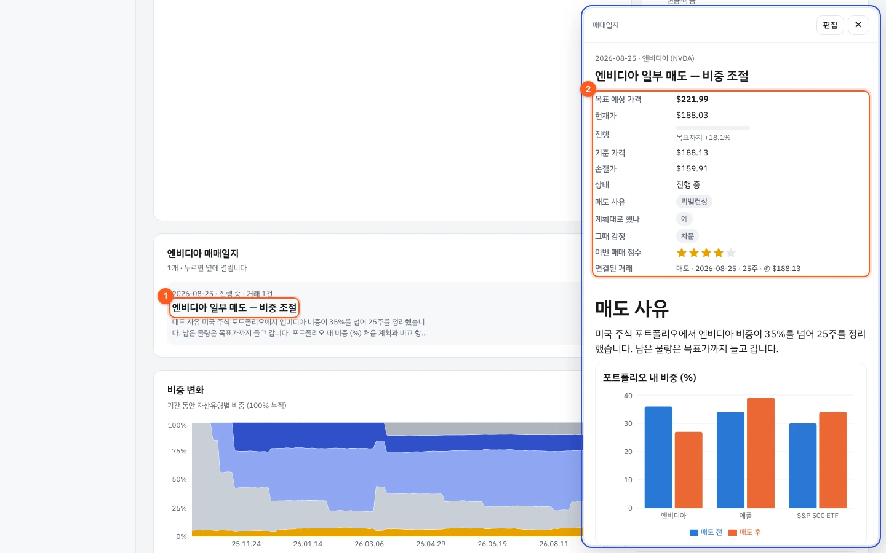

- ① 목록에서 일지를 누르면 화면 오른쪽에 작은 창이 겹쳐 열립니다. 대시보드를 떠나지 않고 내용을 확인할 수 있습니다.
- ② 목표 예상 가격, 현재가, 진행 막대, 기준 가격·손절가, 양식의 속성 값, 연결된 거래가 위에 나오고 그 아래 본문(표·그래프·이미지 포함)이 이어집니다. 이 창에서는 고칠 수 없습니다. 고치려면 **편집**을 누릅니다. **Esc**나 **✕**로 닫습니다.

## 성과 분석

**추가** [`3a2ebd2`](https://github.com/hgrgr/PPFP/commit/3a2ebd21e2860482117172ef07010c1f099bf8fa) · 2026-10-08 · **바뀜** [`35bd533`](https://github.com/hgrgr/PPFP/commit/35bd5336cda613428453324cc90b2359b7501811) · 2026-10-10 (통화 고르기가 위쪽 *₩ 원화 · $ 현지 통화*로)

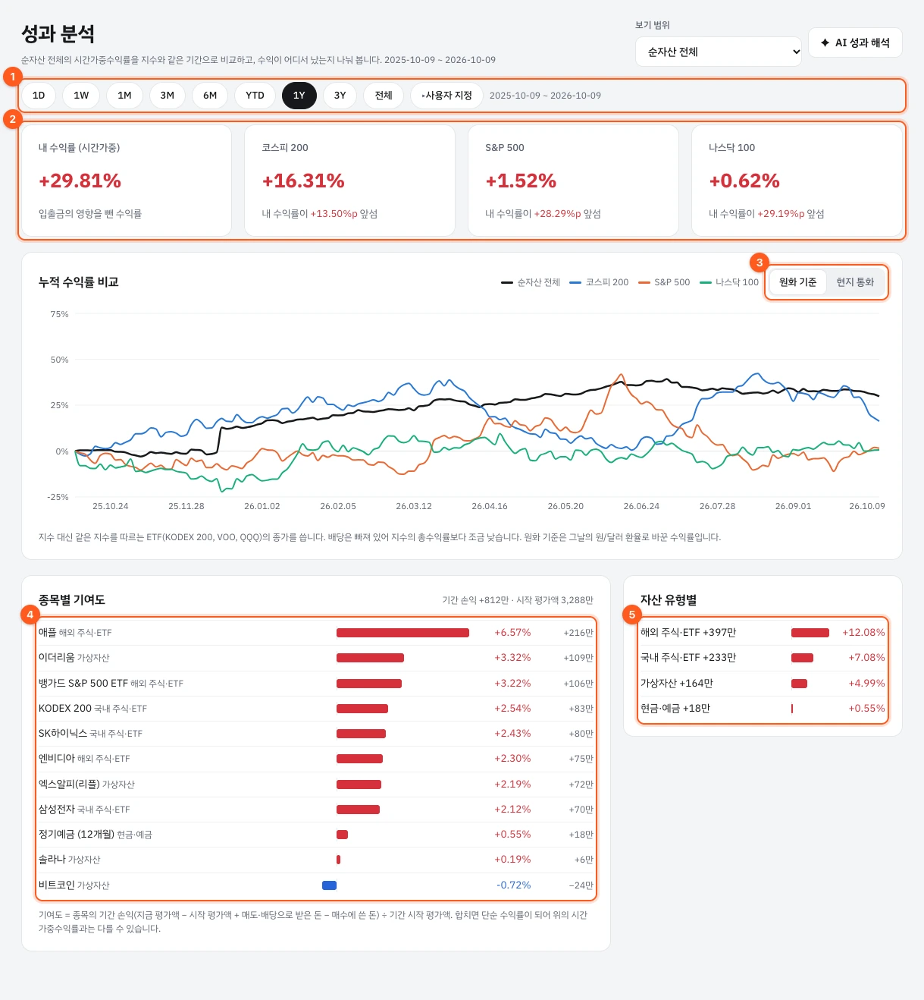

순자산이나 고른 포트폴리오의 수익률을 시장 지수와 같은 기간으로 비교하고, 수익이 어느 종목에서 났는지 나눠 봅니다. 오른쪽 위 **보기 범위**로 포트폴리오를 고릅니다.

- ① **기간** — 대시보드와 같은 기간 선택입니다.
- ② **수익률 비교** — 내 시간가중수익률(입출금의 영향을 뺀 수익률)과 코스피 200·S&P 500·나스닥 100의 같은 기간 수익률, 그리고 내가 몇 %p 앞서거나 뒤처졌는지입니다.
- ③ **₩ 원화 · $ 현지 통화** — 원화로 보면 해외 지수를 그날의 원/달러 환율로 바꾼 수익률이라 원화로 투자한 내 수익률과 바로 비교됩니다. 현지 통화로 보면 환율 효과를 뺀 지수 자체의 수익률이 나오고, 종목별 기여도에서 해외 종목의 손익도 달러로 나옵니다. 대시보드와 같은 설정입니다([현지 통화로 보기](#해외-자산을-현지-통화로-보기)).
- ④ **종목별 기여도** — 종목의 기간 손익(지금 평가액 − 시작 평가액 + 매도·배당으로 받은 돈 − 매수에 쓴 돈)을 기간 시작 평가액으로 나눈 값입니다. 막대는 오른쪽이 이익, 왼쪽이 손실입니다. 다 더하면 단순 수익률이라 ②의 시간가중수익률과는 다를 수 있습니다.
- ⑤ **자산 유형별** — 같은 기여도를 국내 주식·해외 주식·가상자산 등으로 묶은 것입니다.

지수는 같은 지수를 따르는 ETF(KODEX 200, VOO, QQQ)의 종가로 대신하며 배당은 빠져 있습니다. 처음 열 때 연결된 증권사에서 ETF 시세를 받아 저장합니다. **✦ AI 성과 해석**은 이 결과를 [AI 어드바이저](#ai-어드바이저)가 풀어 설명하게 합니다.

## 포트폴리오

**추가** [`db77f63`](https://github.com/hgrgr/PPFP/commit/db77f639c3e24f0a4d5affbf259d87e442975f8a) · 2026-10-07 · **바뀜** [`64b046f`](https://github.com/hgrgr/PPFP/commit/64b046fac2dd876a95bd627b3ba9ddc71ae44264) · 2026-10-08 (목표 비중과 이탈 알림)

### 구조 만들기

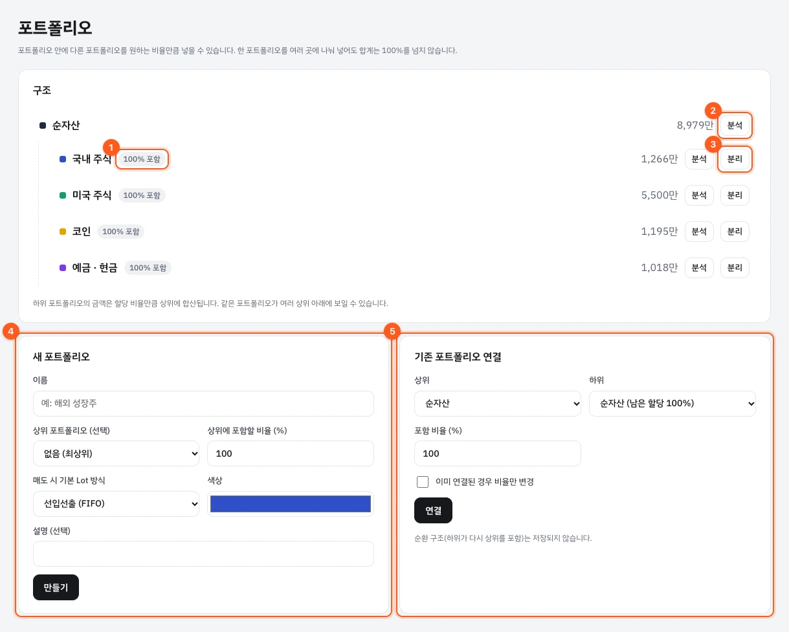

포트폴리오 안에 다른 포트폴리오를 원하는 비율만큼 넣을 수 있습니다. 예를 들어 *순자산* 아래에 *국내 주식*, *미국 주식*, *코인*을 100%씩 넣으면 순자산 금액이 세 포트폴리오의 합이 됩니다.

- ① **포함 비율** — 하위 포트폴리오가 상위에 몇 % 합산되는지 보여 줍니다. 한 포트폴리오를 여러 상위에 나눠 넣을 수 있지만 합계는 100%를 넘지 못합니다. 남은 비율이 있으면 *미배정* 배지가 붙습니다.
- ② **분석** — 그 포트폴리오를 범위로 한 대시보드를 엽니다.
- ③ **분리** — 상위와의 연결만 끊습니다. 포트폴리오 자체는 지워지지 않습니다.
- ④ **새 포트폴리오** — 이름, 상위 포트폴리오와 포함 비율, 매도할 때 기본으로 쓸 Lot 방식, 색상을 정해 만듭니다.
- ⑤ **기존 포트폴리오 연결** — 이미 있는 두 포트폴리오를 상위·하위로 잇거나, *이미 연결된 경우 비율만 변경*을 켜고 비율을 고칩니다. 하위가 다시 상위를 포함하는 순환 구조는 저장되지 않습니다.

### 포트폴리오 화면

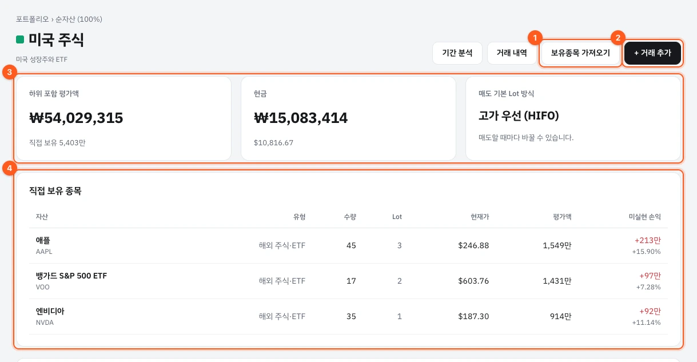

포트폴리오 이름을 누르면 열립니다.

- ① **보유종목 가져오기** — 이 포트폴리오를 기본 대상으로 [보유종목 가져오기](#보유종목-가져오기)를 엽니다.
- ② **+ 거래 추가** — 아래쪽 매수·입출금 입력으로 이동합니다.
- ③ **요약** — 하위 포함 평가액(직접 보유분 별도 표시), 포트폴리오 현금(통화별), 매도 기본 Lot 방식입니다.
- ④ **직접 보유 종목** — 이 포트폴리오에 직접 담긴 자산입니다. 이름을 누르면 종목 화면으로 갑니다. 위쪽 *$ 현지 통화*를 고르면 해외 종목의 평가액과 손익이 달러로 나옵니다([현지 통화로 보기](#해외-자산을-현지-통화로-보기)).
- ⑤ **제거** — 그 종목을 이 포트폴리오에서 처음부터 없던 것처럼 뺍니다. 그 종목의 거래(매수·매도·배당·평가 갱신·분할)와 Lot이 모두 지워지고, 그 거래로 늘거나 줄었던 포트폴리오 현금도 되돌아가며, 지난 일별 기록도 다시 계산됩니다. 몇 건이 지워지는지 확인 창에 나옵니다. 매매일지는 남고, 지운 거래는 감사 로그에 남습니다. [`a851703`](https://github.com/hgrgr/PPFP/commit/a85170376aafaf77686442b37824da8b2ab4c67e) · 2026-10-10에 추가되었습니다. 이전에는 거래 내역에서 매도부터 하나씩 지워야 했습니다. 종목을 팔았다고 기록하려면 제거 대신 종목 화면에서 매도를 입력하세요.

### 목표 비중 · 리밸런싱 알림

**추가** [`64b046f`](https://github.com/hgrgr/PPFP/commit/64b046fac2dd876a95bd627b3ba9ddc71ae44264) · 2026-10-08 · **바뀜** [`57ab87e`](https://github.com/hgrgr/PPFP/commit/57ab87e100ea61b0a4042020f25cac070cfbe580) · 2026-10-08 (*✦ AI 리밸런싱 제안* 버튼)

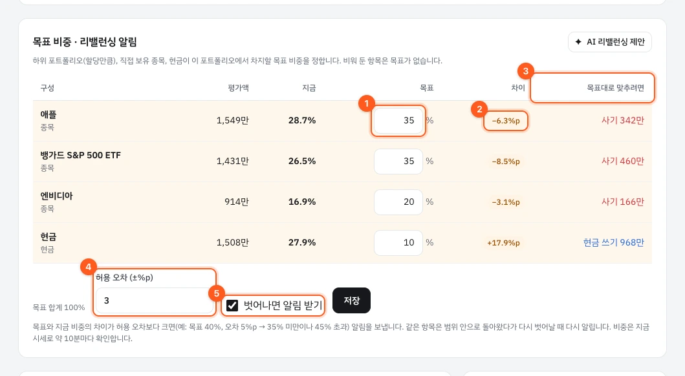

포트폴리오 화면의 *목표 비중 · 리밸런싱 알림* 카드에서 이 포트폴리오를 어떤 비율로 유지할지 정합니다. 항목은 하위 포트폴리오(할당 비율만큼), 이 포트폴리오에 직접 담긴 종목, 현금입니다. 예를 들어 맨 위 *순자산*에서는 국내 주식 25 · 미국 주식 45 · 코인 5 · 예금 25처럼, *미국 주식*에서는 애플 35 · S&P 500 ETF 35 · 엔비디아 20 · 현금 10처럼 정합니다. 카드 오른쪽 위 **✦ AI 리밸런싱 제안**을 누르면 [AI 어드바이저](#ai-어드바이저)가 지금 비중과 목표를 비교해 맞추는 방법이나 목표 비중 자체를 제안합니다. 제안한 목표 비중은 확인 카드에서 **실행**해야 저장됩니다.

- ① **목표** — 항목마다 %로 적습니다. 비워 둔 항목은 목표가 없고 알림도 보내지 않습니다. 합계는 100%를 넘을 수 없고, 100%보다 적으면 나머지는 목표 없이 둡니다. 지금 갖고 있지 않은 종목에 목표를 걸어 두면 0%에서 시작합니다.
- ② **차이** — 지금 비중 − 목표입니다. 허용 오차를 넘은 줄은 노랗게 칠해지고 차이가 강조됩니다.
- ③ **목표대로 맞추려면** — 지금 평가액 기준으로 목표 비중이 되려면 얼마를 사거나 팔아야 하는지(현금은 늘리거나 써야 하는지) 보여 줍니다. 다른 항목은 그대로 둔다고 보고 계산한 대략의 금액입니다.
- ④ **허용 오차 (±%p)** — 목표에서 몇 %p까지는 괜찮다고 볼지 정합니다. 예: 목표 40%, 오차 5%p면 35% 이상 45% 이하는 정상입니다. 0.1~50%p 사이로 정할 수 있고 기본값은 5%p입니다.
- ⑤ **벗어나면 알림 받기** — 켜 두면 서버가 약 10분마다 지금 시세로 비중을 계산해, 어느 항목이든 허용 오차를 넘으면 [알림](#알림)을 보냅니다. 같은 항목은 범위 안으로 돌아왔다가 다시 벗어날 때 다시 알립니다. 목표나 오차를 바꿔 저장하면 처음부터 다시 셉니다.

**저장**을 눌러야 반영됩니다. 부채는 비중 계산에서 뺍니다.

### 매수 · 입출금 기록

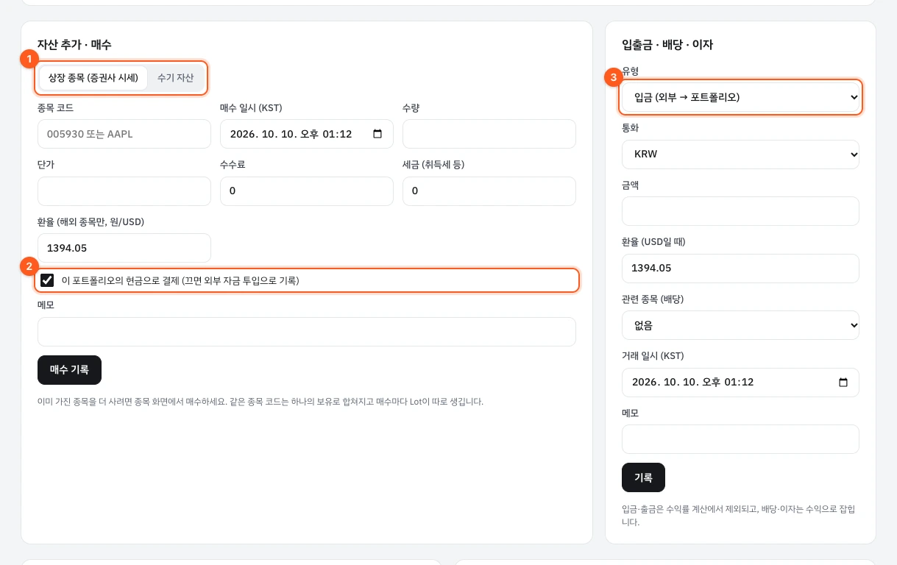

- ① **자산 종류** — *상장 종목*은 종목코드(예: `005930`, `AAPL`)를 넣으면 연결된 증권사에서 이름과 시세를 찾습니다. *수기 자산*은 부동산·현금·예금·채권·펀드·대안자산·부채처럼 시세가 자동으로 들어오지 않는 자산을 이름과 통화로 등록합니다.
- 매수 일시, 수량, 단가, 수수료, 세금, (해외 종목이면) 환율을 넣고 **매수 기록**을 누릅니다. 매수할 때마다 Lot이 하나씩 생기고, Lot 단가에는 매수 수수료와 세금이 포함됩니다.
- ② **이 포트폴리오의 현금으로 결제** — 켜면 포트폴리오 현금에서 돈이 빠집니다. 끄면 밖에서 돈을 넣어 산 것으로 기록되어 수익률 계산에서 입금으로 처리됩니다.
- ③ **입출금 · 배당 · 이자** — 입금·출금·배당·이자·수수료·세금을 원화나 달러로 기록합니다. 입금·출금은 수익률에서 빠지고 배당·이자는 수익으로 잡힙니다. 배당은 관련 종목을 고를 수 있습니다.

화면 맨 아래에서 하위 포트폴리오 비율 변경, 이름·색상·기본 Lot 방식 변경, 보관과 삭제를 할 수 있습니다. 거래나 하위 포트폴리오가 있는 포트폴리오는 삭제할 수 없으니 대신 *보관*하세요.

## 보유 자산

**추가** [`55360b4`](https://github.com/hgrgr/PPFP/commit/55360b464505d2f35d52fa358f82444d6b74ccfe) · 2026-10-10

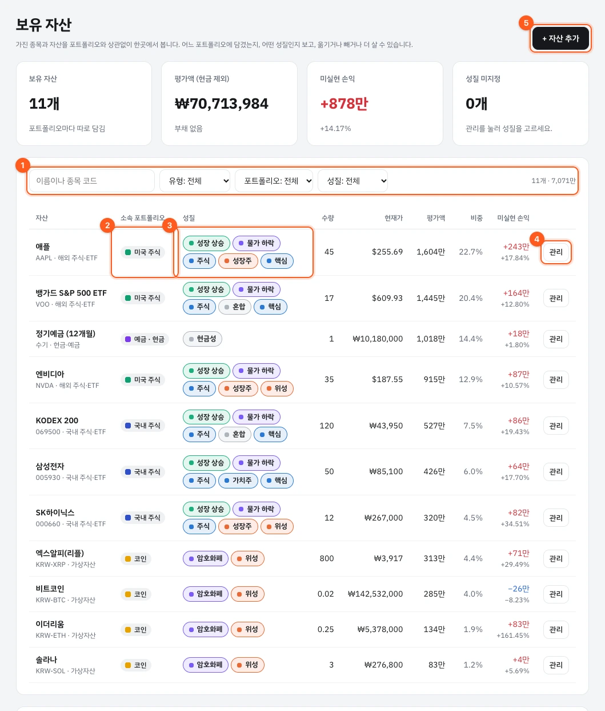

가진 종목과 자산을 포트폴리오와 상관없이 한 목록으로 봅니다. 여러 포트폴리오에 나눠 담은 같은 종목은 한 줄로 합쳐 보여 줍니다. 위쪽 카드에는 자산 수, 현금을 뺀 평가액, 미실현 손익, 성질을 아직 고르지 않은 자산 수가 나옵니다.

- ① **찾기** — 이름이나 종목 코드로 찾고, 유형·포트폴리오·성질로 거릅니다. *성질 미지정*을 고르면 아직 분류하지 않은 자산만 남습니다. 오른쪽 끝에 걸러진 자산 수와 평가액 합계가 나옵니다.
- ② **소속 포트폴리오** — 이 자산이 담긴 포트폴리오입니다. 누르면 그 포트폴리오의 [종목 화면](#종목-화면--lot-매도)으로 갑니다.
- ③ **성질** — [자산 성질](#자산-성질)에서 붙인 성질(성장주, 우량 대형주, 핵심 등)입니다. 분류가 여럿이면 모두 함께 보입니다.
- ④ **관리** — 아래 [옮기기 · 빼기 · 더 사기](#옮기기--빼기--더-사기)를 엽니다. 자산 이름을 눌러도 열립니다.
- ⑤ **+ 자산 추가** — 맨 아래 *자산 추가 · 매수*로 갑니다. 포트폴리오 화면의 [매수 기록](#매수--입출금-기록)과 같고, 담을 포트폴리오를 여기서 고릅니다.

비중은 부채를 뺀 보유 자산 합계에 대한 비율입니다. 포트폴리오 현금은 이 목록에 들어가지 않습니다. 위쪽 *$ 현지 통화*를 고르면 해외 자산의 평가액과 손익이 달러로 나오고, 제목 아래에 기준 환율이 나옵니다([현지 통화로 보기](#해외-자산을-현지-통화로-보기)).

### 옮기기 · 빼기 · 더 사기

**추가** [`55360b4`](https://github.com/hgrgr/PPFP/commit/55360b464505d2f35d52fa358f82444d6b74ccfe) · 2026-10-10

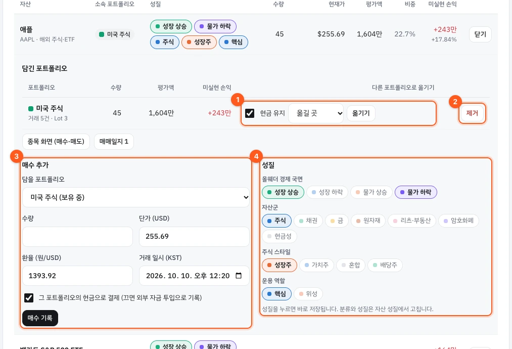

*관리*를 누르면 그 자산이 담긴 포트폴리오마다 수량·평가액·손익과 거래·Lot 수가 나옵니다.

- ① **옮기기** — 옮길 포트폴리오를 고르고 *옮기기*를 누릅니다. 거래(매수·매도·배당·평가 갱신)와 Lot이 모두 그쪽으로 옮겨 가서, 처음부터 그 포트폴리오에서 산 것처럼 됩니다. 매수일과 취득 단가는 그대로라 세금 계산도 바뀌지 않습니다. 옮길 포트폴리오에 같은 종목이 이미 있으면 하나로 합칩니다. 다만 어느 한쪽에 분할·병합 기록이 있으면 합치지 않습니다.
  - **현금 유지**(기본으로 켜짐) — 매매 대금만큼 현금을 원래 포트폴리오에서 출금하고 옮겨 간 포트폴리오에 입금으로 기록합니다. 그래서 두 포트폴리오의 지금 현금은 바뀌지 않습니다. 끄면 거래의 현금 기록만 따라갑니다. 이 경우 원래 포트폴리오의 현금은 매수 대금만큼 늘고, 옮겨 간 곳의 현금은 줄어서 마이너스가 될 수 있습니다. 마이너스가 되면 결과 메시지에서 알려 줍니다.
  - 증권사·거래소에서 가져온 거래가 있는 종목은 다음 동기화 때 원래 포트폴리오에 다시 들어올 수 있습니다. 확인 창에서 이것도 알려 줍니다.
- ② **제거** — 그 포트폴리오에서 종목을 처음부터 없던 것처럼 뺍니다. 포트폴리오 화면의 [제거](#포트폴리오-화면)와 같습니다. 여러 포트폴리오에 담긴 자산은 *모든 포트폴리오에서 빼기*로 한 번에 뺄 수 있습니다.
- ③ **매수 추가** — 이 자산을 더 삽니다. 담을 포트폴리오를 고르면 아직 없는 포트폴리오에도 담을 수 있습니다. 단가에는 지금 가격이, 환율에는 오늘 환율이 미리 들어갑니다.
- ④ **성질** — 분류마다 성질을 누르면 바로 저장됩니다. 분류와 성질 목록은 [자산 성질](#자산-성질)에서 만들고 고칩니다. 분류가 하나도 없으면 *자산 성질*로 가는 안내가 나옵니다.

옮기기와 빼기는 지난 일별 기록을 첫 거래일부터 다시 계산하고, 감사 로그에 남습니다. 결과는 화면 아래 알림으로 나옵니다. *종목 화면 (매수·매도)*으로 매도나 Lot 선택을, *매매일지*로 이 자산의 일지를 봅니다.

## 종목 화면 · Lot 매도

**추가** [`db77f63`](https://github.com/hgrgr/PPFP/commit/db77f639c3e24f0a4d5affbf259d87e442975f8a) · 2026-10-07 · **바뀜** [`72034c5`](https://github.com/hgrgr/PPFP/commit/72034c52db619e96bee37ba344491ab18d96a11b) · 2026-10-08 (매매일지 목록, 거래마다 일지 쓰기), [`27b79fc`](https://github.com/hgrgr/PPFP/commit/27b79fc73d98b453b9b4bf395de2e5d553122f73) · 2026-10-08 (관련 투자 거장 · 책 · 메모), [`57ab87e`](https://github.com/hgrgr/PPFP/commit/57ab87e100ea61b0a4042020f25cac070cfbe580) · 2026-10-08 (*✦ AI에게 이 종목 묻기*), [`8244851`](https://github.com/hgrgr/PPFP/commit/8244851e3bbfc944781ac46217a8209b4a602523) · 2026-10-08 (*✦ AI 리서치*), [`a851703`](https://github.com/hgrgr/PPFP/commit/a85170376aafaf77686442b37824da8b2ab4c67e) · 2026-10-10 (*종목 빼기*), [`55360b4`](https://github.com/hgrgr/PPFP/commit/55360b464505d2f35d52fa358f82444d6b74ccfe) · 2026-10-10 (*다른 포트폴리오로 옮기기*)

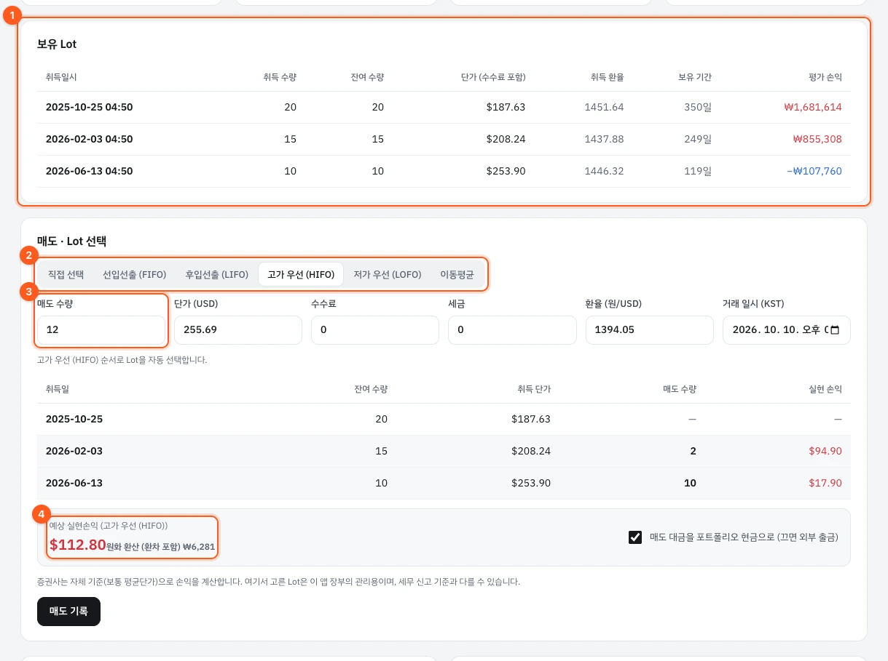

대시보드나 포트폴리오에서 종목 이름을 누르면 열립니다. 맨 위에 현재가, 보유 수량과 평균단가, 원화 평가액, 누적 실현손익이 나옵니다. 제목 옆 **✦ AI 리서치**는 이 종목의 [리서치 리포트](#리서치-애널리스트)를, **✦ AI에게 이 종목 묻기**는 이 종목의 보유 상황, 일지 목표가 대비 위치, 최근 소식, 연결한 투자 철학을 [AI 어드바이저](#ai-어드바이저)에게 한 번에 물어봅니다.

- ① **보유 Lot** — 매수마다 생긴 Lot의 취득일시, 취득·잔여 수량, 단가(수수료 포함), 취득 환율, 보유 기간, 평가 손익입니다.
- ② **Lot 선택 방식** — 이번 매도에서 어느 Lot을 먼저 팔지 고릅니다. 기본값은 포트폴리오에 정한 방식입니다.

  | 방식 | 먼저 파는 Lot |
  | --- | --- |
  | 직접 선택 | 표에서 Lot마다 팔 수량을 직접 입력 |
  | 선입선출 (FIFO) | 가장 먼저 산 Lot |
  | 후입선출 (LIFO) | 가장 나중에 산 Lot |
  | 고가 우선 (HIFO) | 단가가 가장 높은 Lot (실현이익을 작게) |
  | 저가 우선 (LOFO) | 단가가 가장 낮은 Lot |
  | 이동평균 | 남은 Lot 모두에서 수량 비율대로 조금씩 (평균 단가로 판 것과 같음) |

- ③ **매도 수량** — 수량, 단가, 수수료, 세금, 환율, 거래 일시를 넣으면 아래 표에 Lot별로 몇 주가 팔리는지 바로 나옵니다.
- ④ **예상 실현손익** — 저장하기 전에 손익을 미리 봅니다. 해외 종목은 원화 환산 손익(환차 포함)도 함께 나옵니다. 매도 수수료·세금은 소진 수량 비율로 각 Lot에 나눕니다.

*매도 대금을 포트폴리오 현금으로*를 끄면 매도 대금이 포트폴리오 밖으로 나간 것(출금)으로 기록됩니다. 여기서 고른 Lot은 이 앱 장부의 관리용이며, 증권사 손익(보통 평균단가 기준)이나 세무 신고 기준과 다를 수 있습니다.

같은 화면 아래쪽에서 할 수 있는 일:

- **추가 매수** — 이 종목을 더 산 기록을 남깁니다. 새 Lot이 생깁니다.
- **평가 갱신** (수기 자산) — 부동산·예금처럼 시세가 없는 자산의 현재 가치를 기록합니다. 기록한 날부터 이 값으로 평가합니다.
- **분할 · 병합 · 무상증자** — 모든 Lot의 수량에 비율을 곱하고 단가를 나눕니다. 예: 1주→4주 분할은 4, 10주→1주 병합은 0.1.
- **매매일지** — 이 종목에 대해 쓴 일지와 목표까지의 진행입니다. **+ 새 일지**로 바로 씁니다.
- **거래 내역** — 이 종목의 거래만 모아 봅니다. *매매일지* 열의 **+ 일지**를 누르면 그 거래가 연결된 새 일지가 열리고, 이미 연결된 일지가 있으면 **일지**로 바로 갑니다.
- **관련 투자 거장 · 책 · 메모** — 이 종목에 직접 연결한 [투자 노트](#투자-노트)와, 이 종목의 자산 성질(예: 가치주)·키워드로 이어지는 거장·책·메모입니다. 항목마다 무엇으로 이어졌는지 함께 나옵니다.

  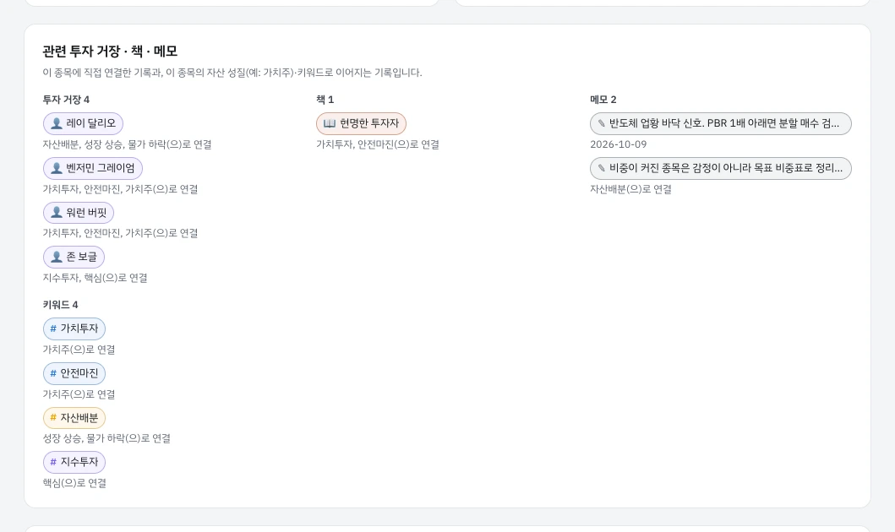


**다른 포트폴리오로 옮기기** — 화면 아래쪽에서 옮길 포트폴리오를 고르면 이 종목의 거래와 Lot이 그쪽으로 옮겨 갑니다. 옮긴 뒤에는 새 포트폴리오의 종목 화면이 열립니다. 방식은 [보유 자산의 옮기기](#옮기기--빼기--더-사기)와 같습니다.

**종목 빼기** — 화면 맨 아래 *이 포트폴리오에서 종목 빼기*는 포트폴리오 화면의 [제거](#포트폴리오-화면)와 같습니다. 이 종목의 거래와 Lot을 모두 지우고 현금과 지난 기록을 되돌린 뒤 포트폴리오 화면으로 돌아갑니다.

## 거래 내역

**추가** [`db77f63`](https://github.com/hgrgr/PPFP/commit/db77f639c3e24f0a4d5affbf259d87e442975f8a) · 2026-10-07 · **바뀜** [`72034c5`](https://github.com/hgrgr/PPFP/commit/72034c52db619e96bee37ba344491ab18d96a11b) · 2026-10-08 (매매일지 열)

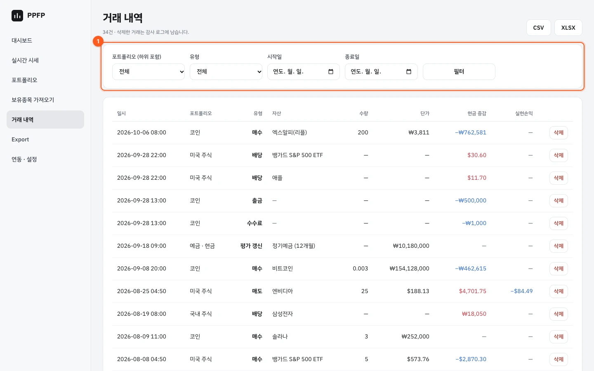

모든 포트폴리오의 거래를 최신순으로 보여 줍니다. 코인 거래소에서 가져온 체결·입출금도 여기에 함께 나옵니다.

- ① **필터** — 포트폴리오(하위 포함), 유형(매수·매도·입금·출금·배당·평가 갱신 등), 기간으로 좁힙니다. 오른쪽 위 **CSV**·**XLSX**는 지금 고른 포트폴리오·기간의 거래를 [가져오기 형식](#가져오기--내보내기)으로 내려받습니다.
- **매매일지** — 종목이 있는 거래에는 **+ 일지**가 있습니다. 누르면 그 거래가 연결되고, 거래 종류에 맞는 양식(매도→매도 복기, 매수→매수 계획)과 거래 단가가 기준 가격으로 채워진 새 일지가 열립니다. 이미 연결된 일지가 있으면 **일지**(여러 개면 *일지 n*)로 표시되고 누르면 그 일지로 갑니다.
- **삭제** — 잘못 넣은 거래를 지웁니다. 거래를 고치려면 지우고 다시 입력합니다. 지운 거래는 감사 로그에 원본이 남고, 연결된 매매일지에서는 빠지지만 일지 자체는 남습니다. 이미 일부 매도된 Lot의 매수 거래는 그 매도를 먼저 지워야 삭제됩니다.

## 세금

**추가** [`0982906`](https://github.com/hgrgr/PPFP/commit/0982906c172a739ce7c566c9967fe2a8cf63287b) · 2026-10-08

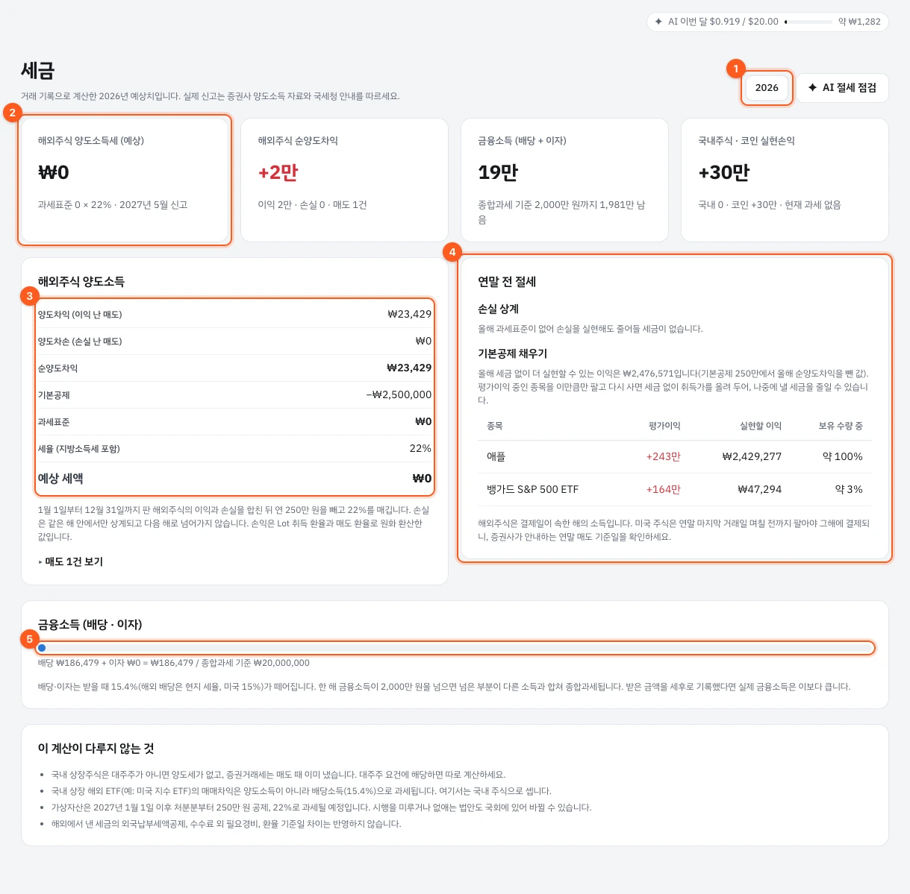

거래 기록으로 한 해의 세금을 미리 계산합니다. 한국 거주 개인, 대주주가 아닌 경우를 기준으로 한 **예상치**이며, 실제 신고는 증권사가 주는 양도소득 자료와 국세청 안내를 따르세요.

- ① **연도** — 매도나 배당이 있었던 해를 고릅니다.
- ② **요약** — 해외주식 양도소득세 예상액, 해외주식 순양도차익, 배당·이자 금융소득 합계, 국내주식·코인 실현손익(참고)입니다.
- ③ **해외주식 양도소득** — 1월 1일부터 12월 31일까지 판 해외주식의 이익과 손실을 합친 뒤 기본공제 250만 원을 빼고 22%(지방소득세 포함)를 곱합니다. 손실은 같은 해 안에서만 상계되고 다음 해로 넘어가지 않습니다. 다음 해 5월에 신고합니다. 손익은 Lot의 취득 환율과 매도 환율로 원화 환산한 값입니다.
- ④ **연말 전 절세** (올해만) — 두 가지를 제안합니다.
  - *손실 상계*: 평가손실 중인 해외 종목을 연내에 팔면 올해 차익과 상계되어 세금이 그만큼 줄어듭니다. 줄어드는 세금을 종목마다 보여 줍니다.
  - *기본공제 채우기*: 올해 세금 없이 더 실현할 수 있는 이익(250만 원 − 올해 순양도차익)을 평가이익 종목에 나눠, 팔고 다시 사면 취득가를 올려 둘 수 있는 금액과 보유 수량 중 비율을 보여 줍니다.
- ⑤ **금융소득** — 배당과 이자의 합이 종합과세 기준 2,000만 원까지 얼마나 찼는지입니다. 넘으면 넘은 부분이 다른 소득과 합쳐 과세됩니다.

다루지 않는 것도 화면 아래에 적어 두었습니다. 국내 상장 해외 ETF의 매매차익(배당소득으로 과세), 대주주 양도세, 외국납부세액공제는 계산하지 않습니다. 해외주식은 결제일 기준으로 귀속되므로 연말에는 증권사의 연내 결제 마감일을 확인하세요. 가상자산은 2027년 1월 1일 이후 처분분부터 과세될 예정이지만 시행을 미루거나 없애는 법안이 국회에 있어 바뀔 수 있습니다.

## 배당

**추가** [`0b04f87`](https://github.com/hgrgr/PPFP/commit/0b04f877a18a1867fde5348367db75c2672db4ae) · 2026-10-08

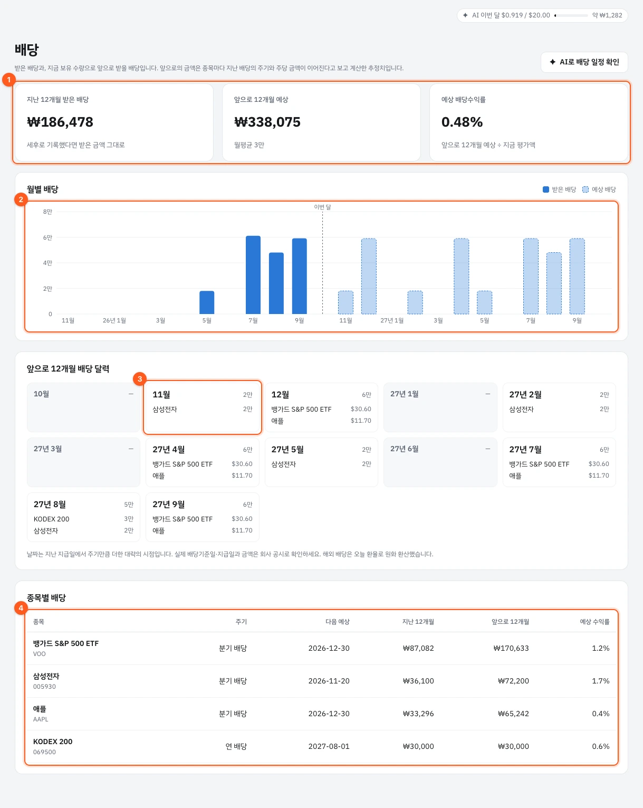

받은 배당과, 지금 보유 수량으로 앞으로 받을 배당을 봅니다. 배당은 포트폴리오 화면의 *입출금 · 배당 · 이자*에서 종목을 골라 기록합니다.

- ① **요약** — 지난 12개월 받은 배당, 앞으로 12개월 예상 배당과 월평균, 예상 배당수익률(앞으로 12개월 예상 ÷ 지금 평가액)입니다.
- ② **월별 배당** — 진한 막대는 받은 배당, 옅은 점선 막대는 예상 배당입니다. 점선 세로줄이 이번 달입니다.
- ③ **배당 달력** — 앞으로 12개월 동안 달마다 들어올 배당입니다. 해외 배당은 달러 금액으로, 달 합계는 원화로 보입니다.
- ④ **종목별 배당** — 배당 주기(월·분기·반기·연), 다음 예상일, 지난 12개월과 앞으로 12개월 금액, 예상 수익률입니다.

앞으로의 배당은 종목마다 최근 배당 사이의 간격으로 주기를 정하고, 마지막 배당의 주당 금액(그날 보유 수량으로 나눈 값)에 지금 수량을 곱해 계산합니다. 13개월 넘게 배당이 없거나 다 판 종목은 빠집니다. 실제 배당기준일과 금액은 회사 공시로 확인하세요. **✦ AI로 배당 일정 확인**은 리서치 애널리스트가 실제 일정과 배당 변화를 찾아 비교합니다.

## 목표

**추가** [`c041869`](https://github.com/hgrgr/PPFP/commit/c041869dfa2ed36f5ca355b6317a0b937cdc74d8) · 2026-10-08

### 목표 시뮬레이션

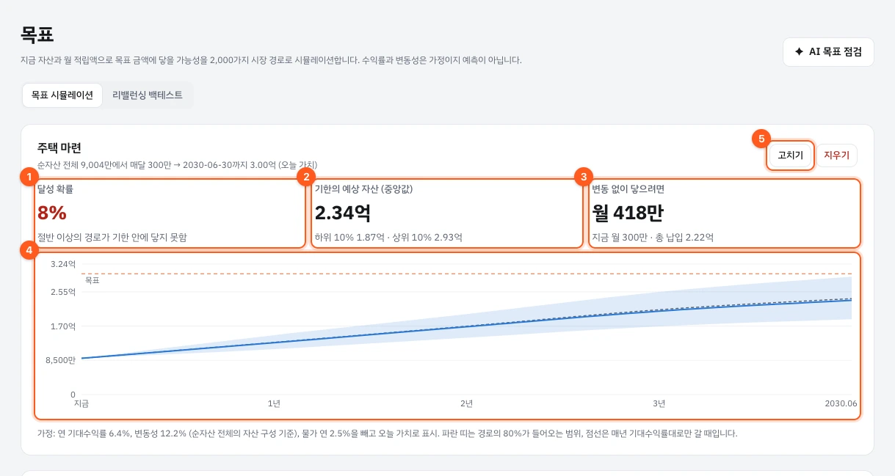

은퇴 자금이나 주택 마련처럼 *언제까지 얼마*를 정하면, 지금 자산과 월 적립액으로 닿을 가능성을 2,000가지 시장 경로로 시뮬레이션합니다. 화면 아래 **목표 추가**에서 이름, 목표 금액, 날짜, 월 적립액, 어느 돈으로(순자산 전체 또는 포트폴리오)를 넣습니다.

- ① **달성 확률** — 기한 안에 목표 금액에 닿은 경로의 비율입니다. 절반 이상이 닿으면 중앙값 경로가 닿는 시점도 나옵니다.
- ② **기한의 예상 자산** — 목표 날짜의 중앙값과 하위·상위 10% 값입니다.
- ③ **변동 없이 닿으려면** — 매년 기대수익률대로만 간다면 필요한 월 적립액입니다.
- ④ **차트** — 파란 띠는 경로의 80%가 들어오는 범위, 진한 선은 중앙값, 점선은 변동 없이 갈 때, 주황 점선은 목표입니다.
- ⑤ **고치기** — 금액·날짜·적립액과 가정을 바꿉니다.

기대수익률과 변동성은 비워 두면 자산 유형별 장기 가정(국내 주식 연 7%·변동성 20%, 미국 주식 8%·17%, 채권 3.5%·6%, 예금 3% 등)을 지금 비중으로 섞어 씁니다. 직접 넣을 수도 있습니다. *물가 반영*을 켜면 연 2.5% 물가를 빼고 오늘 가치로 비교합니다. 가정이지 예측이 아닙니다. **✦ AI 목표 점검**은 확률이 낮은 목표에서 무엇을 바꾸는 게 현실적인지 비교해 줍니다.

### 리밸런싱 백테스트

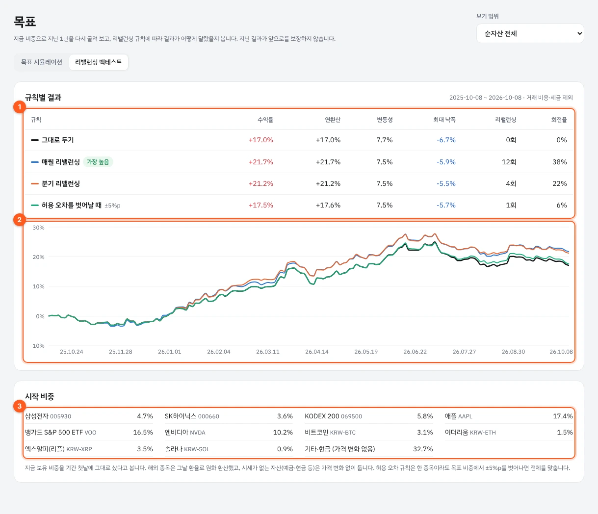

지금 보유 비중으로 지난 1년을 다시 굴려, 리밸런싱 규칙에 따라 결과가 어땠을지 봅니다. 오른쪽 위 **보기 범위**로 포트폴리오를 고릅니다.

- ① **규칙별 결과** — *그대로 두기*, *매월*, *분기*, *허용 오차를 벗어날 때*(포트폴리오의 목표 비중 허용 오차, 순자산은 ±5%p)의 수익률, 연환산 수익률, 변동성, 최대 낙폭, 리밸런싱 횟수, 회전율(비중을 맞추느라 사고판 비율)입니다. 거래 비용과 세금은 빼고 계산합니다.
- ② **차트** — 규칙마다 기간 동안의 누적 수익률입니다.
- ③ **시작 비중** — 기간 첫날 그대로 샀다고 본 비중입니다. 시세가 없는 예금·현금 등은 *기타·현금*으로 묶어 가격 변화 없이 둡니다.

지난 결과가 앞으로를 보장하지 않습니다.

## 매매일지

**추가** [`72034c5`](https://github.com/hgrgr/PPFP/commit/72034c52db619e96bee37ba344491ab18d96a11b) · 2026-10-08 · **바뀜** [`69b342e`](https://github.com/hgrgr/PPFP/commit/69b342ed62f0292c09f37f67cb89e73ab555c154) · 2026-10-08 (트리 보기, 일지에 종목 성질 표시), [`64b046f`](https://github.com/hgrgr/PPFP/commit/64b046fac2dd876a95bd627b3ba9ddc71ae44264) · 2026-10-08 (목표가·손절가 도달 알림), [`27b79fc`](https://github.com/hgrgr/PPFP/commit/27b79fc73d98b453b9b4bf395de2e5d553122f73) · 2026-10-08 (트리 옆 창에 관련 투자 거장·책·메모)

거래할 때의 생각을 남기는 노트입니다. 일지는 종목 하나에 대해 쓰고, 그 종목의 거래를 여러 개 연결할 수 있습니다. 모든 일지에는 **목표 예상 가격**이 반드시 들어갑니다. 앱은 이 값을 지금 가격과 비교해 진행 상황을 보여 주고, 앞으로 넣을 *가격 도달 알림*과 *AI 어드바이저*도 이 값을 기준으로 씁니다.

### 목록

**바뀜** [`8244851`](https://github.com/hgrgr/PPFP/commit/8244851e3bbfc944781ac46217a8209b4a602523) · 2026-10-08 (*✦ AI 매매 코치* 버튼)

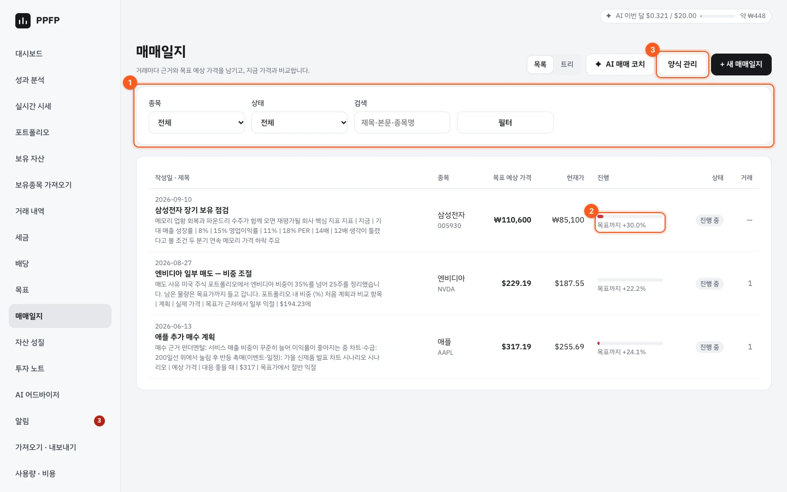

- ① **필터** — 종목, 상태(진행 중·종료), 검색어(제목·본문·종목명)로 좁힙니다.
- ② **진행** — 기준 가격에서 목표 예상 가격까지 지금 가격이 얼마나 왔는지 막대로, 목표까지 남은 등락률을 숫자로 보여 줍니다. 목표에 닿으면 *목표 도달*로 바뀝니다. 목표가 기준 가격보다 낮으면(하락을 기다리는 일지) 아래로 내려갈수록 막대가 찹니다.
- ③ **양식 관리** — 일지 양식을 보고 만듭니다([양식](#양식)). 옆의 **✦ AI 매매 코치**는 지난 매매와 일지를 함께 복기하는 [매매일지 코치](#매매일지-코치)를 엽니다.

제목을 누르면 일지가 열립니다. 오른쪽 끝 *거래*는 연결된 거래 수입니다.

### 트리로 보기

**추가** [`69b342e`](https://github.com/hgrgr/PPFP/commit/69b342ed62f0292c09f37f67cb89e73ab555c154) · 2026-10-08

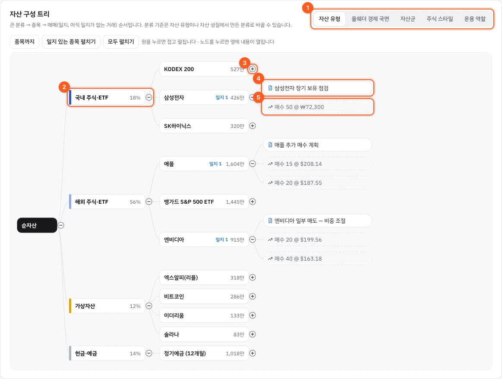

매매일지 화면 오른쪽 위 **트리**를 누르면 내 자산을 *큰 분류 → 종목 → 매매* 순서의 나무 모양으로 그립니다. 맨 왼쪽은 순자산, 그다음은 분류, 종목, 그리고 그 종목의 매매일지와 아직 일지를 쓰지 않은 매수·매도 거래입니다.

- ① **분류 기준** — *자산 유형*(국내 주식·해외 주식·가상자산 …) 또는 [자산 성질](#자산-성질)에서 만든 분류(올웨더 경제 국면, 자산군, 주식 스타일 …)로 나눕니다. 성질을 두 개 고른 종목(예: 주식은 성장 상승과 물가 하락)은 양쪽에 모두 나오고 평가액은 반씩 셉니다. 아무 성질도 지정하지 않은 종목은 *미분류*로 모입니다.
- ② **분류** — 이름 옆 숫자는 순자산에서 차지하는 비중입니다.
- ③ **접기·펼치기** — 노드 오른쪽 원을 누르면 그 아래를 접거나 펼칩니다. 처음에는 일지가 있는 종목만 펼쳐져 있습니다. 위쪽 **종목까지 · 일지 있는 종목 펼치기 · 모두 펼치기**로 한 번에 바꿉니다.
- ④ **매매일지** — 문서 아이콘이 붙은 노드입니다. 누르면 일지가 옆 창에 열립니다.
- ⑤ **일지 없는 거래** — 점선 노드는 아직 일지를 쓰지 않은 매수·매도입니다. 한 종목에 기록이 많으면 최근 것만 보이고 나머지는 *외 n건*으로 묶입니다.

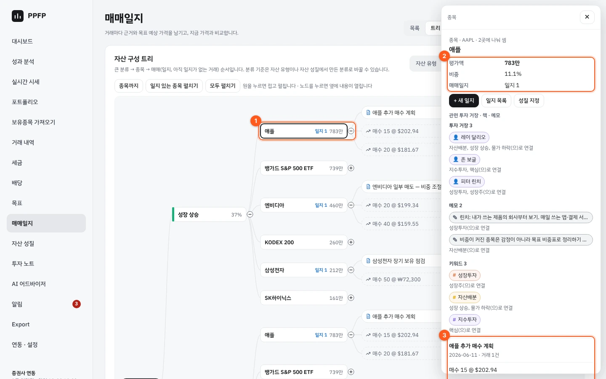

- ① 분류·종목·거래 노드를 누르면 오른쪽에 작은 창이 겹쳐 열립니다. **Esc**나 **✕**로 닫습니다.
- ② 종목이면 평가액, 비중, 일지 수가 나오고 **+ 새 일지 · 일지 목록 · 성질 지정**으로 바로 갑니다. 분류이면 그 안의 종목과 비중이 나옵니다.
- ③ 그 종목의 기록 목록입니다. 일지 제목을 누르면 일지가 열리고, 일지 없는 거래 옆 **+ 일지**는 그 거래로 새 일지를 시작합니다.

**바뀜** [`27b79fc`](https://github.com/hgrgr/PPFP/commit/27b79fc73d98b453b9b4bf395de2e5d553122f73) · 2026-10-08 — 옆 창 아래에 [투자 노트](#투자-노트)에서 이어진 거장·책·메모가 함께 나옵니다.

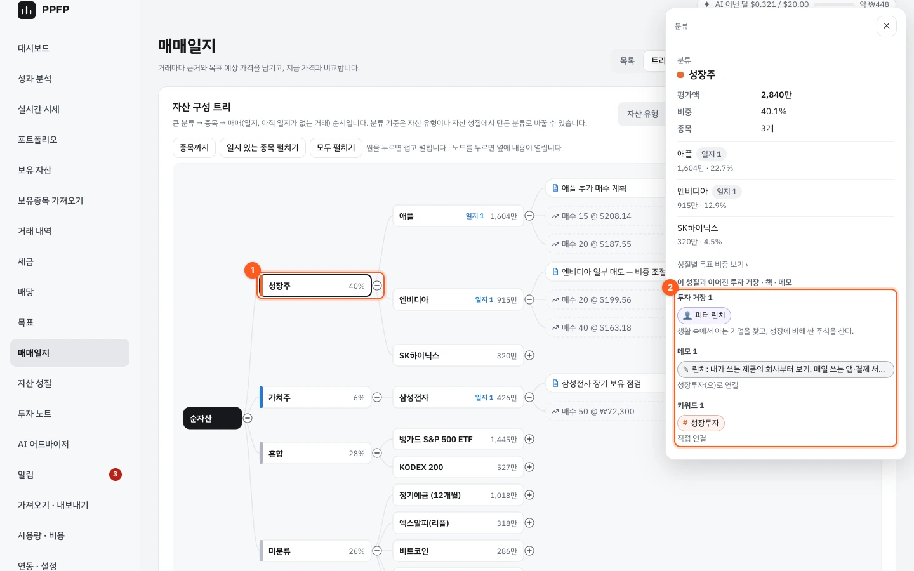

- ① 종목 노드, 또는 자산 성질로 나눈 트리의 분류 노드(예: *주식 스타일*의 성장주)를 누릅니다.
- ② **이 성질과 이어진 투자 거장 · 책 · 메모** — 성장주라면 성장투자 키워드와 피터 린치처럼 그 성질로 이어진 기록이 나옵니다. 종목 노드이면 그 종목과 이어진 기록입니다.

### 일지 쓰기

**바뀜** [`57ab87e`](https://github.com/hgrgr/PPFP/commit/57ab87e100ea61b0a4042020f25cac070cfbe580) · 2026-10-08 (*✦ AI와 복기* 버튼), [`8244851`](https://github.com/hgrgr/PPFP/commit/8244851e3bbfc944781ac46217a8209b4a602523) · 2026-10-08 (*AI와 복기*가 매매일지 코치로 열림)

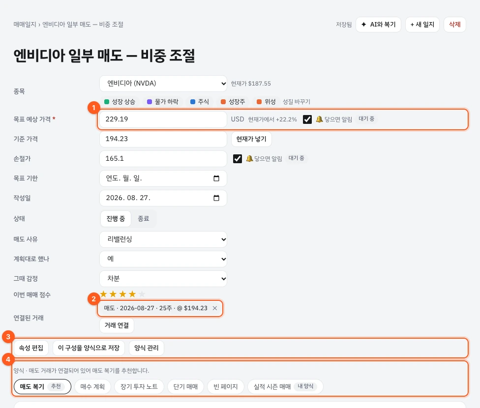

**+ 새 매매일지**, 거래 내역의 **+ 일지**, 종목 화면이나 대시보드의 **+ 새 일지**로 시작합니다. 저장한 일지 위쪽의 **✦ AI와 복기**는 [매매일지 코치](#매매일지-코치)를 열어, 근거가 지금도 유효한지, 목표가·손절가가 적절한지, 일지의 계획과 실제 매매가 맞았는지 함께 돌아봅니다. 코치가 제안한 복기는 실행하면 본문 끝에 *AI 복기* 제목으로 덧붙습니다.

- **제목** — 비워 두면 *종목명 + 양식 이름*으로 저장됩니다.
- **종목** — 일지를 쓸 종목입니다. 고르면 현재가와 그 종목의 [성질](#자산-성질)(예: 성장 상승 · 성장주 · 핵심)이 옆에 나옵니다. **성질 지정**으로 바로 바꾸러 갈 수 있습니다.
- ① **목표 예상 가격 (필수)** — 그 종목의 거래 통화로 적습니다. 옆에 현재가에서 목표까지 몇 % 남았는지 나옵니다. **🔔 닿으면 알림**이 기본으로 켜져 있어, 가격이 목표에 닿으면 [알림](#알림)을 보냅니다. 옆 표시는 알림 상태입니다(*대기 중*, *도달*, 일지를 *종료*하면 *쉬는 중*). 이미 도달한 알림은 목표 가격을 바꾸면 다시 켜집니다.
- **기준 가격** — 일지를 쓸 때의 가격입니다. 거래에서 시작하면 그 거래 단가, 아니면 현재가가 미리 들어갑니다. 목표까지의 진행률은 이 가격부터 셉니다. **현재가 넣기**로 바꿀 수 있습니다.
- **손절가 · 목표 기한 · 작성일 · 상태** — 손절가와 목표 기한은 선택입니다. 손절가를 적으면 손절가에도 **🔔 닿으면 알림**이 생깁니다(목표가와 반대 방향). 상태는 *진행 중*과 *종료*가 있고, 목록에서 걸러 볼 때 씁니다.
- **양식 속성** — 고른 양식에 들어 있는 항목(예: 매도 사유, 감정, 확신도 별점)입니다.
- ② **연결된 거래** — **거래 연결**을 누르면 이 종목의 매수·매도·배당 등이 나오고, 체크해서 연결합니다. **✕**로 연결을 풉니다.
- ③ **속성 편집** — 이 일지에만 속성을 더하거나 빼고 순서를 바꿉니다. **이 구성을 양식으로 저장**은 지금 속성과 본문을 새 양식으로 저장해 다음 일지에서 고를 수 있게 합니다.
- ④ **양식 고르기** — 연결한 거래에 맞춰 하나를 추천합니다(매도 거래→*매도 복기*, 매수 거래→*매수 계획*, 거래 없음→*장기 투자 노트*). 다른 양식을 누르면 속성과 본문이 그 양식으로 바뀝니다. 본문을 이미 썼다면 바꾸기 전에 확인을 받습니다.

새 일지는 **저장**을 눌러 처음 저장합니다. 그다음부터는 고칠 때마다 1~2초 뒤 자동으로 저장되고, 오른쪽 위에 *저장됨*이 표시됩니다. **Ctrl+S**(맥은 **⌘S**)로 바로 저장할 수도 있습니다.

### 본문 편집기

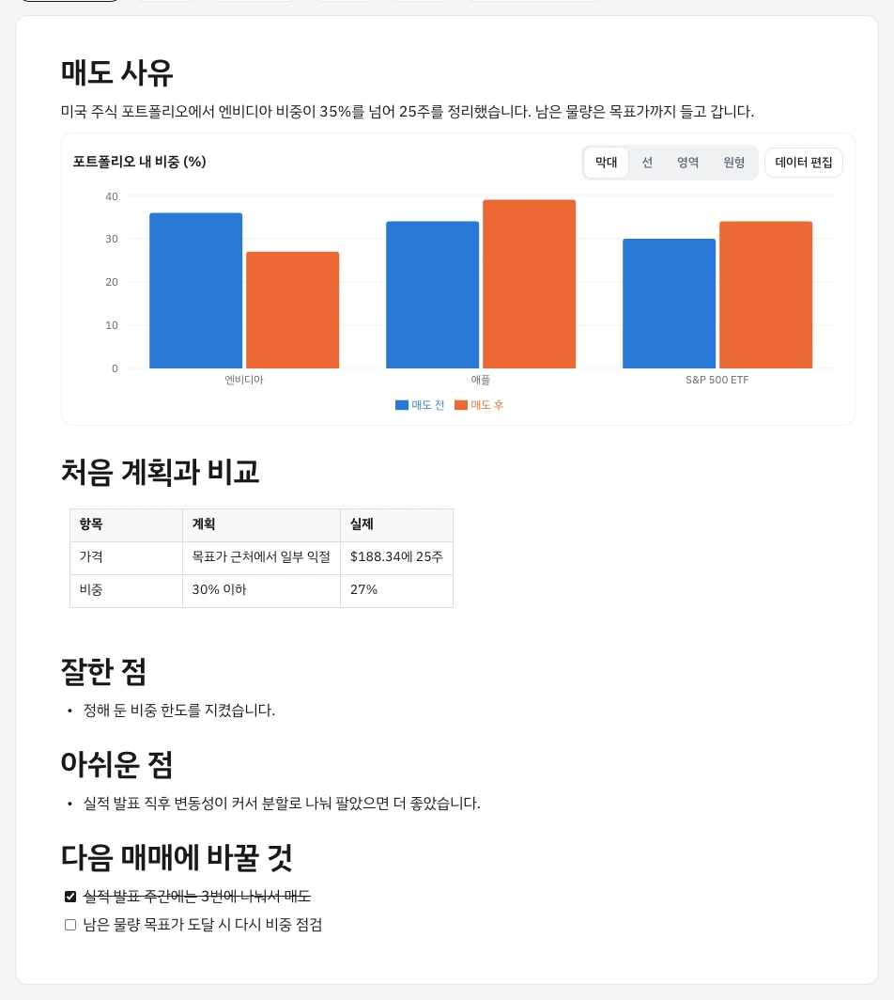

본문은 노션처럼 블록 단위로 씁니다.

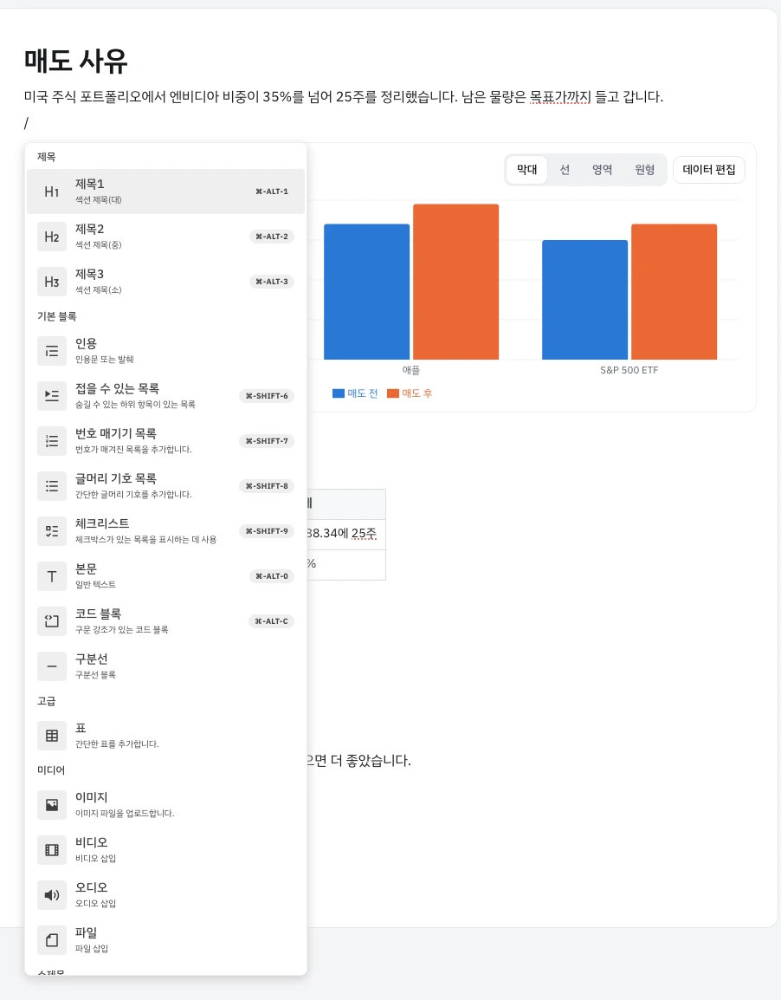

- 빈 줄에서 **/**를 누르면 넣을 블록 목록이 나옵니다. 이어서 글자를 치면(예: `/표`, `/그래프`) 목록이 좁혀집니다.
  - 제목 1·2·3, 본문, 인용
  - 글머리·번호·체크리스트, 접을 수 있는 목록(토글)
  - 표: 칸을 누르고 쓰며, 표 가장자리의 **+**로 줄·칸을 더합니다
  - 코드 블록: 언어를 고르면 문법 색이 칠해집니다
  - 구분선
  - 이미지·비디오·오디오·파일: 이미지는 올리거나 주소로 넣고, 화면에 붙여넣어도 됩니다
  - 그래프와 종목 시세 차트(아래 설명)
- 글자를 드래그하면 굵게·기울임·밑줄·취소선·색·**링크** 도구가 뜹니다. 줄 맨 앞에 `# `(제목), `- `(글머리 목록), `1. `(번호 목록)을 치면 그 블록으로 바로 바뀝니다.
- 블록 왼쪽의 **⋮⋮** 손잡이를 끌어 순서를 바꾸고, 눌러서 블록을 지우거나 색을 바꿉니다.
- 이미지는 PNG·JPEG·GIF·WebP를 5MB까지 올릴 수 있고, 올린 사람만 볼 수 있습니다.

<br clear="right">

**그래프 블록** — `/그래프`로 넣습니다. **막대·선·영역·원형** 중 하나를 고르고, **데이터 편집**을 눌러 값을 넣습니다. 첫 줄은 항목 이름, 다음 줄부터 값이며 쉼표나 탭으로 나눕니다. 엑셀에서 표를 복사해 붙여넣어도 됩니다. 값 열이 여러 개면 계열이 여러 개인 그래프가 됩니다. 원형은 첫 번째 값 열만 씁니다.

```
분기,매출,영업이익
1Q,120,12
2Q,150,18
```


**종목 시세 차트 블록** — `/시세`로 넣습니다. 이 일지 종목의 봉 차트가 나오고, 목표 예상 가격과 손절가가 점선으로 그려집니다. 간격(1분~주봉)은 [종목 상세](#종목-상세--봉-차트)와 같이 바꿀 수 있습니다. 상장 종목(국내·미국·코인)에서만 나옵니다.

### 양식

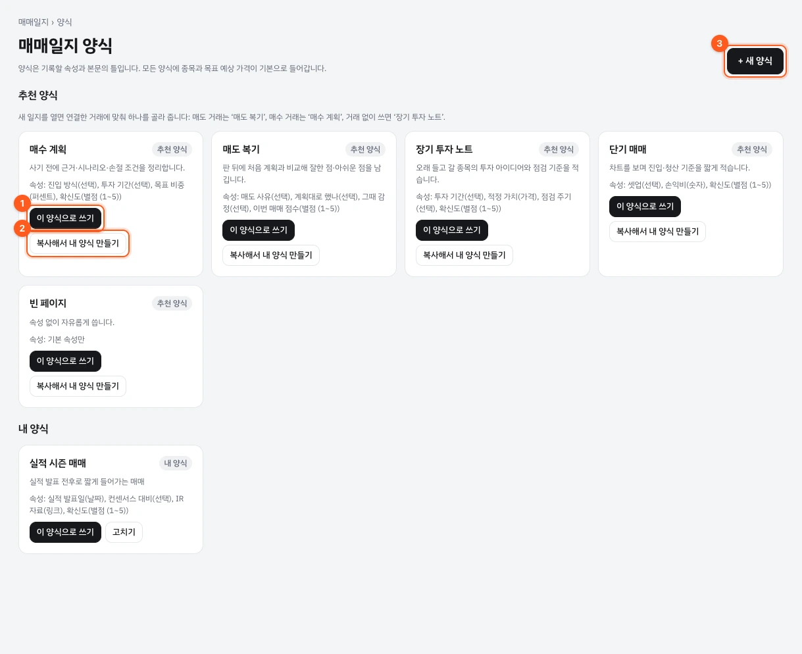

양식은 *기록할 속성*과 *본문의 틀*을 묶은 것입니다. 종목·목표 예상 가격·기준 가격·손절가·목표 기한·상태는 양식과 상관없이 모든 일지에 들어갑니다.

| 추천 양식 | 이럴 때 | 속성 | 본문 틀 |
| --- | --- | --- | --- |
| 매수 계획 | 사기 전에 | 진입 방식, 투자 기간, 목표 비중, 확신도 | 매수 근거, 시나리오 표, 리스크와 손절 조건, 체크리스트, 참고 자료 |
| 매도 복기 | 판 뒤에 | 매도 사유, 계획대로 했나, 그때 감정, 이번 매매 점수 | 매도 사유, 계획과 비교 표, 잘한 점, 아쉬운 점, 다음에 바꿀 것 |
| 장기 투자 노트 | 오래 들고 갈 때 | 투자 기간, 적정 가치, 점검 주기, 확신도 | 한 줄 요약, 투자 아이디어, 경쟁력, 핵심 지표 표, 틀렸다고 볼 조건, 점검 기록 |
| 단기 매매 | 차트를 보고 짧게 | 셋업, 손익비, 확신도 | 종목 시세 차트, 진입 근거, 청산 계획, 결과 |
| 빈 페이지 | 자유롭게 | 없음 | 빈 본문 |

- ① **이 양식으로 쓰기** — 이 양식으로 새 일지를 엽니다.
- ② **복사해서 내 양식 만들기** — 추천 양식을 복사해 고칩니다. 추천 양식 자체는 바꿀 수 없습니다.
- ③ **+ 새 양식** — 빈 양식부터 만듭니다.

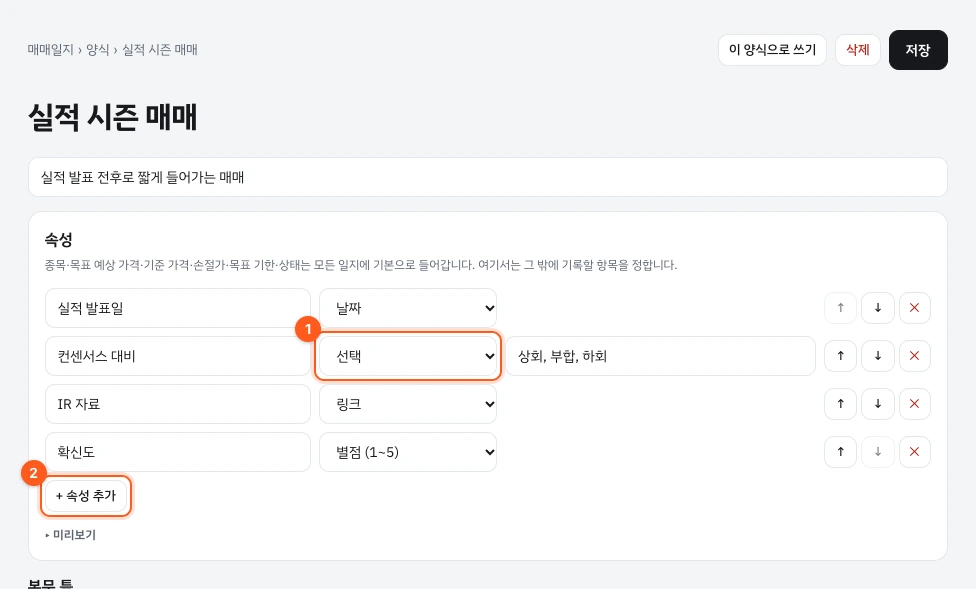

내 양식에서는 이름, 한 줄 설명, 속성, 본문 틀을 정합니다.

- ① 속성마다 이름과 종류를 고릅니다. 종류는 텍스트, 숫자, 가격, 퍼센트, 날짜, 선택(선택지를 쉼표로 적음), 별점(1~5), 체크박스, 링크가 있습니다. **↑ ↓**로 순서를 바꾸고 **✕**로 지웁니다. *미리보기*를 펼치면 일지에서 어떻게 보이는지 나옵니다.
- ② **+ 속성 추가**로 항목을 더합니다(최대 30개).
- 본문 틀은 일지 본문과 같은 편집기로 씁니다. 양식을 고친 뒤에도 이미 쓴 일지는 쓸 때의 속성 그대로 남습니다.

## 자산 성질

**추가** [`69b342e`](https://github.com/hgrgr/PPFP/commit/69b342ed62f0292c09f37f67cb89e73ab555c154) · 2026-10-08

자산을 *성질*로 나눠 봅니다. 예를 들어 같은 주식이라도 올웨더 관점에서는 *성장 상승·물가 하락*에 강하고, 스타일로는 *성장주*, 역할로는 *위성*일 수 있습니다. 이렇게 여러 기준(분류)을 함께 두고, 분류마다 지금 비중을 목표와 비교해 무엇을 더 사야 할지 봅니다.

### 분류 추가

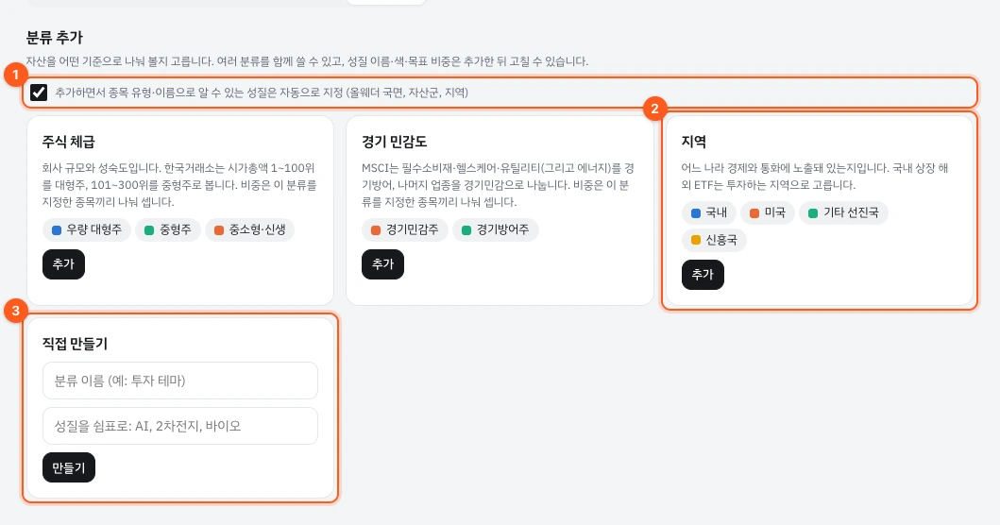

처음 들어가면 분류를 고르는 화면이 나옵니다. 이미 추가한 분류가 있으면 위쪽 탭의 **+ 분류 추가**를 누릅니다.

- ① **자동 지정** — 켜 두면 분류를 추가하면서 종목 유형·이름·티커로 알 수 있는 성질을 바로 지정합니다(올웨더 경제 국면, 자산군, 지역만 해당). 예: 채권 ETF는 채권·성장 하락·물가 하락, `KODEX 골드선물`은 금·물가 상승, `TIGER 미국S&P500`은 주식·미국. 추천일 뿐이니 나중에 바꿀 수 있습니다.
- ② **추천 분류** — 아래 표의 분류 중 하나를 **추가**합니다.
- ③ **직접 만들기** — 분류 이름과 성질 목록(쉼표로 구분)을 넣어 나만의 분류를 만듭니다. 예: 투자 테마 → AI, 2차전지, 바이오.

| 분류 | 성질 | 근거 · 메모 |
| --- | --- | --- |
| 올웨더 경제 국면 | 성장 상승, 성장 하락, 물가 상승, 물가 하락 | 브리지워터 *The All Weather Story*(2012)의 네 국면. 주식은 성장 상승·물가 하락, 국채는 성장 하락·물가 하락, 물가연동채는 성장 하락·물가 상승, 원자재는 성장 상승·물가 상승에 둡니다. 금은 브리지워터 그림에는 없고 흔히 물가 상승으로 봅니다. 코인·현금은 정해진 자리가 없어 미지정으로 둡니다. |
| 자산군 | 주식, 채권, 금, 원자재, 리츠·부동산, 암호화폐, 현금성 | 예시 목표: 토니 로빈스가 소개한 올웨더 대중판(주식 30 · 채권 55 · 금 7.5 · 원자재 7.5). 포트폴리오 현금은 *현금성*으로 셉니다. |
| 주식 스타일 | 성장주, 가치주, 혼합, 배당주 | 모닝스타 스타일박스·MSCI 가치/성장 기준. 주식끼리의 비중으로 셉니다. |
| 주식 체급 | 우량 대형주, 중형주, 중소형·신생 | 한국거래소 규모별 지수(시총 1~100위 대형, 101~300위 중형). 주식끼리의 비중. |
| 경기 민감도 | 경기민감주, 경기방어주 | MSCI 경기민감/방어 업종 구분. 주식끼리의 비중. |
| 지역 | 국내, 미국, 기타 선진국, 신흥국 | 국내 상장 해외 ETF는 투자 지역으로 셉니다. |
| 운용 역할 | 핵심, 위성 | 예시 목표: 핵심 80 · 위성 20. 위성 비중에 한도를 두는 용도입니다. |

> **금액 비중과 위험 비중** — 이 화면의 비중은 모두 *금액* 기준입니다. 브리지워터 올웨더는 네 국면에 *위험*을 25%씩 나누는 전략이라, 금액으로 보면 변동성이 작은 채권 쪽이 훨씬 커 보이는 것이 정상입니다. 그래서 올웨더 국면에는 기본 목표를 넣지 않았습니다.

### 비중과 목표 비교

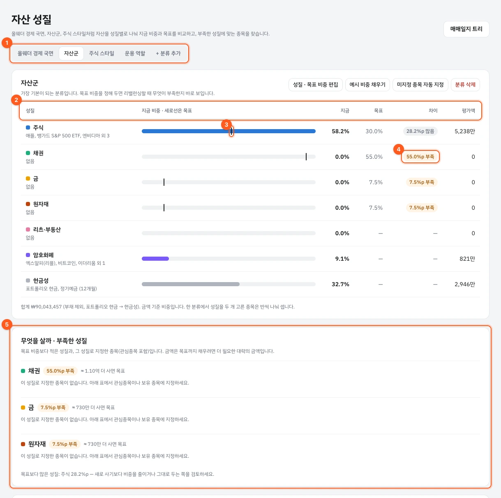

- ① **분류 탭** — 만든 분류를 오갑니다. 고른 분류는 주소에 남습니다.
- ② **성질별 비중** — 성질마다 지금 비중(막대), 목표, 차이, 평가액입니다. 성질 이름 아래에는 그 성질에 속한 종목이 나옵니다. 성질을 지정하지 않은 종목과 현금은 *미지정*에 모입니다.
- ③ **목표 표시** — 막대 위 세로선이 목표 비중입니다.
- ④ **차이** — 목표보다 적으면 *n%p 부족*, 많으면 *n%p 많음*, 0.5%p 안이면 *맞음*입니다.
- ⑤ **무엇을 살까** — 목표보다 적은 성질을 부족한 순서로 보여 주고, 목표까지 채우려면 대략 얼마를 더 사야 하는지 적습니다.

한 분류에서 성질을 두 개 고른 종목은 평가액을 반씩 나눠 셉니다. 부채는 빼고, 평가액은 지금 시세로 계산합니다.

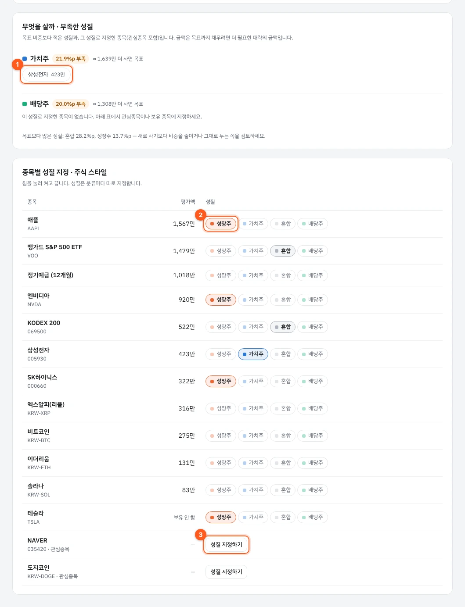

- ① **매수 후보** — 부족한 성질로 지정한 종목입니다. 보유 중이면 평가액이, 관심종목이면 *관심*이 붙습니다. 누르면 그 종목의 *매수 계획* 일지가 열려 바로 근거와 목표 예상 가격을 적을 수 있습니다.
- ② **종목별 성질 지정** — 칩을 눌러 켜고 끕니다. 바로 저장됩니다. 성질은 분류마다 따로 지정합니다.
- ③ **관심종목** — [실시간 시세](#실시간-시세)의 관심종목도 목록 끝에 나옵니다. **성질 지정하기**를 누르면 사기 전이라도 성질을 정해 두고 매수 후보로 볼 수 있고, 매매일지도 쓸 수 있습니다.

위쪽 버튼:

- **예시 비중 채우기** — 자산군·운용 역할처럼 예시 목표가 있는 분류에서 그 값으로 목표를 채웁니다.
- **미지정 종목 자동 지정** — 새로 생긴 종목 중 아직 성질이 없는 것에 추천 성질을 넣습니다. 이미 지정한 종목은 건드리지 않습니다.
- **분류 삭제** — 분류와 종목별 지정을 함께 지웁니다.

### 성질 · 목표 비중 편집

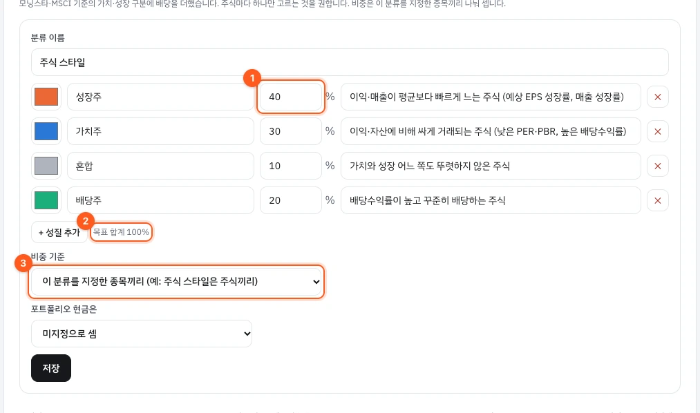

**성질 · 목표 비중 편집**을 누르면 분류 이름, 성질의 색·이름·설명을 고치고 성질을 더하거나 뺄 수 있습니다. 성질을 지우면 그 성질의 종목 지정도 함께 지워집니다.

- ① **목표 비중** — 성질마다 %로 적습니다. 비워 두면 목표 없음입니다.
- ② 목표 합계가 나옵니다. 100%를 넘으면 저장되지 않습니다.
- ③ **비중 기준** — *전체 자산 대비*는 현금·미지정까지 모두 더한 금액으로 나눕니다. *이 분류를 지정한 종목끼리*는 지정한 종목만으로 나눠, 예를 들어 주식 스타일 목표(성장 40 · 가치 30 …)를 주식 안에서의 비중으로 맞춥니다. 주식 스타일·체급·경기 민감도는 처음부터 *지정한 종목끼리*로 만들어집니다.
- **포트폴리오 현금은** — 포트폴리오에 남아 있는 현금을 어느 성질로 셀지 고릅니다(자산군은 *현금성*).

## 알림

**추가** [`64b046f`](https://github.com/hgrgr/PPFP/commit/64b046fac2dd876a95bd627b3ba9ddc71ae44264) · 2026-10-08 · **바뀜** [`47ee0a1`](https://github.com/hgrgr/PPFP/commit/47ee0a1732e2ca52bd3dc2b48e0a81f4bd4099ff) · 2026-10-08 (AI 아침 브리핑, 알림 AI 분석)

가격이 정한 값에 닿거나 포트폴리오가 목표 비중에서 벗어나면 알려 줍니다. 켜 두면 [AI 아침 브리핑](#아침-브리핑--알림-분석)도 여기로 옵니다. 알림은 이 화면의 알림함에 쌓이고, [푸시 알림](#푸시-알림-받을-기기)을 켠 휴대폰·PC에도 바로 갑니다.

### 알림함

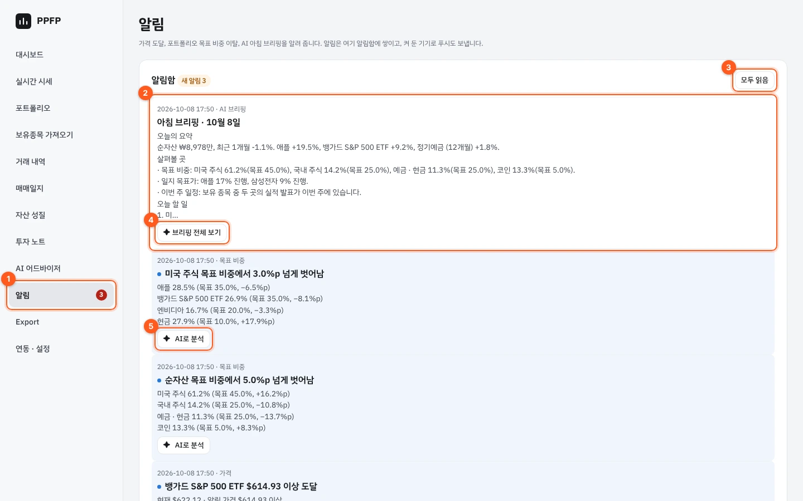

- ① 왼쪽 메뉴 *알림* 옆 숫자는 읽지 않은 알림 수입니다.
- ② 알림마다 받은 시각과 종류(가격·목표 비중·AI 브리핑), 내용이 나옵니다. 제목을 누르면 관련 화면으로 갑니다. 가격 알림은 매매일지나 종목 시세, 목표 비중 알림은 그 포트폴리오의 목표 비중 카드가 열립니다. 읽지 않은 알림은 파란 점과 배경으로 표시됩니다.
- ③ **모두 읽음**으로 표시를 지웁니다.
- ④ **브리핑 전체 보기** — AI 아침 브리핑은 요약만 나오고, 누르면 AI 어드바이저에서 전체를 보고 이어서 묻습니다.
- ⑤ **AI로 분석** — 가격·목표 비중 알림을 [AI 어드바이저](#ai-어드바이저) 옆 창에서 바로 분석합니다(매매일지 목표가·손절가 알림은 매매일지 코치가 봅니다). 설정에서 *알림이 오면 AI가 바로 분석*을 켜 두면 알림이 올 때 분석이 미리 만들어지고, 이 자리에 **AI 분석 보기**가 나옵니다.

### 가격 알림

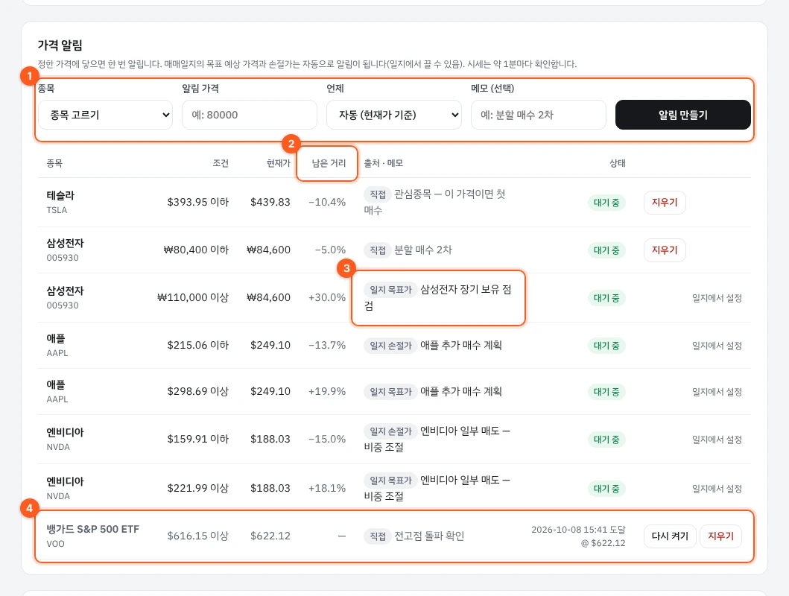

- ① **알림 만들기** — 종목과 가격을 넣습니다. *언제*를 *자동*으로 두면 지금 가격보다 높게 적었을 때는 그 가격 *이상*, 낮게 적었을 때는 *이하*가 되면 알립니다. 직접 고를 수도 있습니다. 보유하지 않은 종목은 [자산 성질](#자산-성질)의 관심종목 *성질 지정하기*나 매매일지로 먼저 추가하면 고를 수 있습니다.
- ② **남은 거리** — 현재가에서 알림 가격까지 몇 % 남았는지입니다.
- ③ **출처** — *직접* 만든 알림과, 매매일지의 *일지 목표가*·*일지 손절가* 알림이 함께 나옵니다. 일지 알림은 일지 화면에서 켜고 끄며, 일지의 가격을 바꾸면 따라 바뀝니다.
- ④ **도달한 알림** — 알림은 한 번 울리면 꺼지고, 도달한 시각과 가격이 남습니다. **다시 켜기**로 같은 조건을 다시 기다립니다.

시세는 서버가 약 1분마다 연결된 증권사·거래소에서 받아 확인합니다. 지연된 시세(장 마감 후 종가 등)로는 울리지 않습니다. 장이 열려 있지 않으면 다음 장에서 처음 닿을 때 울립니다.

### 목표 비중 알림 · 기기 설정

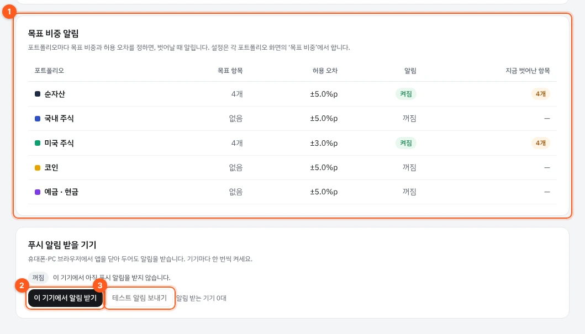

- ① **목표 비중 알림** — 포트폴리오마다 목표 항목 수, 허용 오차, 알림 여부, 지금 범위를 벗어난 항목 수를 모아 봅니다. 이름을 누르면 그 포트폴리오의 [목표 비중](#목표-비중--리밸런싱-알림) 카드로 갑니다.
- ② **이 기기에서 알림 받기** — 누르고 브라우저의 알림 권한을 허용하면, 앱을 닫아 두어도 이 기기로 푸시 알림이 옵니다. 휴대폰·PC마다 한 번씩 켭니다. 끄려면 같은 자리의 **이 기기 알림 끄기**를 누릅니다.
- ③ **테스트 알림 보내기** — 알림을 켠 모든 기기로 시험 알림을 보냅니다.

### 푸시 알림 받을 기기

- **안드로이드·PC(Chrome·Edge·Firefox·Safari)** — 브라우저에서 바로 켤 수 있습니다.
- **아이폰·아이패드** — iOS 16.4 이상에서 Safari *공유 → 홈 화면에 추가*로 앱을 설치한 뒤, 설치한 앱에서 켭니다. 브라우저 탭에서는 켤 수 없습니다.
- 푸시는 **HTTPS**로 접속할 때만 됩니다(내 컴퓨터의 `localhost`는 예외). 알림을 차단했다면 브라우저 설정의 사이트 권한에서 알림을 허용한 뒤 다시 누릅니다.

## 투자 노트

**추가** [`27b79fc`](https://github.com/hgrgr/PPFP/commit/27b79fc73d98b453b9b4bf395de2e5d553122f73) · 2026-10-08

떠오른 생각을 적는 **메모**, 읽은 책을 요약하는 **독서 노트**, 투자 거장의 철학을 정리하는 **투자 거장**을 한곳에서 관리합니다. 세 가지 모두 **속성**을 붙여 키워드, [자산 성질](#자산-성질), 내 종목과 이을 수 있습니다. 그래서 *워런 버핏 — 가치투자 — 가치주*처럼 이어 두면, 버핏 정리에서는 가치주로 지정한 내 종목이 보이고, 반대로 그 종목 화면에서는 버핏과 관련 책·메모가 보입니다.

### 메모

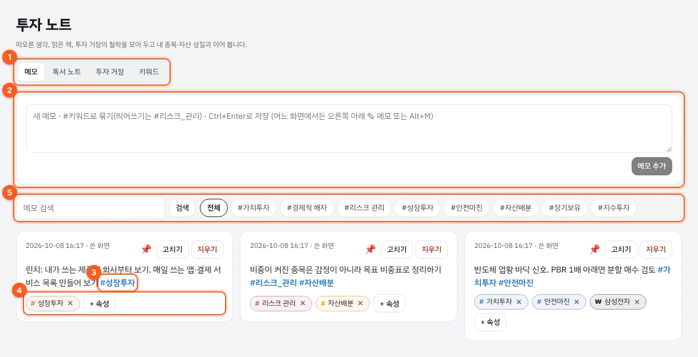

- ① **탭** — 메모, 독서 노트, 투자 거장, 키워드 화면을 오갑니다. 왼쪽 메뉴 *투자 노트*를 누르면 메모가 먼저 열립니다.
- ② **새 메모** — 적고 **메모 추가**나 **Ctrl+Enter**(맥은 ⌘+Enter)로 저장합니다.
- ③ **#키워드** — 본문에 `#가치투자`처럼 쓰면 그 키워드가 자동으로 붙습니다. 띄어쓰기가 있는 키워드는 `#리스크_관리`처럼 밑줄로 씁니다. 본문의 키워드를 누르면 그 키워드의 메모만 봅니다.
- ④ **속성** — 메모에 붙은 키워드·종목·거장·책입니다. **+ 속성**으로 더 붙이고 **✕**로 뗍니다.
- ⑤ **찾기** — 글자로 찾거나 키워드를 눌러 걸러 봅니다.

메모마다 **📌**로 맨 위에 고정하고, **고치기**·**지우기**를 할 수 있습니다. *쓴 화면*을 누르면 메모를 적었던 화면으로 돌아갑니다.

### 빠른 메모

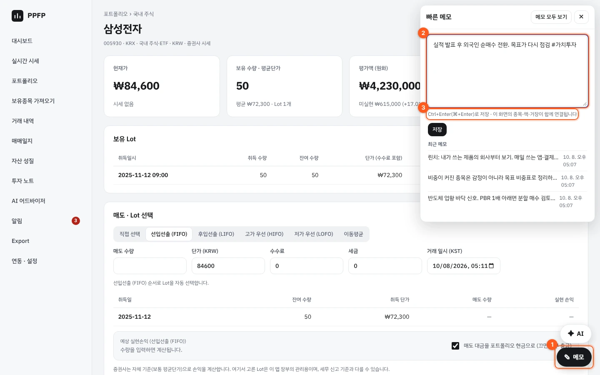

- ① 어느 화면에서든 오른쪽 아래 **✎ 메모** 버튼이나 **Alt+M**으로 메모 창을 엽니다. 보던 화면은 그대로 둔 채 적습니다.
- ② 적고 **Ctrl+Enter**나 **저장**을 누릅니다. 아래에 최근 메모가 나옵니다.
- ③ 종목 화면, 매매일지, 시세 화면의 종목 상세, 책·거장 정리에서 적으면 그 종목·책·거장이 메모에 자동으로 연결됩니다.

### 속성 붙이기

메모·책·거장의 **+ 속성**을 누르면 검색 창이 열립니다. 키워드, 자산 성질, 내 종목, 거장, 책, 다른 메모를 이름으로 찾아 누르면 연결됩니다. 없는 낱말을 적고 **Enter**를 누르면 새 키워드를 만들어 바로 붙입니다.

무엇으로 이어지는지는 이렇습니다.

| 이렇게 붙이면 | 이렇게 보입니다 |
| --- | --- |
| 자산 성질(예: 가치주) | 그 성질로 지정한 내 종목과 이어집니다. |
| 키워드(예: 가치투자) | 같은 키워드를 단 메모·책·거장과 이어지고, 키워드에 이어 둔 자산 성질을 거쳐 그 성질의 종목과도 이어집니다. |
| 종목 | 그 종목 화면의 *관련 투자 거장 · 책 · 메모*에 바로 나옵니다. |

종목의 성질은 [자산 성질](#자산-성질)에서 지정합니다. 종목에 성질을 직접 속성으로 붙이지는 않습니다.

### 독서 노트

**바뀜** [`333e034`](https://github.com/hgrgr/PPFP/commit/333e034c197867ab8ad950f686cc240acd043bbf) · 2026-10-09 (제목으로 저자·출판사·연도 찾기), [`d5bfb1b`](https://github.com/hgrgr/PPFP/commit/d5bfb1bdcfb1d69d70de91381ddfe7d24ad47692) · 2026-10-09 (*✦ AI에게 다음 책 추천받기*)

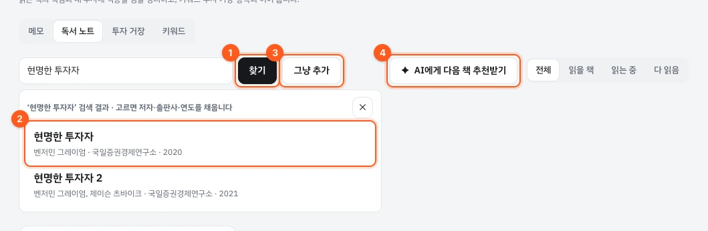

**독서 노트** 탭에서 책 제목을 넣고 책을 추가합니다. 목록에서는 *읽을 책 · 읽는 중 · 다 읽음*으로 걸러 봅니다.

- ① **찾기** — 제목으로 실제 출간된 책을 찾습니다. Enter를 눌러도 됩니다.
- ② **검색 결과** — 제목·저자·출판사·출간 연도가 나옵니다. 하나를 고르면 그 정보가 채워진 책이 추가되고 정리 화면이 열립니다. 같은 책의 다른 판이 여러 개 나오면 가지고 있는 판을 고르세요.
- ③ **그냥 추가** — 찾지 않고 적은 제목 그대로 추가합니다. 저자·출판사·연도는 나중에 채워도 됩니다.
- ④ **✦ AI에게 다음 책 추천받기** — [독서 큐레이터](#독서-큐레이터)가 읽은 책과 내 투자 기록을 보고 다음에 읽을 책을 추천합니다.

한국 책은 카카오 책 검색으로 찾습니다. [연동 · 설정](#연동--설정)의 **책 검색**에 카카오 REST API 키를 넣어야 쓸 수 있습니다(서버 관리자가 키를 정해 두었으면 넣지 않아도 됩니다). 키가 없으면 영문 책만 Open Library에서 찾습니다. 검색할 때는 책 제목만 보냅니다.

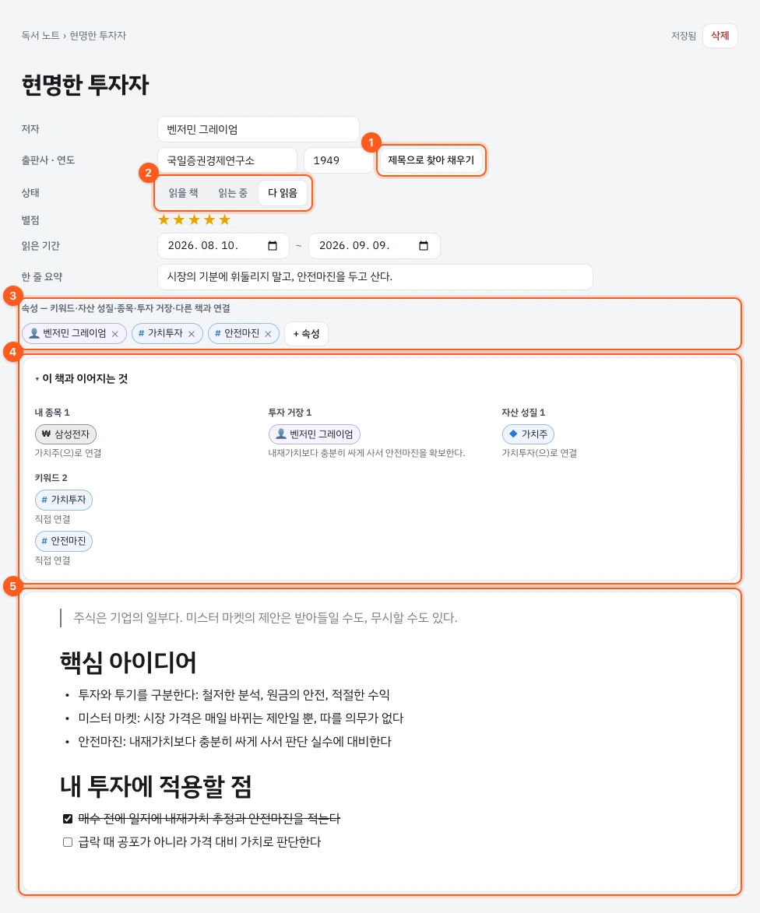

새 책에는 *핵심 아이디어 · 인상 깊은 구절 · 내 투자에 적용할 점* 틀이 담겨 있습니다.

- ① **제목으로 찾아 채우기** — 지금 제목으로 찾아, 고른 책의 제목·저자·출판사·연도로 바꿉니다. 그냥 추가한 책이나 정보가 틀린 책에 씁니다.
- ② **읽은 상태** — 저자, 출판사·연도, 별점, 읽은 기간, 한 줄 요약과 함께 적습니다.
- ③ **속성** — 이 책의 키워드, 저자인 거장, 관련 종목을 붙입니다.
- ④ **이 책과 이어지는 것** — 속성을 거쳐 이어진 내 종목, 거장, 메모, 자산 성질입니다.
- ⑤ **본문** — [매매일지 편집기](#본문-편집기)와 같은 블록 편집기입니다. `/`로 제목·목록·체크리스트·인용·표를 넣습니다.

고친 내용은 1.5초 뒤 저절로 저장되고, **Ctrl+S**로 바로 저장할 수도 있습니다. 오른쪽 위에 *저장됨*이 보이면 저장된 것입니다.

### 투자 거장

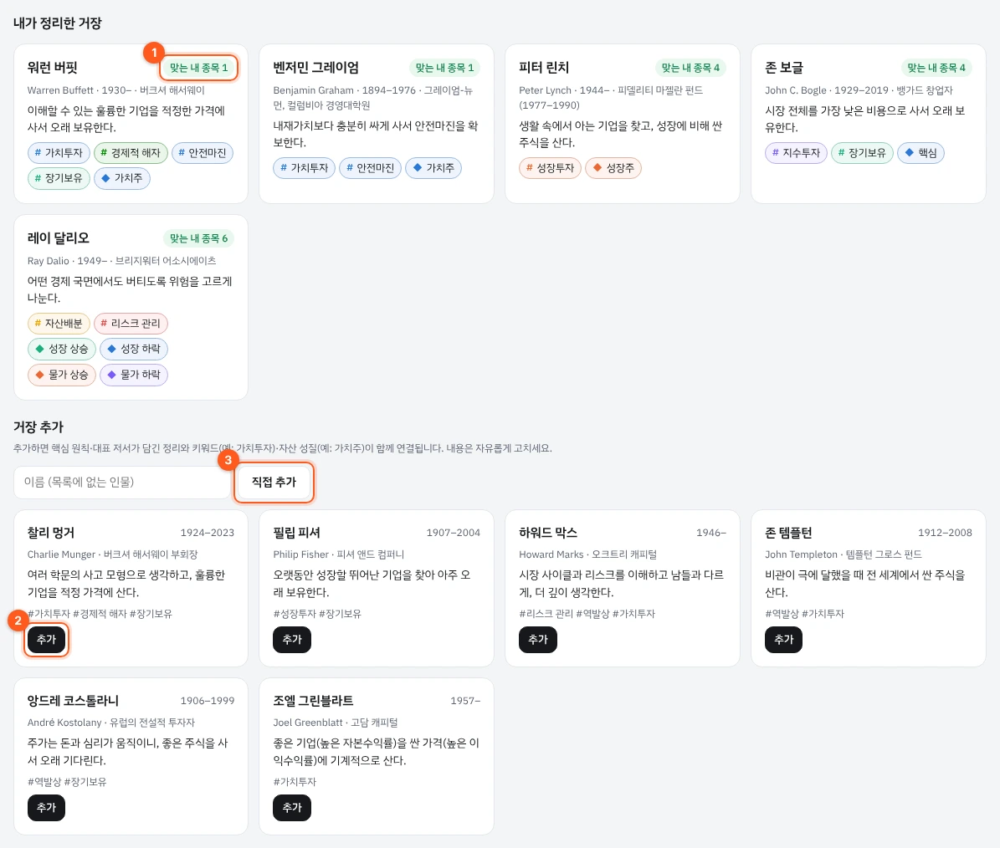

- ① **내가 정리한 거장** — 카드마다 그 철학에 맞는 내 종목 수가 나옵니다. 거장의 자산 성질(예: 가치주)로 지정한 종목 수입니다.
- ② **거장 추가** — 아래 목록에서 **추가**를 누르면 핵심 원칙과 대표 저서가 담긴 정리, 그리고 키워드·자산 성질 연결이 함께 만들어집니다. 내용은 자유롭게 고칩니다.
- ③ **직접 추가** — 목록에 없는 인물은 이름만 넣어 만듭니다.

| 거장 | 키워드 | 자산 성질 |
| --- | --- | --- |
| 워런 버핏 | 가치투자, 경제적 해자, 안전마진, 장기보유 | 가치주, 우량 대형주 |
| 벤저민 그레이엄 | 가치투자, 안전마진 | 가치주 |
| 피터 린치 | 성장투자 | 성장주, 중소형·신생 |
| 찰리 멍거 | 가치투자, 경제적 해자, 장기보유 | 가치주, 우량 대형주 |
| 필립 피셔 | 성장투자, 장기보유 | 성장주 |
| 존 보글 | 지수투자, 장기보유 | 핵심 |
| 레이 달리오 | 자산배분, 리스크 관리 | 성장 상승, 성장 하락, 물가 상승, 물가 하락 |
| 하워드 막스 | 리스크 관리, 역발상, 가치투자 | — |
| 존 템플턴 | 역발상, 가치투자 | 가치주, 신흥국 |
| 앙드레 코스톨라니 | 역발상, 장기보유 | — |
| 조엘 그린블라트 | 가치투자 | 가치주 |

자산 성질은 [자산 성질](#자산-성질)에 그 분류(주식 스타일, 주식 체급, 올웨더 경제 국면, 운용 역할, 지역)를 추가해 두었을 때만 연결됩니다. 나중에 분류를 추가했다면 거장 화면의 **+ 속성**에서 직접 붙입니다.

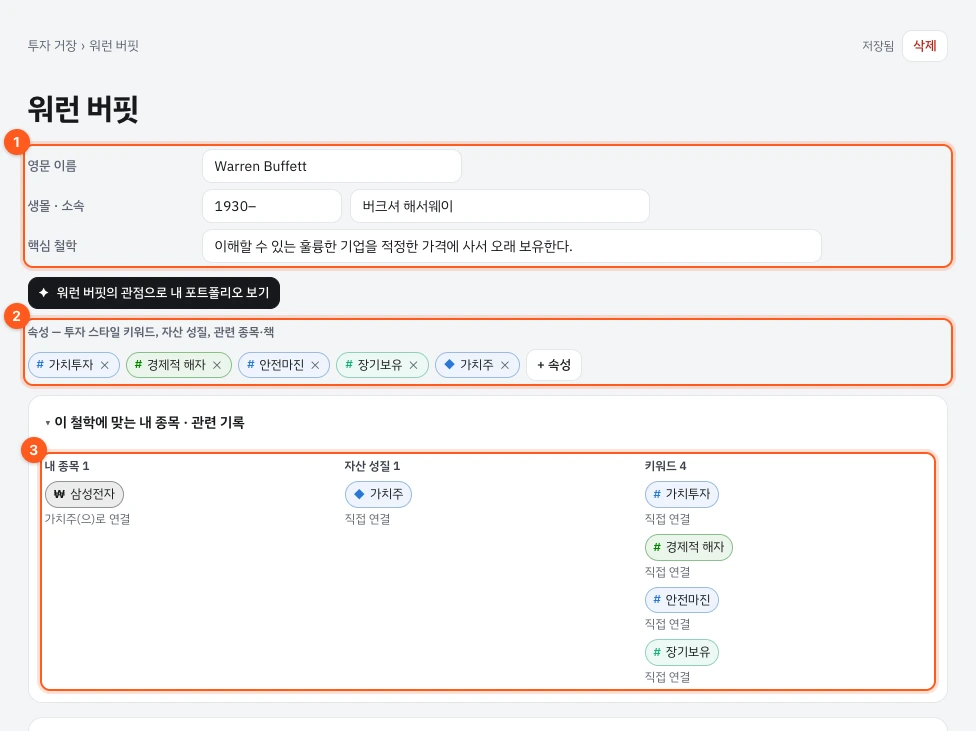

- ① 영문 이름, 생몰·소속, 핵심 철학을 적습니다. 아래 본문에는 핵심 원칙·대표 저서·내 투자에 적용할 점이 들어 있습니다.
- ② **속성** — 투자 스타일 키워드, 자산 성질, 관련 종목·책을 붙입니다.
- ③ **이 철학에 맞는 내 종목 · 관련 기록** — 붙인 성질로 지정한 내 종목이 *가치주(으)로 연결*처럼 이유와 함께 나옵니다.

**바뀜** [`57ab87e`](https://github.com/hgrgr/PPFP/commit/57ab87e100ea61b0a4042020f25cac070cfbe580) · 2026-10-08 — 철학 아래 **✦ (이름)의 관점으로 내 포트폴리오 보기**를 누르면, 이 정리를 기준으로 내 포트폴리오를 보는 [투자 거장 관점](#투자-거장-관점) 에이전트가 열립니다.

### 키워드

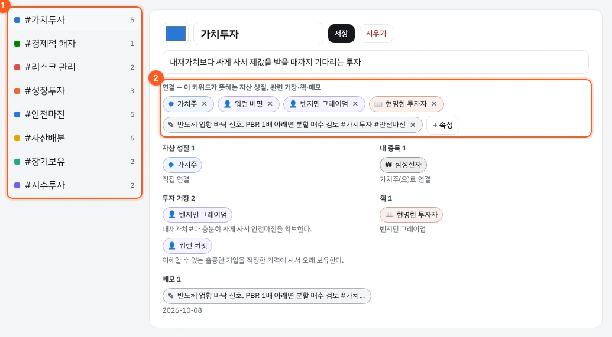

키워드는 메모·책·거장을 묶는 꼬리표입니다. 메모에 `#키워드`를 쓰거나 거장을 추가하면 생기고, 이 화면에서 직접 만들 수도 있습니다.

- ① **키워드 목록** — 옆 숫자는 연결된 항목 수입니다. 눌러서 고릅니다.
- ② **연결** — 이 키워드가 뜻하는 자산 성질과 관련 거장·책·메모입니다. *가치투자 → 가치주*처럼 자산 성질을 이어 두면 그 성질의 종목도 이 키워드와 이어집니다. 아래에는 이렇게 이어진 모든 항목이 나옵니다.

이름, 색, 설명을 고치고 **저장**합니다. **지우기**는 키워드와 연결만 지우고 메모·책·거장은 남깁니다.

## AI 어드바이저

**추가** [`57ab87e`](https://github.com/hgrgr/PPFP/commit/57ab87e100ea61b0a4042020f25cac070cfbe580) · 2026-10-08 · **바뀜** [`8244851`](https://github.com/hgrgr/PPFP/commit/8244851e3bbfc944781ac46217a8209b4a602523) · 2026-10-08 (리서치 애널리스트, 매매일지 코치), [`47ee0a1`](https://github.com/hgrgr/PPFP/commit/47ee0a1732e2ca52bd3dc2b48e0a81f4bd4099ff) · 2026-10-08 (아침 브리핑, 알림 분석), [`0982906`](https://github.com/hgrgr/PPFP/commit/0982906c172a739ce7c566c9967fe2a8cf63287b)·[`0b04f87`](https://github.com/hgrgr/PPFP/commit/0b04f877a18a1867fde5348367db75c2672db4ae)·[`3a2ebd2`](https://github.com/hgrgr/PPFP/commit/3a2ebd21e2860482117172ef07010c1f099bf8fa)·[`c041869`](https://github.com/hgrgr/PPFP/commit/c041869dfa2ed36f5ca355b6317a0b937cdc74d8) · 2026-10-08 (세금·배당·성과·목표를 읽는 도구), [`ab85c05`](https://github.com/hgrgr/PPFP/commit/ab85c05a58394108597e75078b56fc84971fbd02) · 2026-10-09 (ChatGPT·Gemini·Grok·DeepSeek 연동, 에이전트별 모델), [`d5bfb1b`](https://github.com/hgrgr/PPFP/commit/d5bfb1bdcfb1d69d70de91381ddfe7d24ad47692) · 2026-10-09 (독서 큐레이터), [`ea8adbb`](https://github.com/hgrgr/PPFP/commit/ea8adbbde9ca27a0c2dc4ac73cd8e7a2428c0110) · 2026-10-09 (스킬)

내 포트폴리오·매매일지·투자 노트를 직접 읽고 점검과 제안을 하는 AI 에이전트입니다. Claude(Anthropic), ChatGPT(OpenAI), Gemini(Google), Grok(xAI), DeepSeek 중 [API 키](#설정과-비용)를 넣은 곳의 모델로 동작하고, 에이전트마다 다른 모델을 고를 수 있습니다. 다섯 가지 에이전트가 있습니다.

| 에이전트 | 이럴 때 |
| --- | --- |
| **포트폴리오 매니저** | 포트폴리오 점검, 집중 위험, 목표 비중 이탈과 리밸런싱, 종목의 최근 실적·뉴스 확인 |
| **리서치 애널리스트** | 종목·업종을 웹에서 깊이 조사한 리포트(사업, 실적, 밸류에이션, 주가 흐름, 리스크, 촉매, 출처). 매수 계획 일지 초안 |
| **매매일지 코치** | 일지와 실제 매매를 함께 복기. 승률·손익비·보유 기간 같은 매매 성적과 반복되는 습관, 일지에 복기 덧붙이기 |
| **독서 큐레이터** | 읽은 책·투자 노트·매매일지·포트폴리오 성질을 보고 다음에 읽을 책 추천. 실제로 있는 책인지 찾아 확인하고 읽을 책 목록에 추가 |
| **투자 거장 관점** | [투자 노트](#투자-거장)에 정리한 거장(예: 워런 버핏)의 철학으로 내 포트폴리오를 보기. 잘 맞는 종목, 어긋나는 종목, 그 철학이라면 하지 않을 행동 |

에이전트가 하는 일과 하지 않는 일:

- **앱의 숫자를 씁니다** — 평가액·비중·수익률·Lot·목표 비중·자산 성질·일지 목표가, [세금](#세금) 예상, [배당](#배당), [성과 분석](#성과-분석), [목표](#목표) 시뮬레이션과 백테스트는 앱이 계산한 값을 도구로 읽어 옵니다. 답에 나온 숫자는 대시보드와 같은 값입니다.
- **웹을 찾아봅니다** — 최근 실적·뉴스·업황은 웹 검색으로 찾고 출처를 붙입니다. 웹 검색은 Claude 모델에서만 됩니다. 다른 회사의 모델은 앱의 데이터와 모델이 이미 아는 지식으로 답하고, 최신 소식은 직접 확인하라고 밝힙니다. 설정에서 끌 수 있습니다.
- **바꾸는 일은 제안만 합니다** — 메모 저장, 가격 알림 만들기, 목표 비중 바꾸기, 일지에 복기 덧붙이기, 새 일지 초안 만들기, 읽을 책 추가는 답 안에 **확인 카드**로 나옵니다. **실행**을 눌러야 반영되고, **넘기기**를 누르면 그대로 둡니다. 다음 질문 때 에이전트는 어느 제안을 실행했는지 압니다.
- **스킬을 붙일 수 있습니다** — 나만의 분석 순서·체크리스트·투자 원칙을 [스킬](#스킬)로 써 두거나 커뮤니티에서 가져와 에이전트에게 붙이면, 맞는 질문에서 그 지침을 따릅니다.
- **주문은 내지 않습니다** — 매수·매도는 직접 기록하세요. AI의 판단은 참고용이며 결정은 사용자의 몫입니다.

### 어디서나 묻기

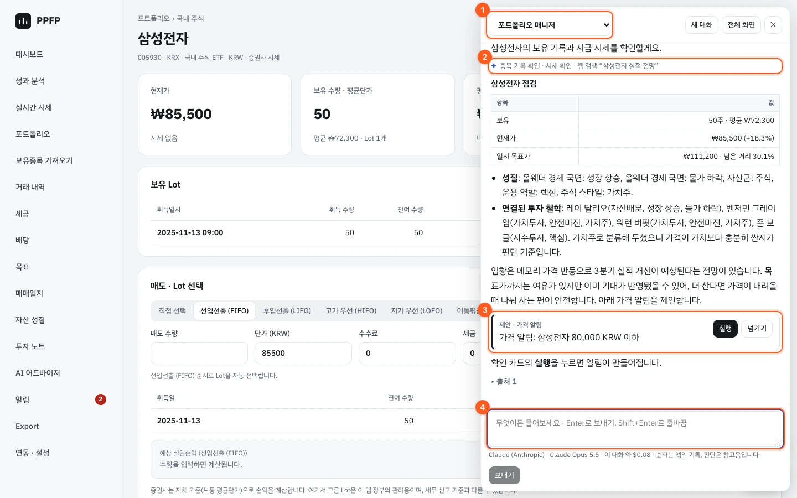

오른쪽 아래 **✦ AI**나 **Alt+K**로 옆 창을 엽니다. 보던 화면은 그대로 두고 묻습니다. 여러 화면의 **✦** 버튼은 그 화면에 맞는 질문으로 창을 엽니다. 대시보드의 *AI 점검*, 종목 화면의 *AI 리서치*·*AI에게 이 종목 묻기*, 시세 종목 상세의 *AI 리서치*, 목표 비중 카드의 *AI 리밸런싱 제안*, 매매일지 목록의 *AI 매매 코치*와 일지의 *AI와 복기*, 독서 노트의 *AI에게 다음 책 추천받기*, 투자 거장 정리의 *관점으로 내 포트폴리오 보기*가 있습니다.

- ① **에이전트** — 포트폴리오 매니저, 리서치 애널리스트, 매매일지 코치, 독서 큐레이터, *(거장 이름)의 관점* 중에서 고릅니다. 바꾸면 새 대화가 시작됩니다. **새 대화**, **전체 화면**(아래 AI 어드바이저 화면에서 이어 보기)도 여기 있습니다.
- ② **한 일** — 에이전트가 확인한 것(종목 기록, 시세, 웹 검색어 등)이 한 줄로 나옵니다.
- ③ **확인 카드** — 제안입니다. **실행**하면 반영되고 *실행함*과 **보기** 링크로 바뀝니다.
- ④ **질문** — Enter로 보내고 Shift+Enter로 줄을 바꿉니다. 창은 지금 보는 화면(종목, 포트폴리오, 일지, 책, 거장)을 알고 있어서 "이 종목"이라고만 써도 됩니다. 입력창 아래에 이 대화를 답하는 회사와 모델이 나옵니다.

### AI 어드바이저 화면

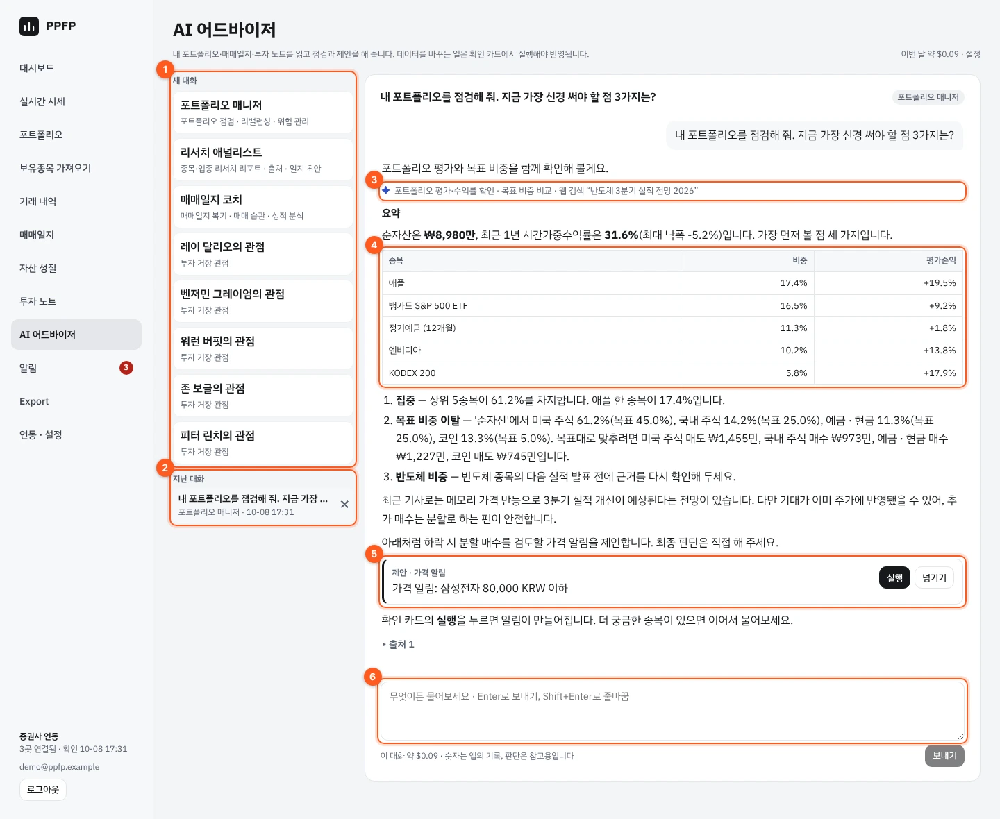

왼쪽 메뉴 *AI 어드바이저*에서 대화를 넓게 보고 지난 대화를 이어 갑니다.

- ① **새 대화** — 포트폴리오 매니저, 리서치 애널리스트, 매매일지 코치, 독서 큐레이터, 또는 정리해 둔 거장마다 *(이름)의 관점*으로 시작합니다. 처음에는 자주 쓰는 질문이 보기로 나옵니다.
- ② **지난 대화** — 눌러서 이어 갑니다. **✕**로 지웁니다.

위쪽의 **✦ 스킬 관리**는 [스킬](#스킬) 화면으로 갑니다.
- ③ **한 일** — 이번 답을 위해 확인한 것들입니다.
- ④ **답** — 표와 목록으로 정리됩니다. 웹에서 찾은 내용은 아래 **출처**를 펼쳐 원문을 엽니다.
- ⑤ **확인 카드** — 이 대화에서 나온 제안입니다.
- ⑥ **질문** — 아래에 이 대화를 답하는 모델과 대략적인 비용이 나옵니다. 대화는 시작할 때의 모델로 이어 가므로, 설정에서 모델을 바꿔도 지난 대화는 그대로입니다.

### 리서치 애널리스트

**추가** [`8244851`](https://github.com/hgrgr/PPFP/commit/8244851e3bbfc944781ac46217a8209b4a602523) · 2026-10-08

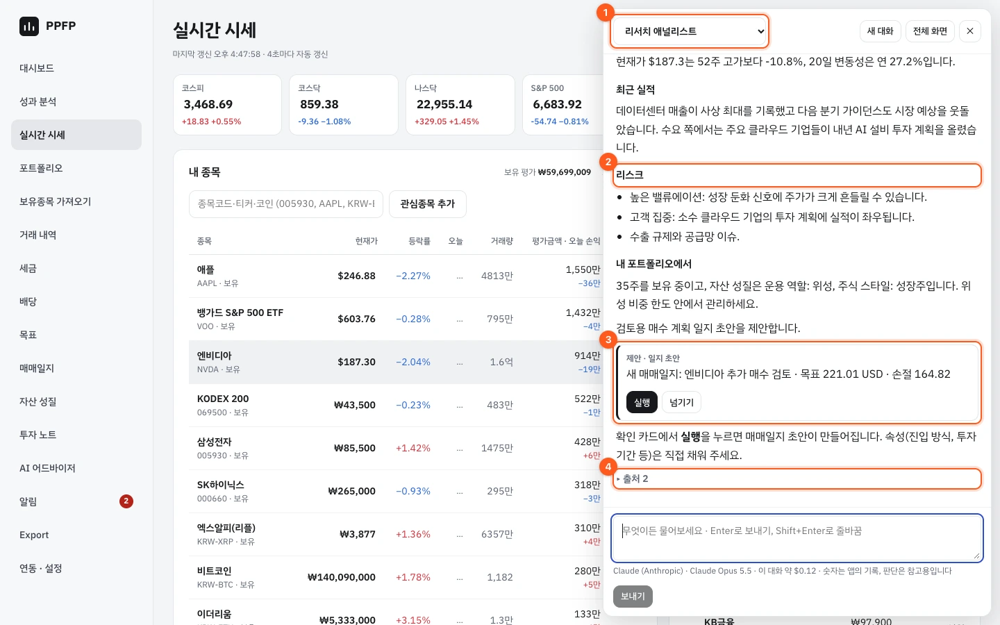

종목이나 업종, 주제(예: 반도체 업황)를 깊이 조사합니다. 다른 에이전트보다 웹을 더 많이 찾고 더 오래 생각하므로 한 번에 비용이 조금 더 듭니다. 회사 발표·실적 자료를 먼저 찾고, 앱의 일봉으로 계산한 주가 흐름(1개월~1년 수익률, 52주 고가와 거리, 이동평균, 변동성)과 내 보유 기록을 함께 봅니다.

- ① 창 위쪽에 *리서치 애널리스트*가 나옵니다.
- ② 리포트는 한 줄 결론 → 사업 → 최근 실적 → 밸류에이션 → 주가 흐름 → 리스크 → 촉매 → 내 포트폴리오에서의 의미 순으로 정리됩니다. 질문에 맞게 줄거나 늘어납니다.
- ③ 매수를 검토할 만하면 **매매일지 초안**을 제안합니다. 실행하면 *매수 계획* 양식으로 목표 예상 가격·손절가·근거가 담긴 일지가 만들어지고, **보기**로 열어 나머지 속성을 채웁니다. 보유하지 않은 종목도 됩니다. 리포트 요약을 투자 노트 메모로 남기자고 제안하기도 합니다.
- ④ **출처**를 펼치면 참고한 자료가 나옵니다.

### 매매일지 코치

**추가** [`8244851`](https://github.com/hgrgr/PPFP/commit/8244851e3bbfc944781ac46217a8209b4a602523) · 2026-10-08

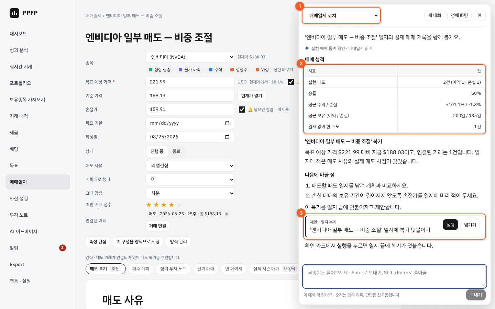

매매일지와 실제 거래·실현 손익을 함께 보고 복기합니다. 매매일지 목록의 **✦ AI 매매 코치**나 일지의 **✦ AI와 복기**로 엽니다.

- ① 창 위쪽에 *매매일지 코치*가 나옵니다.
- ② **매매 성적** — 실현된 매도로 계산한 승률, 평균 수익·손실률, 이긴 매매와 진 매매의 평균 보유 기간, 일지 없이 한 매도 수입니다. 앱의 Lot 기록으로 계산한 값입니다.
- ③ **일지에 복기 덧붙이기** — 일지 한 편을 복기했으면 그 내용을 일지 끝에 *AI 복기 · 날짜* 제목으로 덧붙이자고 제안합니다. 종료할 때가 된 일지는 종료로 바꾸자고 함께 제안하기도 합니다.

위 화면은 매매일지 코치를 ChatGPT 모델로 정해 둔 예입니다(입력창 아래). 코치는 이익은 일찍 팔고 손실은 오래 들고 있는지, 계획에 없던 추가 매수가 반복되는지처럼 습관을 숫자로 짚고, 다음에 바꿀 한두 가지를 제안합니다.

### 독서 큐레이터

**추가** [`d5bfb1b`](https://github.com/hgrgr/PPFP/commit/d5bfb1bdcfb1d69d70de91381ddfe7d24ad47692) · 2026-10-09

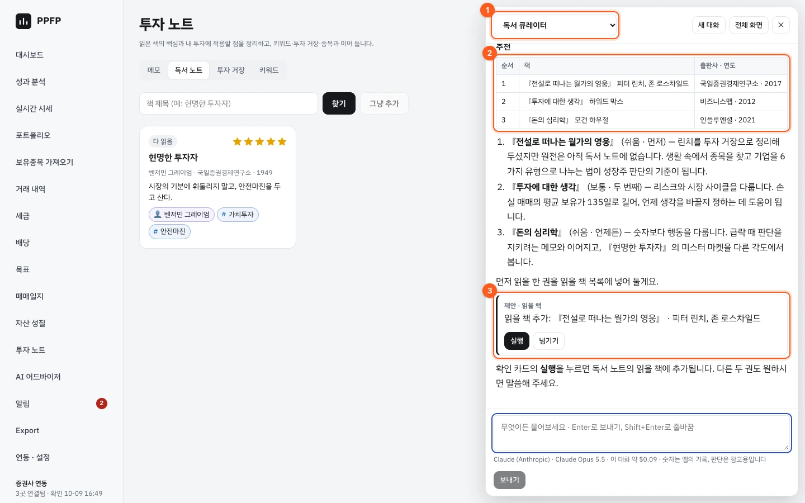

다음에 읽을 투자 책을 추천합니다. [독서 노트](#독서-노트)의 **✦ AI에게 다음 책 추천받기**나, AI 창에서 *독서 큐레이터*를 골라 엽니다.

- ① 창 위쪽에 *독서 큐레이터*가 나옵니다.
- ② **추천** — 보통 3권 안팎을 읽을 순서대로 추천합니다. 출판사·연도는 [책 검색](#독서-노트)으로 확인한 값입니다. 아래에 책마다 난이도와, 왜 지금 나에게 필요한지가 나옵니다.
- ③ **읽을 책 추가** — 실행하면 독서 노트에 *읽을 책* 상태로 추가됩니다. 추천 이유는 한 줄 요약 자리에 들어가고, 이미 있는 키워드와 이어집니다. **보기**로 바로 엽니다.

큐레이터는 독서 노트의 책(상태·별점·한 줄 요약·연결한 키워드와 거장·정리한 내용), 투자 거장·키워드·메모, 매매일지와 실제 매매 성적, 자산 성질별 비중을 읽고 추천 이유를 내 기록과 이어서 설명합니다. 예를 들어 정리만 해 둔 거장의 원전, 매매 습관의 약점을 보완하는 책, 높은 별점을 준 책의 다음 단계, 지금 생각과 반대 시각의 책을 섞습니다. 독서 노트에 이미 있는 책은 추천하지 않고, 검색으로 찾지 못한 책은 추천하지 않거나 확인하지 못했다고 밝힙니다. 한국 책을 확인하려면 카카오 책 검색 키가 있어야 합니다.

### 투자 거장 관점

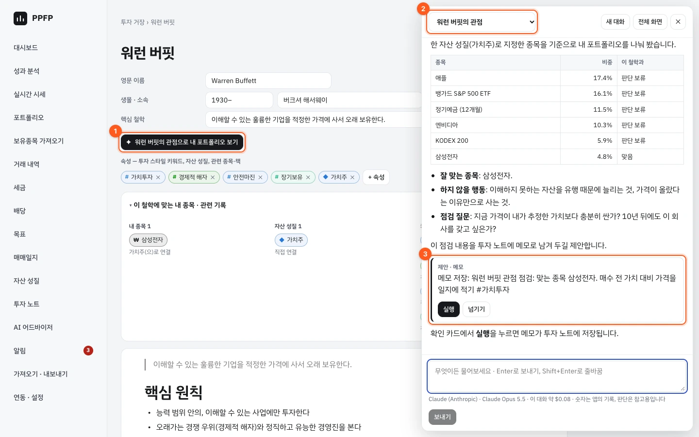

- ① 투자 거장 정리 화면의 **✦ (이름)의 관점으로 내 포트폴리오 보기**로 시작합니다.
- ② 창 위쪽에 *워런 버핏의 관점*처럼 지금 렌즈가 나옵니다.
- ③ 점검한 내용을 투자 노트 메모로 남기자는 제안입니다.

에이전트는 사용자가 [투자 노트](#투자-거장)에 적은 정리(핵심 원칙, 키워드, 자산 성질, 철학에 맞는 내 종목)를 기준으로 판단합니다. 정리를 고치면 다음 새 대화부터 반영됩니다. 그 인물 본인인 척하지 않고 "버핏의 관점에서 보면"처럼 말합니다.

### 아침 브리핑 · 알림 분석

**추가** [`47ee0a1`](https://github.com/hgrgr/PPFP/commit/47ee0a1732e2ca52bd3dc2b48e0a81f4bd4099ff) · 2026-10-08

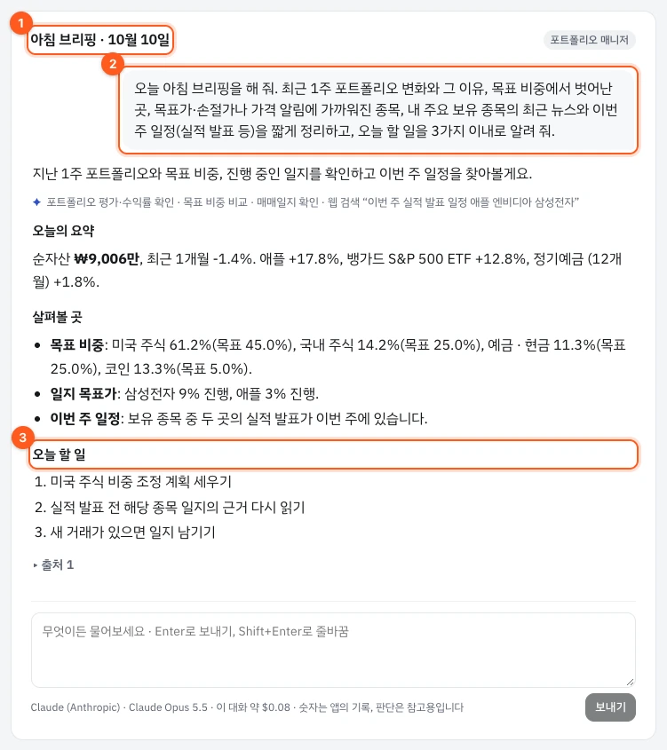

설정에서 켜면 포트폴리오 매니저가 매일 아침 브리핑을 써서 알림함과 푸시로 보냅니다.

- ① 대화 제목은 *아침 브리핑 · 날짜*입니다. 알림의 **브리핑 전체 보기**나 [지난 대화](#ai-어드바이저-화면)에서 엽니다.
- ② 브리핑에 쓰는 질문입니다. 최근 포트폴리오 변화, 목표 비중 이탈, 목표가·손절가나 가격 알림에 가까워진 종목, 보유 종목의 뉴스와 이번 주 일정을 봅니다.
- ③ 끝에 **오늘 할 일**이 3가지 이내로 나옵니다. 브리핑도 보통 대화라서 아래 입력창에 이어서 물어볼 수 있습니다.

정한 시각 이후 서버가 처음 확인할 때(5분마다) 하루 한 번 보냅니다. *평일만*을 켜면 토·일요일은 건너뜁니다. **지금 브리핑 받아 보기**는 같은 질문으로 옆 창을 바로 엽니다.

**알림 AI 분석**을 켜면 가격·목표 비중 알림이 올 때마다 AI가 원인(최근 뉴스 포함)과 지금 검토할 것을 정리해 두고, 알림함에 **AI 분석 보기**가 붙습니다. 알림이 잦으면 비용이 늘어나므로 처음에는 꺼 두고 알림함의 **AI로 분석**을 써 보길 권합니다. 브리핑과 분석은 하나씩 차례로 만들어지고 월 사용 한도에 포함됩니다. 한도에 닿거나 키가 없어 만들지 못하면 그 이유가 알림으로 옵니다.

### 스킬

**추가** [`ea8adbb`](https://github.com/hgrgr/PPFP/commit/ea8adbbde9ca27a0c2dc4ac73cd8e7a2428c0110) · 2026-10-09

에이전트에게 나만의 분석 순서, 체크리스트, 투자 원칙을 가르칩니다. 스킬은 *이름*, *언제 쓰는지*(설명), *지침*으로 된 글이고, 여러 AI 도구에서 쓰는 SKILL.md 형식을 그대로 따릅니다. 에이전트는 붙은 스킬의 이름과 설명을 늘 보고 있다가, 질문이 설명에 맞으면 답하기 전에 지침을 읽고 따릅니다. 어느 AI 회사의 모델에서나 됩니다.

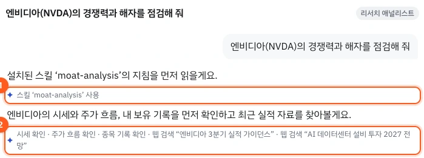

- ① **스킬 사용** — 답 안에 *스킬 ‘이름’ 사용*으로 어느 스킬을 읽었는지 나옵니다.
- ② 그다음부터는 지침이 정한 순서대로 앱의 도구와 웹 검색으로 확인합니다.

#### 내 스킬

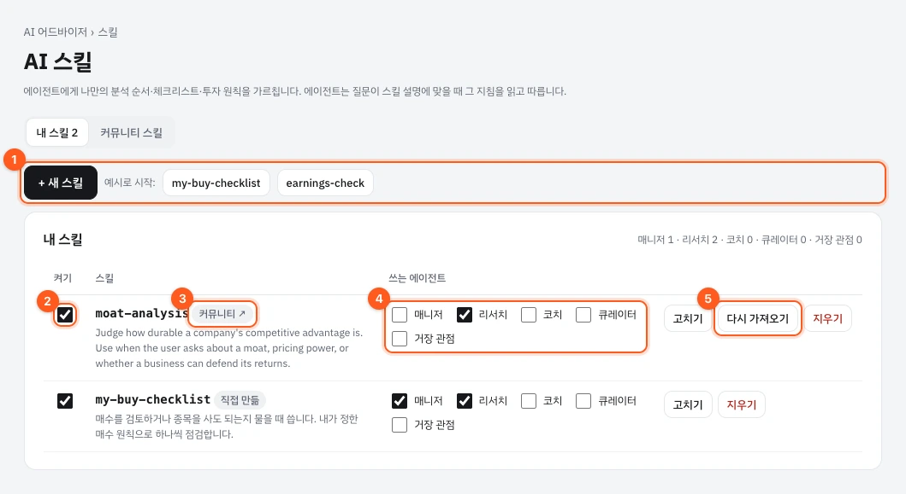

[AI 어드바이저 화면](#ai-어드바이저-화면)의 **✦ 스킬 관리**로 엽니다.

- ① **+ 새 스킬** — 이름, 언제 쓰는지, 쓰는 에이전트, 지침(마크다운)을 적습니다. **예시로 시작**의 *my-buy-checklist*(내 매수 원칙 점검), *earnings-check*(실적 발표 점검)를 고쳐 쓰거나, 다른 곳에서 만든 SKILL.md를 **SKILL.md 붙여넣기**로 채울 수도 있습니다.
- ② **켜기** — 끄면 지우지 않고 잠시 쓰지 않습니다.
- ③ **출처** — *직접 만듦*이나 *커뮤니티 ↗*(원본 GitHub 페이지)입니다.
- ④ **쓰는 에이전트** — 체크한 에이전트만 이 스킬을 봅니다. 바로 저장됩니다. *거장 관점*에 붙이면 모든 거장 관점 대화에서 씁니다.
- ⑤ **다시 가져오기** — 커뮤니티 스킬을 원본에서 다시 읽습니다. 직접 고친 지침은 덮어씁니다.

스킬 설명은 에이전트가 스킬을 고르는 유일한 단서이므로 "매수를 검토할 때"처럼 어떤 질문에 쓰는지 구체적으로 적으세요. 지침에 앱의 도구 이름(`get_holding`, `get_price_history`, `get_trait_allocation` 등)을 적어 두면 그 도구로 확인합니다.

#### 커뮤니티 스킬

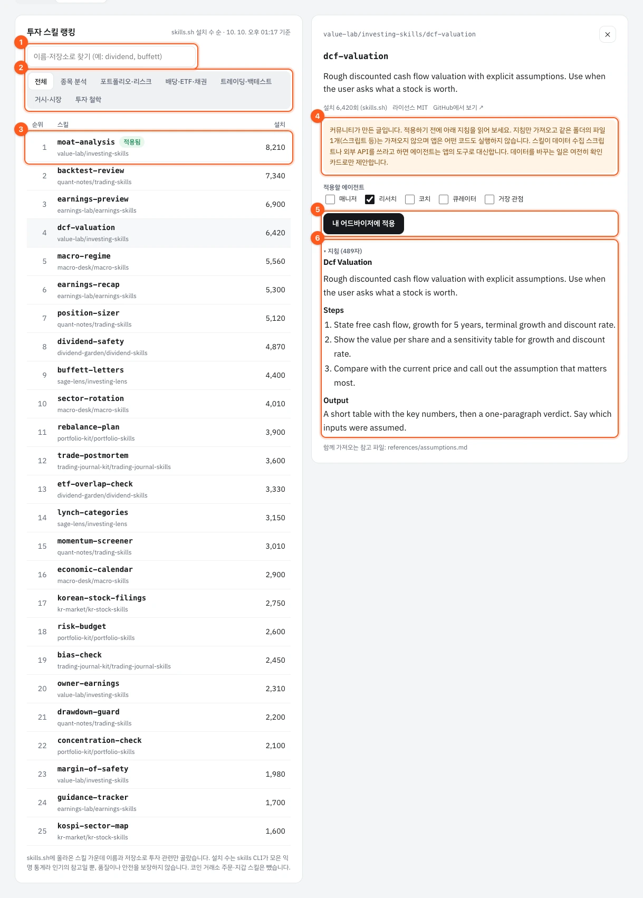

다른 사람들이 만들어 공개한 투자 스킬을 설치 수 순으로 보고 내 에이전트에 적용합니다. 목록은 공개 스킬 디렉터리 [skills.sh](https://skills.sh)에서 투자 관련 낱말로 찾은 뒤 이름과 저장소로 투자 스킬만 골랐고, 스킬 내용은 원본 GitHub 저장소에서 읽습니다. 목록과 내용은 1시간마다 새로 받습니다.

- ① **찾기** — 이름이나 저장소로 거릅니다(예: dividend, buffett).
- ② **분류** — 종목 분석, 포트폴리오·리스크, 배당·ETF·채권, 트레이딩·백테스트, 거시·시장, 투자 철학으로 거릅니다.
- ③ **랭킹** — 순위와 설치 수(skills.sh가 모은 익명 설치 통계)입니다. 이미 적용한 스킬에는 *적용됨*이 붙습니다. 누르면 오른쪽에 미리 보기가 열립니다.
- ④ **주의** — 커뮤니티가 만든 글이므로 적용하기 전에 지침을 읽어 보세요. 앱은 지침 글과 같은 폴더의 참고 문서만 가져오고, 함께 있는 스크립트 같은 파일은 가져오지도 실행하지도 않습니다. 몇 개를 뺐는지 여기 나옵니다.
- ⑤ **내 어드바이저에 적용** — 체크한 에이전트에 붙여 [내 스킬](#내-스킬)에 추가합니다. 스킬 내용을 보고 어울리는 에이전트가 미리 체크돼 있습니다.
- ⑥ **지침** — 원문 그대로입니다. 대부분 영어지만 에이전트는 한국어로 답합니다. 라이선스와 GitHub 원본 링크는 위쪽에 있습니다.

**알아 둘 점**

- 설치 수는 인기의 참고일 뿐 품질이나 안전을 보장하지 않습니다. 코인 거래소에 주문을 내거나 지갑을 다루는 스킬은 목록에서 뺐습니다.
- 스킬이 데이터 수집 스크립트나 외부 API를 쓰라고 해도 에이전트는 실행할 수 없으므로 앱의 도구와 (Claude라면) 웹 검색으로 대신하고, 그렇게 했다고 밝힙니다.
- 스킬 지침보다 앱의 규칙이 먼저입니다. 숫자는 도구로 확인하고, 데이터를 바꾸는 일은 확인 카드로만 제안하며, 주문은 내지 않습니다. 스킬 안의 지시가 이 규칙과 부딪치면 따르지 않습니다.
- 스킬을 많이 붙이면 질문마다 보내는 글이 조금 늘어 비용도 약간 늘어납니다. 지침은 필요할 때만 읽습니다.

### 설정과 비용

**바뀜** [`ab85c05`](https://github.com/hgrgr/PPFP/commit/ab85c05a58394108597e75078b56fc84971fbd02) · 2026-10-09 (AI 회사별 API 키, 에이전트별 모델)

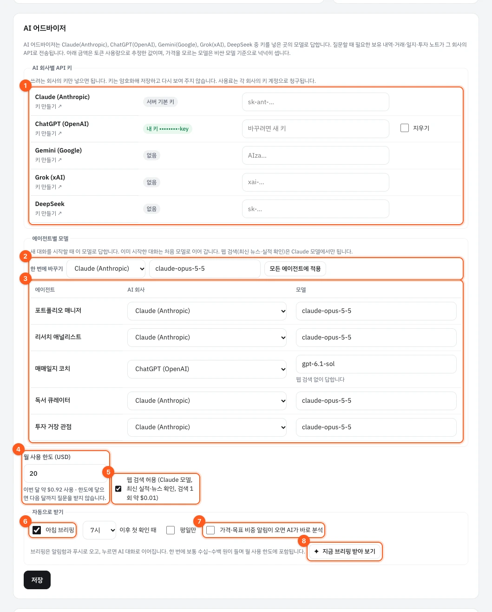

*연동 · 설정*의 **AI 어드바이저** 카드에서 정합니다.

- ① **AI 회사별 API 키** — 쓰려는 회사의 키만 넣습니다. **키 만들기 ↗**는 그 회사의 키 발급 화면으로 갑니다. 키는 서버에서 암호화해 저장하고 다시 보여 주지 않으며, *내 키 ••••abcd*처럼 끝자리만 보입니다. 서버 관리자가 서버 기본 키를 정해 둔 회사는 *서버 기본 키*로 나오고 키 없이도 쓸 수 있으며, 내 키를 넣으면 그 키를 씁니다. **지우기**를 체크하고 저장하면 내 키를 지웁니다.

  | 회사 | 키 모양 | 웹 검색 |
  | --- | --- | --- |
  | Claude (Anthropic) | `sk-ant-…` | 됨 |
  | ChatGPT (OpenAI) | `sk-…` | 안 됨 |
  | Gemini (Google) | `AIza…` | 안 됨 |
  | Grok (xAI) | `xai-…` | 안 됨 |
  | DeepSeek | `sk-…` | 안 됨 |

- ② **한 번에 바꾸기** — 회사와 모델을 고르고 **모든 에이전트에 적용**을 누르면 아래 표의 모든 에이전트가 그 모델로 바뀝니다. 저장을 눌러야 반영됩니다.
- ③ **에이전트별 모델** — 에이전트마다 AI 회사와 모델을 고릅니다. 모델 칸을 누르면 자주 쓰는 모델이 보기로 나오고, 그 회사의 키가 있으면 키로 쓸 수 있는 모델 목록도 함께 나옵니다. 목록에 없는 모델 이름을 직접 적어도 됩니다. 키가 없는 회사를 고르면 *키가 없어 지금은 Claude로 답합니다*처럼 대신 쓰는 모델이 나오고, 웹 검색이 없는 모델이면 *웹 검색 없이 답합니다*가 나옵니다. 최신 뉴스가 중요한 리서치 애널리스트는 Claude를 권합니다. 아침 브리핑과 가격·목표 비중 알림 분석은 포트폴리오 매니저의 모델로, 매매일지 목표가·손절가 알림 분석은 매매일지 코치의 모델로 만듭니다.
- ④ **월 사용 한도** — 이번 달 추정 사용액이 한도에 닿으면 다음 달까지 질문을 받지 않습니다. 비우면 한도가 없습니다. 사용액은 토큰 사용량과 웹 검색 횟수로 추정한 값이라 실제 청구액과 조금 다를 수 있습니다. 가격을 아는 모델은 그 가격으로, 모르는 모델은 입력 100만 토큰당 $10·출력 $50(비싼 모델 기준)으로 넉넉히 셉니다. 정확한 금액은 각 회사의 콘솔에서 봅니다. 지금까지 쓴 금액은 화면 위쪽과 AI 창 맨 위의 **✦ AI 이번 달**에 늘 보이고, 자세한 내역은 [사용량 · 비용](#사용량--비용)에서 봅니다.
- ⑤ **웹 검색 허용** — 끄면 Claude도 앱 안의 데이터만으로 답합니다. 검색 1회에 약 $0.01이 더 듭니다.
- ⑥ **아침 브리핑** — 켜고 시각과 *평일만* 여부를 고릅니다([아침 브리핑](#아침-브리핑--알림-분석)).
- ⑦ **알림이 오면 AI가 바로 분석** — 가격·목표 비중 알림마다 AI 분석을 미리 만듭니다.
- ⑧ **지금 브리핑 받아 보기** — 설정과 상관없이 지금 브리핑을 옆 창에서 받습니다.

새로 고른 모델은 새 대화부터 쓰입니다. 이미 시작한 대화는 시작할 때의 회사·모델로 이어 가고, 그 회사의 키를 지우면 이어 갈 수 없다는 안내가 나옵니다. 그럴 때는 새 대화를 시작하세요.

질문하거나 브리핑·분석을 만들 때 필요한 보유 내역·거래·일지·투자 노트가 그 대화를 답하는 회사의 API로 전송됩니다. 한 번 점검에 드는 비용은 모델과 질문, 확인할 데이터 양에 따라 다르며, Claude Opus 5.5 기준으로 보통 수십 원에서 수백 원 정도입니다.

## 사용량 · 비용

**추가** [`35bd533`](https://github.com/hgrgr/PPFP/commit/35bd5336cda613428453324cc90b2359b7501811) · 2026-10-10

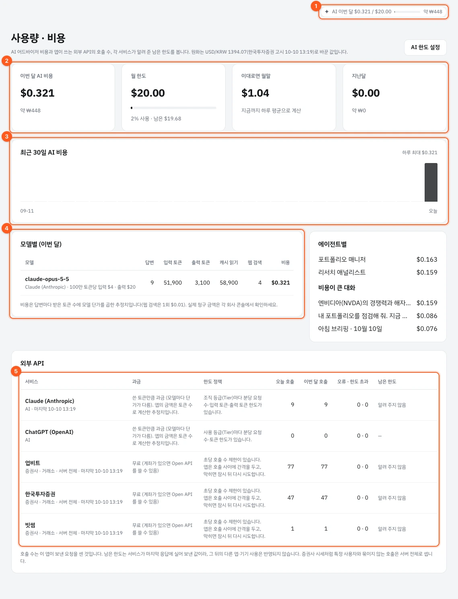

AI 어드바이저에 든 비용과, 앱이 쓰는 외부 API(AI 회사, 책 검색, 스킬 목록, 증권사·거래소)를 얼마나 불렀는지 봅니다. 원화 금액은 [가장 최근 공시 환율](#해외-자산을-현지-통화로-보기)로 바꾼 값입니다.

- ① **✦ AI 이번 달** — 모든 화면의 오른쪽 위와 AI 창 맨 위에 늘 보이는 작은 표시입니다. 이번 달 AI 비용, 월 한도와 막대, 원화 금액이 나와서 AI에게 묻기 전에 얼마나 썼는지 알 수 있습니다. 답을 받을 때마다 다시 계산되고, 한도의 80%를 넘으면 막대가 노랗게, 다 쓰면 빨갛게 바뀝니다. 누르면 이 화면으로 옵니다.
- ② **요약** — 이번 달 AI 비용, [월 한도](#설정과-비용)와 사용 비율, 지금까지의 하루 평균으로 계산한 월말 예상, 지난달 비용입니다. 월말 예상이 한도를 넘으면 빨간 글씨로 알려 줍니다.
- ③ **최근 30일 AI 비용** — 하루 단위 막대입니다. 막대에 마우스를 올리면 날짜와 금액이 나옵니다.
- ④ **모델별** — 이번 달 모델마다 답변 수, 입력·출력·캐시 읽기 토큰, 웹 검색 횟수, 비용입니다. 모델 이름 아래에 앱이 쓰는 100만 토큰당 단가가 나옵니다. 단가를 모르는 모델은 비싼 쪽으로 추정했다고 적힙니다. 옆에는 **에이전트별** 비용과 **비용이 큰 대화**가 나오고, 대화를 누르면 그 대화로 갑니다.
- ⑤ **외부 API** — 서비스마다 과금 방식, 한도 정책, 오늘·이번 달 호출 수, 오류와 한도 초과(429 등으로 거절된) 횟수입니다. 서비스 이름을 누르면 그 회사의 사용량·한도 화면이 열립니다. *남은 한도*는 서비스가 응답에 실어 보낸 값(예: *요청 49 / 50 남음 · 13:20 초기화*)으로, 알려 주지 않는 서비스는 *알려 주지 않음*으로 나옵니다.

| 서비스 | 과금 | 한도 |
| --- | --- | --- |
| Claude·ChatGPT·Gemini·Grok·DeepSeek | 쓴 토큰만큼 | 회사·등급마다 분당 요청·토큰 한도 |
| 카카오 책 검색 | 무료 | 앱(키)마다 하루 쿼터 |
| Open Library | 무료 | 정해진 한도 없음 |
| GitHub (스킬 파일) | 무료 | 로그인 없이 IP마다 시간당 60회 |
| skills.sh | 무료 | 공개 목록, 앱이 하루 동안 저장해 둠 |
| 증권사·코인 거래소 | 무료 | 초당 호출 수 제한, 앱이 간격을 두고 호출 |

AI 비용은 답변마다 받은 토큰 수로 계산한 추정치라 실제 청구액과 조금 다를 수 있습니다. 호출 수는 이 앱이 보낸 요청만 셉니다. 증권사 시세나 공개 스킬 목록처럼 특정 사용자와 묶이지 않는 호출은 *서버 전체*로 셉니다.

## 실시간 시세

**추가** [`6156d44`](https://github.com/hgrgr/PPFP/commit/6156d44348ee35aa0d5d265030b3856bdc96a79a) · 2026-10-08 · **바뀜** [`a9cb43c`](https://github.com/hgrgr/PPFP/commit/a9cb43c123a3f2238ad3744c28fadaf132d8d05c) · 2026-10-08 (코인 시세·코인 랭킹 탭 추가), [`8e6df7e`](https://github.com/hgrgr/PPFP/commit/8e6df7e0585896c34a2f7f6e9811c05a7520ad79) · 2026-10-08 (랭킹 표에서 현재가와 등락률을 한 칸에 표시)

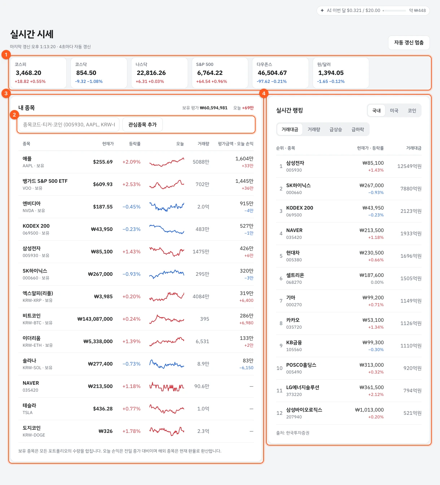

연결된 증권사·거래소에서 몇 초마다 새 값을 받아오는 시세판입니다. 오른쪽 위 **자동 갱신 멈춤**으로 잠시 멈출 수 있고, 브라우저 탭이 안 보일 때는 저절로 멈춥니다.

- ① **지수 · 환율** — 코스피, 코스닥, 나스닥, S&P 500, 다우존스와 원/달러를 전일 대비와 함께 보여 줍니다.
- ② **관심종목 추가** — 국내 종목코드(`005930`), 미국 티커(`AAPL`), 코인 원화마켓 코드(`KRW-BTC`)를 넣습니다. 관심종목은 표 오른쪽 ★로 뺍니다.
- ③ **내 종목** — 모든 포트폴리오에 보유한 상장 종목·코인과 관심종목입니다.
  - *현재가·등락률·거래량*: 전일 종가 대비 값입니다.
  - *오늘*: 당일 흐름을 보여 주는 미니 차트입니다. 코인은 최근 12시간입니다.
  - *평가금액·오늘 손익*: 보유한 종목만 나옵니다. 해외 종목은 현재 환율로 환산합니다.
  - 행을 누르면 아래에 [종목 상세](#종목-상세--봉-차트)가 열립니다.
- ④ **실시간 랭킹** — 시장(국내·미국·코인)과 기준(거래대금·거래량·급상승·급하락)을 골라 상위 종목을 봅니다. 등락률은 현재가 바로 아래에 나옵니다. 창이 좁으면 랭킹 카드가 시세판 아래로 내려가서 표가 잘리지 않습니다. 아래에 응답한 증권사·거래소가 *출처*로 나옵니다. 종목을 누르면 상세가 열립니다.

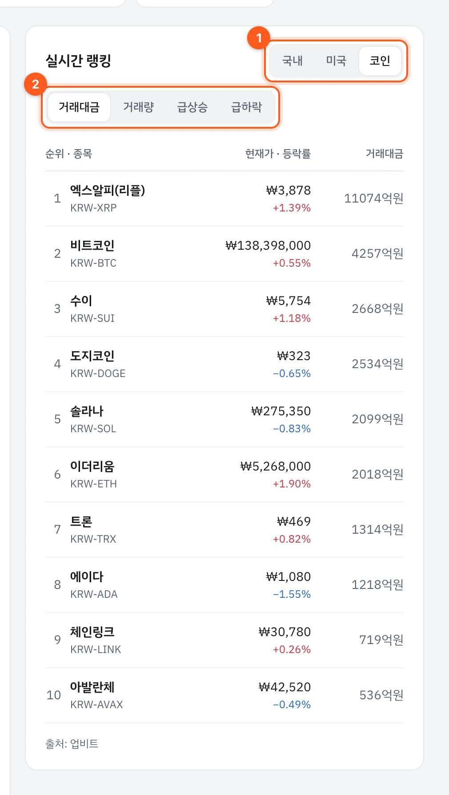

**코인 랭킹** — 코인 거래소를 연결하면 *코인* 탭에서 원화마켓 코인의 24시간 거래대금·거래량과 등락률 순위를 볼 수 있습니다.

갱신 주기는 시세판 4초, 종목 상세 3초, 랭킹 15초입니다. 같은 종목을 여러 탭에서 보더라도 서버가 잠깐 저장해 둔 값을 같이 쓰므로 증권사 호출 한도를 넘지 않습니다.

## 종목 상세 · 봉 차트

**추가** [`a9cb43c`](https://github.com/hgrgr/PPFP/commit/a9cb43c123a3f2238ad3744c28fadaf132d8d05c) · 2026-10-08 (봉 차트와 거래량) · 종목 상세 화면과 호가는 [`6156d44`](https://github.com/hgrgr/PPFP/commit/6156d44348ee35aa0d5d265030b3856bdc96a79a) · 2026-10-08 · **바뀜** [`9c61e96`](https://github.com/hgrgr/PPFP/commit/9c61e96d06312e509777b480a7f240e58a249e91) · 2026-10-08 (가격 축 폭을 가격 길이에 맞춤, 1시간·4시간봉 축에 날짜 표시), [`8244851`](https://github.com/hgrgr/PPFP/commit/8244851e3bbfc944781ac46217a8209b4a602523) · 2026-10-08 (*✦ AI 리서치* 버튼)

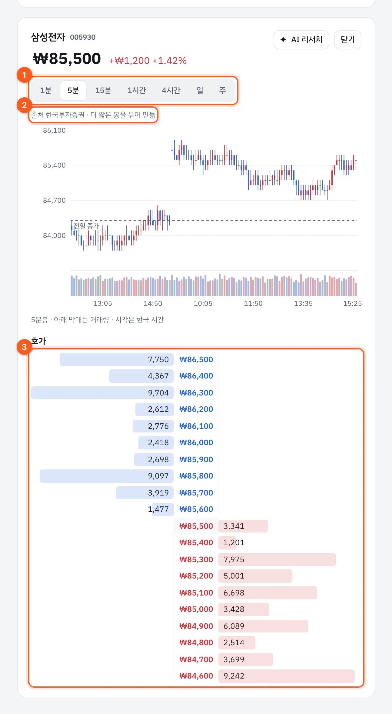

시세판이나 랭킹에서 종목을 누르면 열립니다. 고른 종목은 주소(`?s=005930`)에 남아서 새로고침해도 그대로입니다. 오른쪽 위 **✦ AI 리서치**는 보유하지 않은 종목도 [리서치 애널리스트](#리서치-애널리스트)에게 바로 맡깁니다.

- ① **봉 간격** — 1분·5분·15분·1시간·4시간·일·주 중에서 고릅니다. 위쪽은 캔들(시가·고가·저가·종가), 아래쪽 막대는 거래량입니다. 차트 위에 마우스를 올리면 그 봉의 시·고·저·종가와 등락률, 거래량이 나옵니다. 마지막으로 고른 간격은 브라우저에 기억됩니다.
- ② **출처 · 묶어 만듦** — 봉을 준 증권사·거래소입니다. 그 간격을 직접 주는 곳이 없으면 더 짧은 봉을 시각 경계에 맞춰 묶어 만들고 *더 짧은 봉을 묶어 만듦*으로 표시합니다. 예를 들어 한국투자증권은 국내 종목에 1분봉만 주므로 5분봉은 1분봉 다섯 개를 묶은 것입니다. 기관별로 직접 주는 간격은 [README](../README.md#봉캔들-차트)에 표로 정리돼 있습니다.
- ③ **호가** — 매도 호가 10단계(위)와 매수 호가 10단계(아래)의 가격과 잔량입니다. 막대 길이가 잔량이고, 지금 체결가와 같은 줄은 강조됩니다. 색은 설정한 상승/하락 색을 따릅니다.

분봉(1분~4시간)에는 *전일 종가* 점선이 함께 나옵니다. 시각은 모두 한국 시간이고, 1시간·4시간봉은 여러 날에 걸치므로 축에 날짜도 함께 표시합니다.

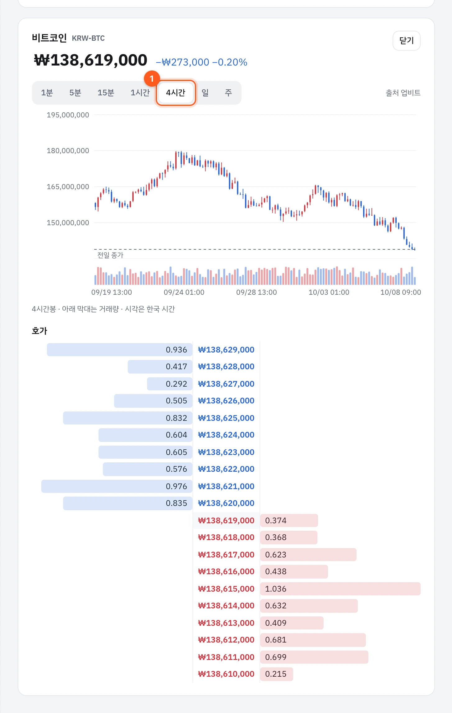

코인도 같은 화면에서 봅니다. 코인 거래소는 1분부터 주봉까지 모든 간격을 직접 주므로 묶어 만들지 않습니다. 24시간 거래되므로 봉이 끊기지 않습니다.

## 연동 · 설정

**추가** [`db77f63`](https://github.com/hgrgr/PPFP/commit/db77f639c3e24f0a4d5affbf259d87e442975f8a) · 2026-10-07 (토스증권만) · **바뀜** [`c99f35d`](https://github.com/hgrgr/PPFP/commit/c99f35dcc414d1e13afb8b7be55ce11998fc8d2e) · 2026-10-07 (증권사 6곳), [`a9cb43c`](https://github.com/hgrgr/PPFP/commit/a9cb43c123a3f2238ad3744c28fadaf132d8d05c) · 2026-10-08 (코인 거래소 4곳), [`57ab87e`](https://github.com/hgrgr/PPFP/commit/57ab87e100ea61b0a4042020f25cac070cfbe580) · 2026-10-08 (AI 어드바이저), [`333e034`](https://github.com/hgrgr/PPFP/commit/333e034c197867ab8ad950f686cc240acd043bbf) · 2026-10-09 (책 검색), [`ab85c05`](https://github.com/hgrgr/PPFP/commit/ab85c05a58394108597e75078b56fc84971fbd02) · 2026-10-09 (AI 회사별 키와 에이전트별 모델)

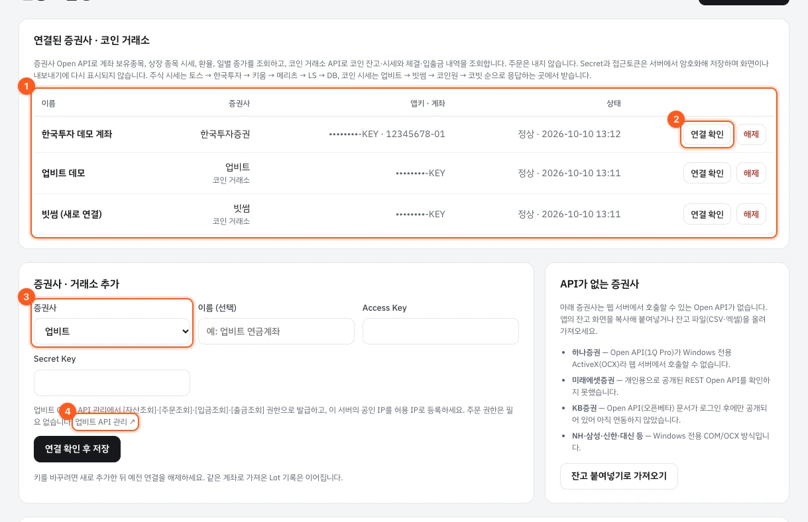

- ① **연결된 증권사 · 코인 거래소** — 연결 이름, 기관, 가려진 앱키·계좌번호, 상태(정상이면 마지막 확인 시각, 아니면 오류 내용)입니다.
- ② **연결 확인** — 저장된 키로 다시 접속해 봅니다. 오류가 사라졌는지 확인할 때 씁니다. **해제**는 저장된 키와 토큰을 지웁니다. 이미 가져온 Lot은 그대로 남습니다.
- ③ **증권사 · 거래소 추가** — 기관을 고릅니다. 증권사는 *토스·한국투자·키움·LS·DB·메리츠*, 코인 거래소는 *업비트·빗썸·코인원·코빗*입니다. 고른 곳에 맞춰 입력란 이름(App Key, Access Key 등)과 필요한 정보(한국투자증권은 계좌번호, 모의투자를 지원하는 증권사는 모의투자 여부)가 바뀝니다.
- ④ **API 관리 / 개발자 포털 링크** — 키를 발급하는 곳으로 갑니다. 위의 안내문에 필요한 권한이 적혀 있습니다. 예를 들어 업비트는 *자산조회·주문조회·입금조회·출금조회* 권한만 있으면 되고, 키를 만들 때 **이 서버의 공인 IP를 허용 IP로 등록**해야 합니다.

**연결 확인 후 저장**을 누르면 실제로 접속해 본 뒤 성공했을 때만 저장합니다. Secret과 접근토큰은 서버에서 암호화해 보관하며 다시 화면에 나오지 않습니다. 이 앱은 조회만 하고 주문은 내지 않습니다.

- **AI 어드바이저** — AI 회사별 API 키, 에이전트별 모델, 월 사용 한도, 웹 검색 허용 여부. [AI 어드바이저 설정](#설정과-비용)을 보세요.
- **책 검색** — 독서 노트에서 한국 책을 찾는 데 쓰는 카카오 REST API 키입니다. [카카오 developers](https://developers.kakao.com/console/app)에서 앱을 만들고 *앱 키*의 REST API 키(32자리)를 넣습니다. 무료이며 암호화해 저장합니다. [독서 노트](#독서-노트)를 보세요.
- **API가 없는 증권사** — 하나·미래에셋·KB·NH·삼성·신한·대신 등은 웹 서버에서 호출할 수 있는 Open API가 없거나 확인되지 않았습니다. 잔고 붙여넣기로 가져오세요.
- **표시** — 이름과 상승/하락 색(*상승 빨강·하락 파랑* 또는 *상승 초록·하락 빨강*)을 고릅니다.
- **데이터 다시 계산** — 과거 종가를 다시 받고 첫 거래일부터 일별 기록을 새로 계산합니다. 오래된 거래를 많이 고쳤을 때 씁니다.

## 보유종목 가져오기

**추가** [`c99f35d`](https://github.com/hgrgr/PPFP/commit/c99f35dcc414d1e13afb8b7be55ce11998fc8d2e) · 2026-10-07

### 연결한 계좌에서

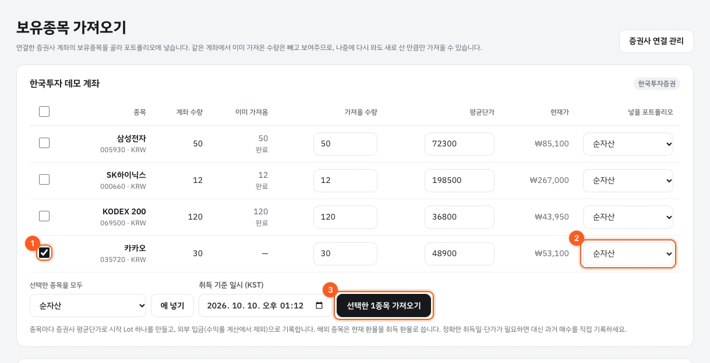

연결한 증권사 계좌마다 표가 하나씩 나옵니다. 각 열은 다음과 같습니다.

- *계좌 수량*: 지금 계좌에 있는 수량
- *이미 가져옴*: 이 계좌에서 예전에 가져와 아직 남아 있는 수량
- *가져올 수량*: 둘의 차이 (기본값)

처음이면 전부, 다시 오면 그 사이 새로 산 만큼만 제안합니다.

- ① 가져올 종목을 고릅니다. 이미 다 가져온 종목은 *완료*로 표시되고 선택이 꺼져 있습니다.
- ② 종목마다 넣을 포트폴리오를 고릅니다. 아래 *선택한 종목을 모두 … 에 넣기*로 한꺼번에 바꿀 수도 있습니다. 수량과 평균단가도 고칠 수 있습니다.
- ③ **가져오기** — 종목마다 증권사 평균단가로 시작 Lot을 하나 만들고, 외부 입금(수익률 계산에서 제외)으로 기록합니다. *취득 기준 일시*가 그 Lot의 취득일이 됩니다.

정확한 Lot별 취득일·단가가 필요하면 가져오기 대신 과거 매수를 하나씩 기록하세요. 해외 종목은 가져오는 시점의 환율을 취득 환율로 씁니다.

### 잔고 표 붙여넣기 · 파일

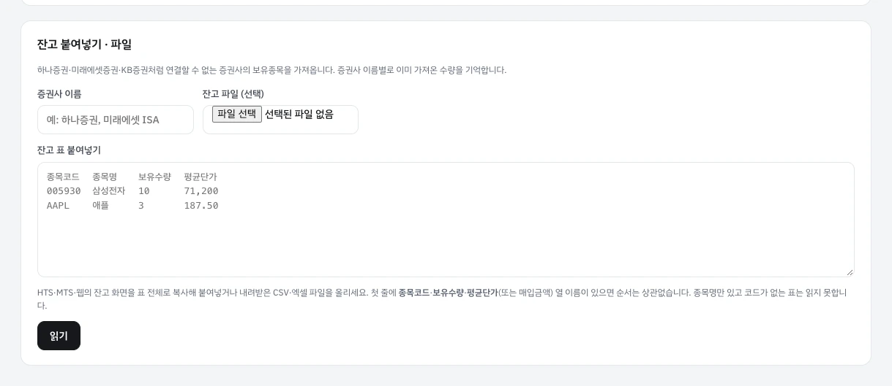

API가 없는 증권사는 HTS·MTS·웹의 잔고 화면을 표 전체로 복사해 붙여넣거나, 내려받은 CSV·엑셀(.xlsx) 파일을 올립니다.

- *증권사 이름*은 꼭 넣습니다. 같은 이름으로 다시 가져오면 이미 가져온 수량을 빼고 보여 줍니다.
- 첫 줄에 **종목코드·보유수량·평균단가**(또는 매입금액) 열 이름이 있으면 열 순서는 상관없습니다. 종목명만 있고 코드가 없는 표는 읽지 못합니다.
- CSV는 UTF-8과 EUC-KR을 모두 읽습니다. 예전 엑셀(.xls)은 .xlsx나 CSV로 저장해 올리세요.
- **읽기**를 누르면 위와 같은 선택 표가 나오고, 같은 방법으로 가져옵니다.

## 코인 거래소 거래내역

**추가** [`a9cb43c`](https://github.com/hgrgr/PPFP/commit/a9cb43c123a3f2238ad3744c28fadaf132d8d05c) · 2026-10-08

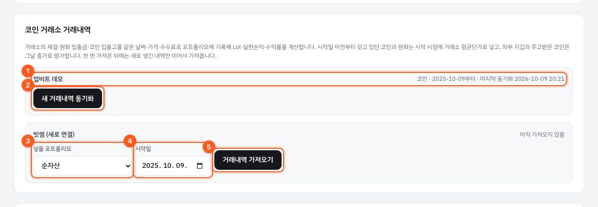

코인은 보유 수량만 가져오지 않고 **거래내역을 그대로 재현**합니다. 그래서 Lot·실현손익·수익률이 거래소 기록과 같은 날짜·가격·수수료로 계산됩니다. *보유종목 가져오기* 화면 아래쪽 *코인 거래소 거래내역*에서 거래소별로 실행합니다.

- 처음 가져올 때(빗썸 예시):
  - ③ **넣을 포트폴리오**를 고릅니다. 한 거래소는 한 포트폴리오로만 동기화합니다.
  - ④ **시작일**을 고릅니다. 기본은 1년 전입니다.
  - ⑤ **거래내역 가져오기**를 누릅니다. 주문이 많으면 몇 분 걸릴 수 있습니다.
- 그다음부터(업비트 예시):
  - ① 넣은 포트폴리오, 시작일, 마지막 동기화 시각이 표시됩니다.
  - ② **새 거래내역 동기화**를 누르면 새로 생긴 내역만 이어서 가져옵니다. 늦게 반영된 체결을 놓치지 않도록 마지막 동기화 2시간 전부터 다시 읽고, 이미 넣은 기록은 건너뜁니다.

**어떻게 기록되나요**

| 거래소 기록 | 포트폴리오에 남는 기록 |
| --- | --- |
| 시작일 이전부터 갖고 있던 코인 | 시작일 직전에 거래소 평균단가로 시작 Lot (외부 입금으로 처리) |
| 시작일 이전부터 있던 원화 | 시작일 직전에 원화 입금 |
| 체결된 매수 · 매도 | 포트폴리오 현금으로 사고파는 매수·매도, 수수료 포함 (코인으로 낸 수수료는 받은 수량에서 뺌) |
| 원화 입금 · 출금 | 입금·출금, 출금 수수료는 별도 수수료 기록 |
| 코인 입고 · 출고 (외부 지갑과 주고받음) | 그날 종가로 평가해 외부에서 들어오거나 밖으로 나간 Lot |

시작 보유분은 지금 잔고에서 기간 안의 거래를 거꾸로 빼서 구합니다. 그래서 동기화를 마치면 포트폴리오의 코인 수량과 원화 현금이 거래소 잔고와 같아집니다.

**거래소별로 알아둘 점**

- 원화마켓(`KRW-`) 거래만 다룹니다. BTC·USDT 마켓 체결은 건너뜁니다.
- **코빗**은 체결 내역을 최근 36시간만 주고, 지금 보유 중인 코인만 조회할 수 있습니다. 그 이전 보유분은 시작 시점에 평균단가로만 들어갑니다.
- 코인 거래소 보유분은 이중으로 집계되지 않도록 위쪽 *연결한 계좌에서* 목록에는 나오지 않습니다.

## 가져오기 · 내보내기

**추가** [`db77f63`](https://github.com/hgrgr/PPFP/commit/db77f639c3e24f0a4d5affbf259d87e442975f8a) · 2026-10-07 (Export) · **바뀜** [`a4f44eb`](https://github.com/hgrgr/PPFP/commit/a4f44eb11cda0136950ad5a0a7604586aaa6bf51) · 2026-10-09 (가져오기, 형식과 샘플, 매매일지·투자 노트 내보내기, 다시 가져올 수 있는 형식), [`05e17c7`](https://github.com/hgrgr/PPFP/commit/05e17c752a760ea574fa854b5cf8a8a075e620b1) · 2026-10-09 (형식 표의 예시), [`a3fbed1`](https://github.com/hgrgr/PPFP/commit/a3fbed1dfdfdd899ed4a11c4a423c7f3e7b831c6) · 2026-10-10 (수기 자산 일지, 날짜 기준 매도, 중복 판정, 연결만 다시 맞추기)

포트폴리오, 거래 내역, 매매일지, 투자 노트(메모·독서 노트·투자 거장·키워드)를 파일로 내보내고, 같은 형식의 파일로 가져옵니다. 내보낸 파일은 그대로 다시 가져올 수 있어서 백업하거나 다른 PPFP 계정으로 옮길 때 씁니다. 다른 곳에서 쓰던 기록은 [샘플 파일](#형식과-샘플)의 열에 맞춰 옮기면 한 번에 들여올 수 있습니다. 왼쪽 메뉴 *가져오기 · 내보내기*에서 엽니다.

### 내보내기

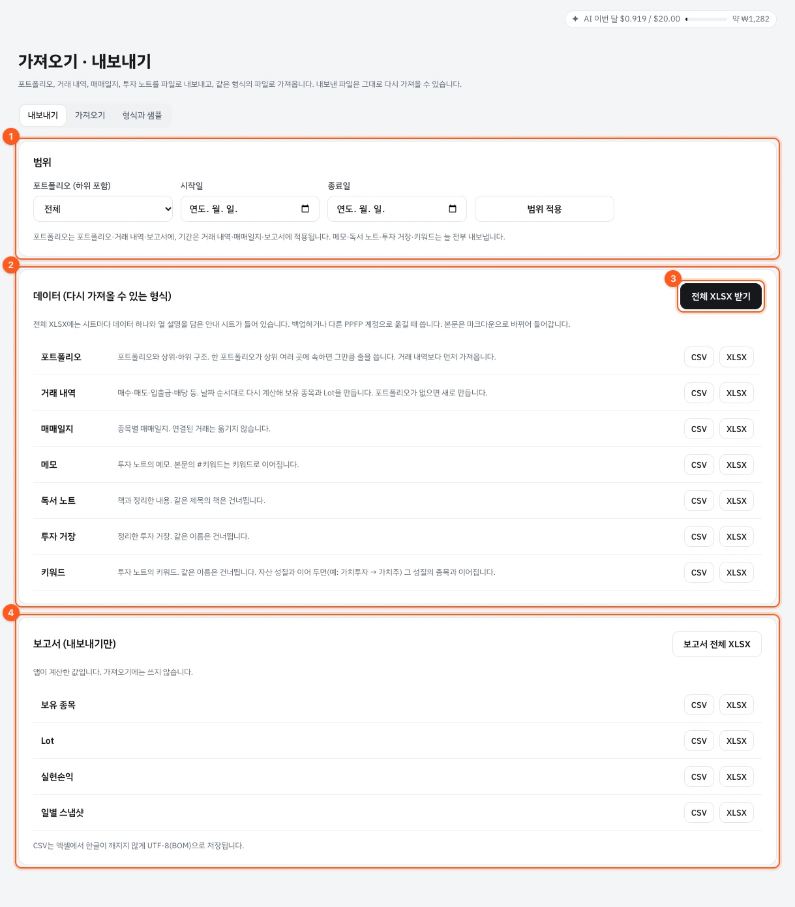

- ① **범위** — 포트폴리오(하위 포함)와 기간을 고르고 **범위 적용**을 누릅니다. 포트폴리오는 포트폴리오·거래 내역·보고서에, 기간은 거래 내역·매매일지·보고서에 적용됩니다. 메모·독서 노트·투자 거장·키워드는 늘 전부 내보냅니다. 대시보드 오른쪽 위 **내보내기**를 누르면 보고 있던 범위·기간이 채워진 채로 이 화면이 열립니다.
- ② **데이터** — 다시 가져올 수 있는 형식입니다. 데이터마다 CSV나 XLSX로 받습니다.
- ③ **전체 XLSX 받기** — 위 데이터를 시트별로 담고, 열 설명을 담은 *안내* 시트를 맨 앞에 둔 엑셀 파일 하나를 받습니다. 백업에는 이것을 쓰세요.
- ④ **보고서** — 보유 종목, Lot, 실현손익, 일별 스냅샷처럼 앱이 계산한 값입니다. 내보내기만 하고 가져오기에는 쓰지 않습니다.

매매일지와 노트의 본문은 마크다운(제목 `#`, 목록 `-`·`1.`, 체크 `- [ ]`, 인용 `>`, 표, 이미지, 코드)으로 바뀌어 들어갑니다. 그래프와 종목 시세 차트처럼 마크다운으로 쓸 수 없는 블록은 ```` ```ppfp-block ```` 코드 블록에 원래 모양 그대로 담겨, 다시 가져오면 되살아납니다. CSV는 엑셀에서 한글이 깨지지 않도록 UTF-8(BOM)으로 저장됩니다.

### 가져오기

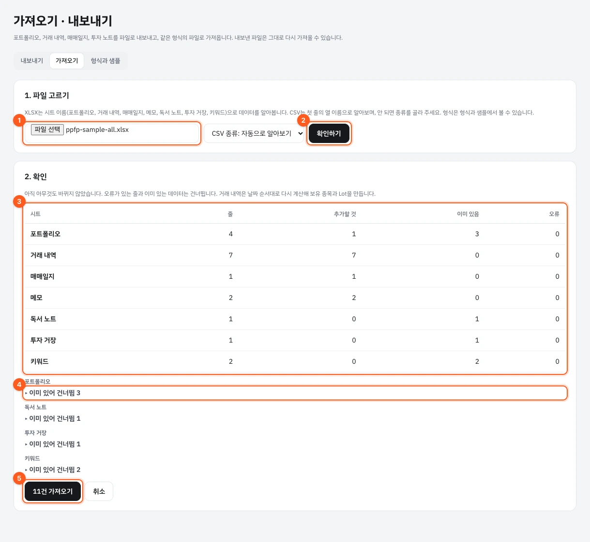

1. ① **파일 고르기** — XLSX나 CSV를 고릅니다. XLSX는 시트 이름(포트폴리오, 거래 내역, 매매일지, 메모, 독서 노트, 투자 거장, 키워드)으로, CSV는 첫 줄의 열 이름으로 어떤 데이터인지 알아봅니다. CSV를 알아보지 못하면 옆에서 종류를 고릅니다.
2. ② **확인하기** — 아직 아무것도 바꾸지 않고 파일을 검사합니다.
3. ③ **확인 결과** — 시트마다 줄 수, 추가할 것, 이미 있어 건너뛸 것, 오류를 보여 줍니다.
4. ④ **자세히** — 오류는 *몇 행에서 무엇이 문제인지*(예: *5행 USD 거래는 환율을 채우세요*), 건너뛸 줄은 그 이유를 펼쳐 봅니다. 행 번호는 파일의 줄 번호(첫 줄이 열 이름)입니다.
5. ⑤ **가져오기** — 오류가 없는 줄만 가져옵니다. 끝나면 같은 표로 결과를 보여 줍니다. 모든 줄이 이미 있으면 버튼이 **연결만 다시 맞추기**로 바뀌어, 없던 연결만 채웁니다.

가져오기 규칙:

- **이미 있는 것은 건너뜁니다** — 내보낸 파일의 *거래 ID*·*일지 ID*가 같거나, 같은 일시(분 단위)·종목·수량의 거래(입출금·배당 같은 현금 거래는 같은 일시·금액), 같은 종목·제목·작성일의 일지, 같은 본문의 메모, 같은 제목의 책, 같은 이름의 포트폴리오·투자 거장·키워드는 다시 만들지 않습니다. 파일 안에서 같은 항목이 두 번 나오면 뒤의 것을 건너뜁니다. 그래서 같은 파일을 두 번 가져와도 겹치지 않고, 중간에 실패한 줄만 고쳐서 다시 가져오면 빠진 것만 들어갑니다.
- **거래는 날짜 순서대로 다시 계산합니다** — 파일 안의 순서와 상관없이 오래된 거래부터 기록해 보유 종목과 Lot을 만듭니다. 매도는 그 날짜까지 산 Lot에서만 팔고, 그날 가진 수량보다 많이 판 줄은 오류가 됩니다. 매도의 Lot 방식은 *Lot 방식* 열, 비우면 포트폴리오의 기본 방식을 따릅니다. *직접 선택*으로 판 거래는 어느 Lot을 골랐는지 파일에 없어 선입선출로 계산하고 알림으로 알려 줍니다(실현손익이 원래와 조금 다를 수 있습니다).
- **없는 것은 만듭니다** — 거래 내역에 처음 나오는 포트폴리오와 종목은 새로 만듭니다. 상장 종목은 *자산 이름*을 적어 두면 증권사 연결 없이도 만들어지고, 비우면 연결된 증권사에서 이름을 찾습니다. 예금·부동산 같은 수기 자산은 *자산 이름*과 *자산 유형*으로 찾거나 만듭니다(거래 내역과 매매일지 모두). 포트폴리오는 이름으로 찾으므로, 이름이 같은 포트폴리오가 여럿이면 내보낼 때 *이름 (2)*처럼 구분해 적습니다.
- **연결은 이름으로 잇습니다** — *연결* 열의 `키워드: 가치투자; 투자 거장: 워런 버핏; 종목: 005930; 책: 현명한 투자자; 자산 성질: 가치주`를 이름으로 찾아 잇습니다. 없는 키워드는 만들고, 없는 투자 거장·책·종목·자산 성질은 *알림*으로 알려 줍니다. 자산 성질은 내보내기에 들어가지 않으므로, 새 계정이라면 [자산 성질](#자산-성질)에서 분류를 먼저 추가한 뒤 같은 파일을 다시 가져오면 연결됩니다.
- **옮기지 않는 것** — 매매일지와 거래의 연결, 매매일지에 올린 이미지 파일(본문에는 주소만 남습니다), 목표 비중, 가격 알림, 자산 성질, AI 대화와 스킬, 증권사 연결은 옮기지 않습니다. 진행 중인 매매일지는 목표가·손절가 알림이 다시 켜집니다.
- 과거 날짜의 거래를 가져왔다면, 결과 아래 **일별 기록 다시 계산**을 눌러 대시보드의 평가액 추이와 수익률을 맞춥니다.

### 형식과 샘플

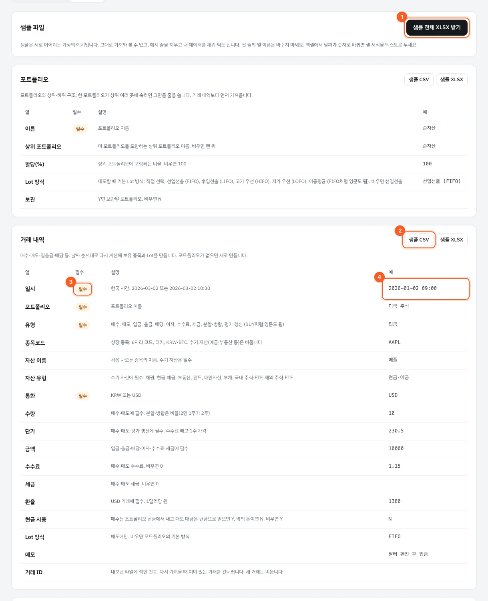

- ① **샘플 전체 XLSX 받기** — 모든 시트의 예시와 *안내* 시트가 든 엑셀 파일입니다. 예시는 서로 이어지는 가상의 데이터라 빈 계정에 그대로 가져와 볼 수 있고, 예시 줄을 지우고 내 데이터를 채워 써도 됩니다.
- ② **샘플 CSV · XLSX** — 데이터 하나만 담은 샘플입니다.
- ③ **필수** — 반드시 채워야 하는 열입니다. 나머지는 비워도 되며, 유형에 따라 필요한 열(예: 매수는 수량·단가, 입금은 금액, USD 거래는 환율)은 설명에 적혀 있습니다.
- ④ **예** — 그 열에 들어갈 값의 예입니다.

첫 줄의 열 이름은 바꾸지 마세요(순서는 바뀌어도 됩니다). 날짜는 `2026-03-02` 또는 `2026-03-02 10:30`(한국 시간), 숫자는 `1,234.5`처럼 쉼표가 있어도 됩니다. 유형·Lot 방식·상태는 화면에 쓰인 이름(매수, 선입선출 (FIFO), 다 읽음)이나 영문 코드(BUY, FIFO)로 씁니다. 엑셀에서 날짜가 숫자로 바뀌면 그 열의 셀 서식을 *텍스트*로 두세요. 엑셀이 지운 종목코드 앞자리 0(005930 → 5930), 퍼센트 서식(60%), 아주 작은 수의 지수 표기(1.2e-7)는 가져올 때 바로잡습니다. 한글 엑셀의 *CSV (쉼표로 분리)*(CP949)도 그대로 읽습니다.

---

## 기능 이력

커밋 순서대로 무엇이 추가·변경·삭제됐는지 정리했습니다. 커밋을 누르면 GitHub에서 바뀐 내용을 볼 수 있습니다.

| 날짜 | 커밋 | PR | 추가 | 바뀜 · 사라짐 |
| --- | --- | --- | --- | --- |
| 2026-10-07 | [`db77f63`](https://github.com/hgrgr/PPFP/commit/db77f639c3e24f0a4d5affbf259d87e442975f8a) | — | 가입·로그인, 포트폴리오 계층, 상장·수기 자산, 매수·Lot 매도(6가지 방식), 입출금·배당·이자, 평가 갱신, 분할·병합, 대시보드(기간·요약·평가액 추이·자산 배분(유형·통화)·비중 변화), 거래 내역, Export, 금액 가리기, 상승/하락 색, 다크 모드, 홈 화면 설치, 토스증권 연동, 계좌 잔고와 장부 비교 | — |
| 2026-10-07 | [`c99f35d`](https://github.com/hgrgr/PPFP/commit/c99f35dcc414d1e13afb8b7be55ce11998fc8d2e) | [#2](https://github.com/hgrgr/PPFP/pull/2) | 증권사 6곳 연동(토스·한국투자·키움·LS·DB·메리츠), 보유종목 가져오기(계좌·붙여넣기·CSV·XLSX) | **사라짐**: 설정의 *계좌 잔고와 장부 비교*, 토스증권 전용 연결 칸 → 보유종목 가져오기와 여러 기관 연결로 대체 |
| 2026-10-07 | [`656324d`](https://github.com/hgrgr/PPFP/commit/656324dd40947d9ed67ecb30dc3c44906eac736b) | [#3](https://github.com/hgrgr/PPFP/pull/3) | 대시보드 자산 배분의 *종목* 기준(종목별 비중) | 자산 배분 기본 기준이 *유형* → *종목* |
| 2026-10-08 | [`6156d44`](https://github.com/hgrgr/PPFP/commit/6156d44348ee35aa0d5d265030b3856bdc96a79a) | [#4](https://github.com/hgrgr/PPFP/pull/4) | 실시간 시세: 지수·환율, 내 종목·관심종목, 미니 차트, 국내·미국 랭킹, 종목 상세(1분 선 차트·호가) | — |
| 2026-10-08 | [`a9cb43c`](https://github.com/hgrgr/PPFP/commit/a9cb43c123a3f2238ad3744c28fadaf132d8d05c) | [#5](https://github.com/hgrgr/PPFP/pull/5) | 봉 차트(1분~주봉 7가지)와 거래량, 코인 거래소 4곳 연동(업비트·빗썸·코인원·코빗), 코인 시세·관심종목·랭킹 탭, 코인 거래내역 동기화, *가상자산* 자산 유형 | **사라짐**: 종목 상세의 당일 1분 선 차트 → 봉 차트로 대체 |
| 2026-10-08 | [`9c61e96`](https://github.com/hgrgr/PPFP/commit/9c61e96d06312e509777b480a7f240e58a249e91) | — | — | 봉 차트: 코인처럼 긴 가격도 축에서 잘리지 않음, 1시간·4시간봉 시간 축에 날짜 표시 |
| 2026-10-08 | [`8e6df7e`](https://github.com/hgrgr/PPFP/commit/8e6df7e0585896c34a2f7f6e9811c05a7520ad79) | [#7](https://github.com/hgrgr/PPFP/pull/7) | — | 실시간 랭킹: 현재가와 등락률을 한 칸에 표시, 창 폭 1280px 근처에서 등락률 열이 밀려 안 보이던 문제 수정 |
| 2026-10-08 | [`72034c5`](https://github.com/hgrgr/PPFP/commit/72034c52db619e96bee37ba344491ab18d96a11b) | — | 매매일지: 목표 예상 가격(필수)·기준 가격·손절가·목표 기한, 거래 연결, 노션식 블록 편집기(표·이미지·링크·코드·그래프·종목 시세 차트), 추천 양식 5가지와 내 양식(사용자 속성 9종류), 목표까지 진행 표시 | 대시보드: 원형 차트·보유 종목에서 종목의 매매일지 목록과 겹쳐 열리는 보기 창. 거래 내역·종목 화면: 거래마다 *+ 일지* |
| 2026-10-08 | [`69b342e`](https://github.com/hgrgr/PPFP/commit/69b342ed62f0292c09f37f67cb89e73ab555c154) | — | 자산 성질: 분류 7가지(올웨더 경제 국면·자산군·주식 스타일·체급·경기 민감도·지역·운용 역할)와 직접 만들기, 유형·이름으로 자동 지정, 목표 비중과 차이, 부족한 성질의 매수 후보(관심종목 포함), 비중 기준(전체/지정 종목끼리). 매매일지 트리(분류→종목→매매) | 대시보드 자산 배분에 *성질* 기준. 매매일지 작성 화면에 종목 성질 표시 |
| 2026-10-08 | [`64b046f`](https://github.com/hgrgr/PPFP/commit/64b046fac2dd876a95bd627b3ba9ddc71ae44264) | — | 알림: 알림함(읽지 않은 수 표시), 가격 알림(이상/이하, 다시 켜기), 매매일지 목표가·손절가 도달 알림, 포트폴리오 목표 비중과 허용 오차·이탈 알림, 목표대로 맞추는 매매 금액, 푸시 알림(휴대폰·PC) | — |
| 2026-10-08 | [`27b79fc`](https://github.com/hgrgr/PPFP/commit/27b79fc73d98b453b9b4bf395de2e5d553122f73) | — | 투자 노트: 메모(#키워드, 고정, 찾기), 어느 화면에서나 빠른 메모(Alt+M, 보던 종목·책·거장 자동 연결), 독서 노트(요약 틀, 읽은 상태·별점·기간), 투자 거장 11명 정리와 직접 추가, 키워드. 속성으로 키워드·자산 성질·종목·거장·책을 서로 연결하고 이어진 항목 보기 | 종목 화면에 *관련 투자 거장 · 책 · 메모*. 매매일지 트리 옆 창에 이어진 거장·책·메모 |
| 2026-10-08 | [`57ab87e`](https://github.com/hgrgr/PPFP/commit/57ab87e100ea61b0a4042020f25cac070cfbe580) | — | AI 어드바이저: 포트폴리오 매니저·투자 거장 관점 에이전트, 앱 데이터 조회 도구와 웹 검색(출처), 메모·가격 알림·목표 비중 제안과 확인 후 실행, 어느 화면에서나 여는 AI 창(Alt+K)과 화면별 질문 버튼, 대화 기록, API 키·월 사용 한도·웹 검색 설정 | 대시보드·종목 화면·목표 비중 카드·매매일지·투자 거장 정리에 ✦ 버튼. 연동 · 설정에 AI 어드바이저 카드 |
| 2026-10-08 | [`8244851`](https://github.com/hgrgr/PPFP/commit/8244851e3bbfc944781ac46217a8209b4a602523) | — | AI 리서치 애널리스트(웹 리서치 리포트·출처, 주가 흐름 통계, 매수 계획 일지 초안), 매매일지 코치(매매 성적·습관 분석, 일지에 복기 덧붙이기) | 종목 화면·시세 종목 상세에 *AI 리서치*, 매매일지 목록에 *AI 매매 코치*. 일지의 *AI와 복기*는 매매일지 코치로 열림 |
| 2026-10-08 | [`47ee0a1`](https://github.com/hgrgr/PPFP/commit/47ee0a1732e2ca52bd3dc2b48e0a81f4bd4099ff) | — | AI 아침 브리핑(시각·평일만 설정, 알림함과 푸시, 대화로 이어 묻기), 알림 AI 분석(자동 또는 알림함의 *AI로 분석*) | 알림함에 브리핑과 AI 분석 버튼. 연동 · 설정의 AI 카드에 *자동으로 받기* |
| 2026-10-08 | [`0982906`](https://github.com/hgrgr/PPFP/commit/0982906c172a739ce7c566c9967fe2a8cf63287b) | — | 세금: 해외주식 양도소득세 예상(250만 원 공제, 22%), 금융소득 2,000만 원 기준, 연말 전 손실 상계·기본공제 채우기 후보 | 화면 구성에 *세금* 메뉴 |
| 2026-10-08 | [`0b04f87`](https://github.com/hgrgr/PPFP/commit/0b04f877a18a1867fde5348367db75c2672db4ae) | — | 배당: 받은 배당과 앞으로 12개월 예상, 월별 현금흐름 차트, 배당 달력, 종목별 주기·예상 수익률 | 화면 구성에 *배당* 메뉴 |
| 2026-10-08 | [`3a2ebd2`](https://github.com/hgrgr/PPFP/commit/3a2ebd21e2860482117172ef07010c1f099bf8fa) | — | 성과 분석: 시간가중수익률과 코스피 200·S&P 500·나스닥 100 비교(원화·현지 통화), 종목·자산 유형별 기여도 | 화면 구성에 *성과 분석* 메뉴 |
| 2026-10-08 | [`c041869`](https://github.com/hgrgr/PPFP/commit/c041869dfa2ed36f5ca355b6317a0b937cdc74d8) | — | 목표: 달성 확률 시뮬레이션(2,000개 경로, 물가 반영), 리밸런싱 규칙 백테스트 | 화면 구성에 *목표* 메뉴. AI 에이전트에 세금·배당·성과·목표·백테스트 도구 |
| 2026-10-09 | [`333e034`](https://github.com/hgrgr/PPFP/commit/333e034c197867ab8ad950f686cc240acd043bbf) | — | 독서 노트: 책 제목으로 저자·출판사·출간 연도 찾기(카카오 책 검색, 영문은 Open Library), 연동 · 설정의 *책 검색* 카드 | 독서 노트의 *+ 책 추가*가 *찾기*와 *그냥 추가*로 나뉨. 책 정리 화면에 *제목으로 찾아 채우기* |
| 2026-10-09 | [`ab85c05`](https://github.com/hgrgr/PPFP/commit/ab85c05a58394108597e75078b56fc84971fbd02) | — | AI 어드바이저를 ChatGPT(OpenAI)·Gemini(Google)·Grok(xAI)·DeepSeek 모델로도 쓰기, 에이전트별 회사·모델 선택과 한 번에 바꾸기, 키로 쓸 수 있는 모델 목록 | 연동 · 설정의 AI 카드: Anthropic 키 칸 → 회사별 키 표(저장된 키는 그대로 옮겨짐). AI 창과 AI 어드바이저 화면에 답하는 모델 표시. 가격을 모르는 모델은 비싼 모델 기준으로 비용 추정 |
| 2026-10-09 | [`d5bfb1b`](https://github.com/hgrgr/PPFP/commit/d5bfb1bdcfb1d69d70de91381ddfe7d24ad47692) | — | AI 독서 큐레이터: 읽은 책·투자 노트·매매일지·자산 성질로 다음 책 추천, 책 검색으로 확인, 읽을 책 추가 제안 | 독서 노트에 *AI에게 다음 책 추천받기* |
| 2026-10-09 | [`ea8adbb`](https://github.com/hgrgr/PPFP/commit/ea8adbbde9ca27a0c2dc4ac73cd8e7a2428c0110) | — | AI 스킬: 직접 만들기(예시·SKILL.md 붙여넣기), 에이전트별 적용과 켜고 끄기, skills.sh 투자 스킬 랭킹(설치 수 순)과 GitHub 원문 미리 보기, 한 번에 적용, 원본에서 다시 가져오기 | AI 어드바이저 화면에 *✦ 스킬 관리*. 답에 사용한 스킬 표시 |
| 2026-10-09 | [`a4f44eb`](https://github.com/hgrgr/PPFP/commit/a4f44eb11cda0136950ad5a0a7604586aaa6bf51) | — | 가져오기(XLSX 시트별·CSV, 미리 보기와 행별 오류, 중복 건너뛰기, 거래 날짜순 재계산, 연결 복원), 매매일지·메모·독서 노트·투자 거장·키워드 내보내기, 형식 안내와 샘플 파일 | *Export* 메뉴 → *가져오기 · 내보내기*(/export는 새 화면으로 이동). 포트폴리오·거래 내역 내보내기가 다시 가져올 수 있는 열로 바뀜(포트폴리오는 상위·할당·Lot 방식, 거래는 종목코드·자산 이름·현금 사용·거래 ID). 거래 내역 화면의 CSV·XLSX도 같은 형식. 대시보드 버튼 *Export* → *내보내기* |
| 2026-10-09 | [`05e17c7`](https://github.com/hgrgr/PPFP/commit/05e17c752a760ea574fa854b5cf8a8a075e620b1) | — | — | 형식과 샘플: 열마다 첫 예시 값을 보여 줌 |
| 2026-10-10 | [`a3fbed1`](https://github.com/hgrgr/PPFP/commit/a3fbed1dfdfdd899ed4a11c4a423c7f3e7b831c6) | — | — | 가져오기·내보내기: 매매일지에 *자산 유형* 열(수기 자산 일지), 현금 거래의 통화, 날짜 기준 매도와 직접 선택 매도(선입선출로), 포트폴리오 행 순서와 미리 보기의 구조 검사, 같은 이름 포트폴리오 구분, 분 단위 중복 판정과 파일 안 중복, 키워드끼리 연결 내보내기, 퍼센트·지수 표기·종목코드 앞자리 0·CP949 CSV 읽기, 연결만 다시 맞추기 |
| 2026-10-10 | [`a851703`](https://github.com/hgrgr/PPFP/commit/a85170376aafaf77686442b37824da8b2ab4c67e) | — | 포트폴리오에서 종목 제거(포트폴리오 화면 *제거*, 종목 화면 *종목 빼기*): 그 종목의 거래·Lot을 한 번에 지우고 현금·지난 기록 되돌리기 | — |
| 2026-10-10 | [`dbadaae`](https://github.com/hgrgr/PPFP/commit/dbadaae2e82e105c20e4ebc481ab326d4c18e772) | — | 자산 배분 *구성* 기준: 하위 포트폴리오는 한 조각, 직접 가진 종목·현금은 따로, 조각을 누르면 그 포트폴리오로 이동 | 자산 배분 기본 기준이 *종목* → *구성* |
| 2026-10-10 | [`55360b4`](https://github.com/hgrgr/PPFP/commit/55360b464505d2f35d52fa358f82444d6b74ccfe) | — | 보유 자산 메뉴: 가진 자산을 한 목록으로(소속 포트폴리오·성질·비중, 찾기와 거르기), 다른 포트폴리오로 옮기기(현금 유지·같은 종목 합치기), 모든 포트폴리오에서 빼기, 어느 포트폴리오에나 더 사기, 성질 고르기. 종목 화면에도 옮기기 | — |
| 2026-10-10 | [`35bd533`](https://github.com/hgrgr/PPFP/commit/35bd5336cda613428453324cc90b2359b7501811) | — | 해외 자산을 현지 통화로 보기(*₩ 원화 · $ 현지 통화*, 최근 공시 환율과 그 출처·시각 표시, 대시보드·성과 분석·포트폴리오·보유 자산), 사용량 · 비용 메뉴(AI 비용·한도·월말 예상·모델별·에이전트별, 외부 API 호출 수와 남은 한도), 모든 화면 위쪽과 AI 창의 *✦ AI 이번 달* 표시 | 성과 분석의 *원화 기준 · 현지 통화*가 위쪽 *₩ 원화 · $ 현지 통화*로 |

## 사라진 기능

예전에는 있었지만 지금은 없는 기능입니다. 대신 쓸 방법을 함께 적었습니다.

| 기능 | 있던 기간 | 대신 쓰는 방법 |
| --- | --- | --- |
| **계좌 잔고와 장부 비교** (연동 · 설정) — 토스증권 계좌 수량과 앱의 Lot 합계를 나란히 놓고 차이만큼 시작 Lot을 만들던 표 | [`db77f63`](https://github.com/hgrgr/PPFP/commit/db77f639c3e24f0a4d5affbf259d87e442975f8a)에서 추가 → [`c99f35d`](https://github.com/hgrgr/PPFP/commit/c99f35dcc414d1e13afb8b7be55ce11998fc8d2e)에서 삭제 | [보유종목 가져오기](#보유종목-가져오기). 계좌 수량·이미 가져온 수량·차이를 계좌마다 보여 주고, 증권사 6곳과 붙여넣기까지 지원합니다. |
| **토스증권 전용 연결 칸** (연동 · 설정의 Client ID/Secret 입력) | [`db77f63`](https://github.com/hgrgr/PPFP/commit/db77f639c3e24f0a4d5affbf259d87e442975f8a)에서 추가 → [`c99f35d`](https://github.com/hgrgr/PPFP/commit/c99f35dcc414d1e13afb8b7be55ce11998fc8d2e)에서 삭제 | *증권사 · 거래소 추가*에서 토스증권을 고릅니다. 예전 연결은 업그레이드할 때 자동으로 옮겨졌습니다. |
| **종목 상세의 당일 1분 선 차트** (실시간 시세) | [`6156d44`](https://github.com/hgrgr/PPFP/commit/6156d44348ee35aa0d5d265030b3856bdc96a79a)에서 추가 → [`a9cb43c`](https://github.com/hgrgr/PPFP/commit/a9cb43c123a3f2238ad3744c28fadaf132d8d05c)에서 삭제 | [봉 차트](#종목-상세--봉-차트)에서 *1분*을 고르면 같은 흐름을 캔들과 거래량으로 봅니다. 시세판의 *오늘* 미니 차트는 그대로 있습니다. |

## 이 문서 관리하기

기능을 추가하거나 바꾸거나 없앨 때마다 이 문서도 함께 고칩니다.

- **새 기능** — 알맞은 장(章)에 설명을 넣고, 제목 아래에 **추가** 커밋과 날짜를 적습니다. [기능 이력](#기능-이력) 표에도 한 줄 추가합니다.
- **바뀐 기능** — 제목 아래 **바뀜**에 커밋과 바뀐 점을 적고, 본문과 화면을 지금 동작에 맞게 고칩니다.
- **없앤 기능** — 본문에서 지우고 [사라진 기능](#사라진-기능) 표로 옮깁니다. 있던 기간(추가·삭제 커밋)과 대신 쓰는 방법을 적습니다.
- **화면 캡처** — 화면이 바뀌면 `npm run build` 후 `npm run docs:screenshots`로 다시 찍습니다. 데모 데이터와 가짜 시세로 임시 DB에서 찍고 끝나면 지우므로 실제 데이터는 쓰지 않습니다. 일부만 다시 찍으려면 `DOCS_ONLY=market,login npm run docs:screenshots`처럼 실행합니다. 찍을 화면과 번호 위치는 [`scripts/docs/capture.ts`](../scripts/docs/capture.ts)의 `SHOTS`에서 정합니다.
- 커밋 번호는 기능 커밋을 만든 뒤 같은 브랜치의 문서 커밋에서 적습니다. PR은 *Merge commit*으로 합쳐서 커밋 번호가 바뀌지 않게 합니다.
